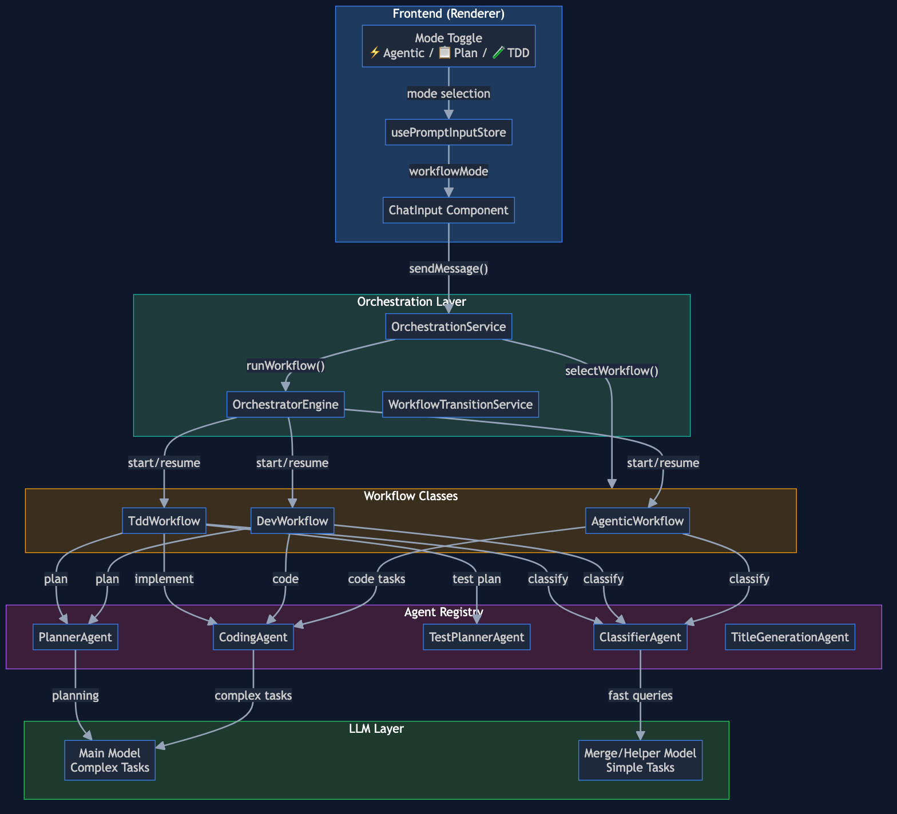
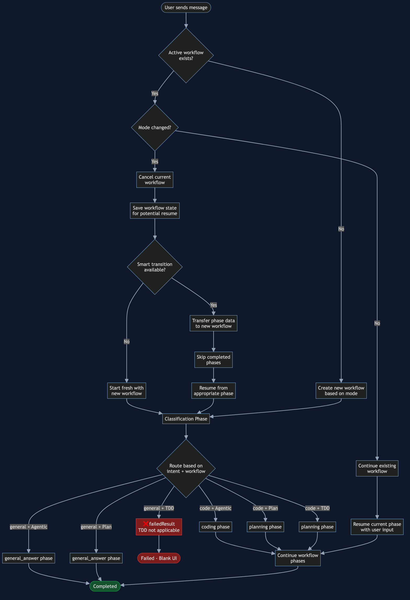
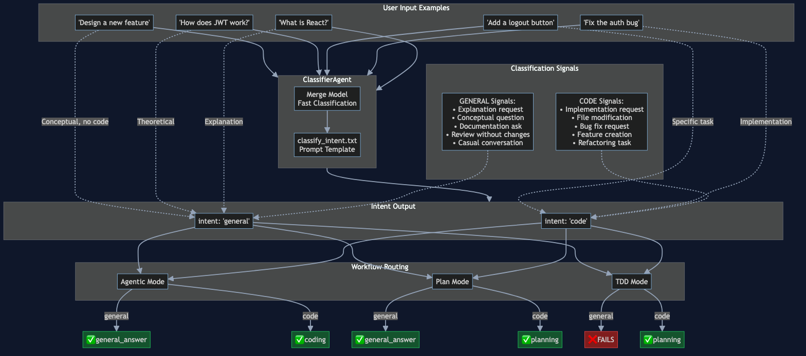
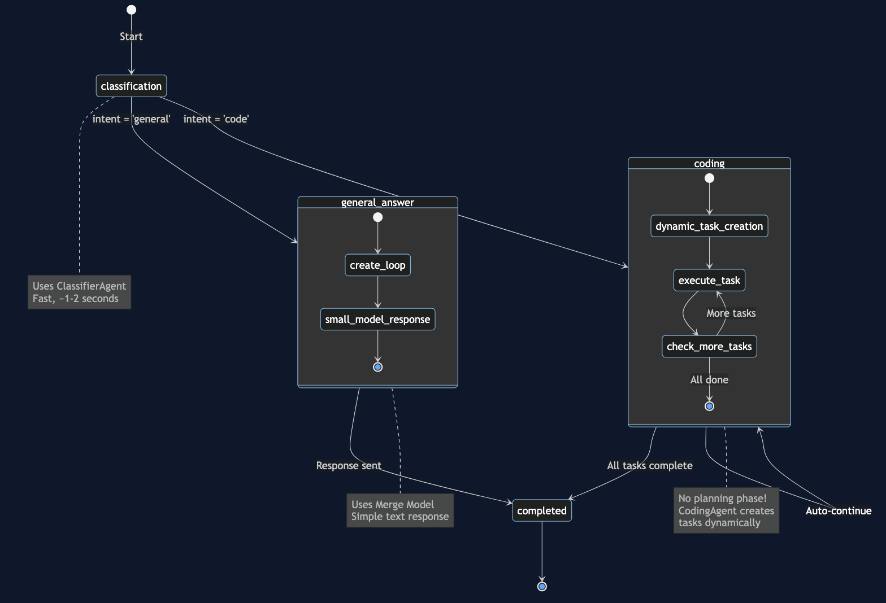
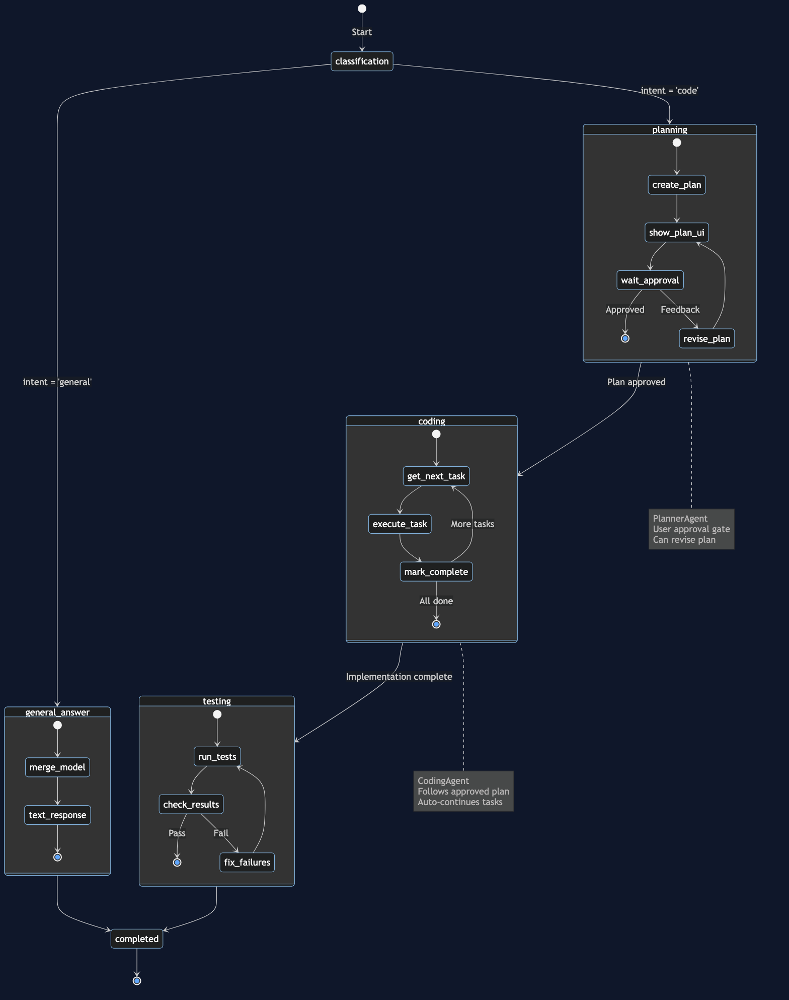
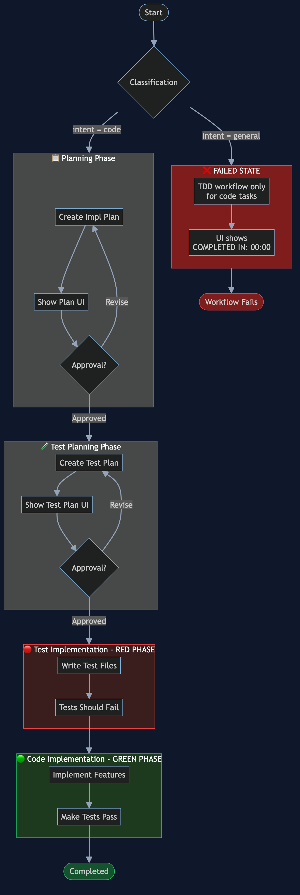
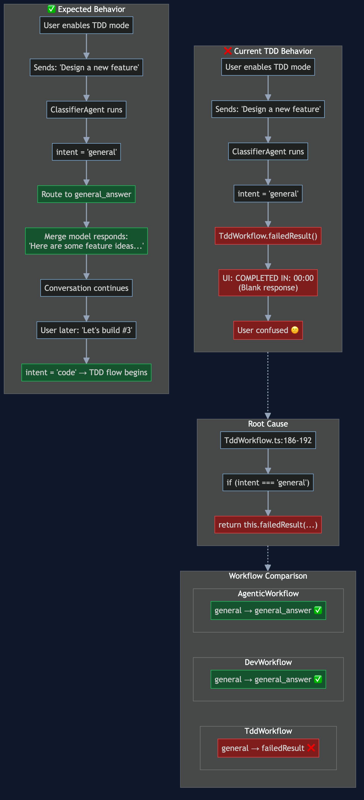
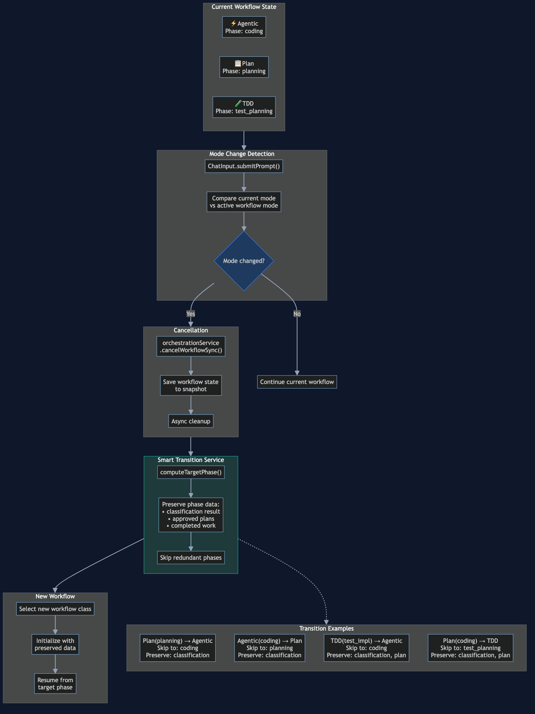

# Fabric Orchestration Architecture

This document provides a comprehensive analysis of Fabric's message orchestration and classification system, including all edge cases and mode-specific behaviors.

## Overview

Fabric uses a multi-layered orchestration system to route user messages through appropriate workflows based on:
1. **User-selected mode** (Agentic, Plan, TDD)
2. **Classifier intent** (code vs general)
3. **Existing workflow state** (new, continuing, mode-changed)

## High-Level Architecture



## Entry Point Flow

When a user sends a message, it flows through several decision points before reaching a workflow:



### Key Decision Points

1. **Active Workflow Check**: Is there an existing workflow for this chat?
2. **Mode Change Detection**: Did the user change modes (e.g., Agentic → TDD)?
3. **Workflow Type Selection**: Based on mode setting
4. **Smart Transition**: Preserve phase data when switching modes

## The Three Workflow Modes

| Mode | Icon | Description | Classification Handling |
|------|------|-------------|------------------------|
| **Agentic** | ⚡ | Fast, no planning, dynamic tasks | Routes to `general_answer` phase |
| **Plan** | 📋 | Full planning with approval gates | Routes to `general_answer` phase |
| **TDD** | 🧪 | Test-first development | **FAILS with error** |

## Classification System



### ClassifierAgent Details

- **Model**: Uses small/fast model (invisible to user)
- **Latency**: ~1-2 seconds
- **Output**: Single intent classification

### Intent Definitions

**CODE Intent** - Classified when user wants:
- Writing, editing, modifying code
- Creating features, fixing bugs, refactoring
- Making architectural decisions
- Database/API/security implementation
- Setting up project structure

**GENERAL Intent** - Classified when user wants:
- Explanations without modification
- Conceptual questions about technologies
- Documentation requests
- Code review without changes
- Casual conversation/greetings

### Edge Cases in Classification

| Query Type | Classification | Reasoning |
|------------|---------------|-----------|
| "How do I implement auth in my app?" | CODE | Project-specific implementation |
| "How does JWT authentication work?" | GENERAL | Theoretical, no implementation |
| "Design a new feature for Fabric" | GENERAL | Conceptual, no code requested |
| "Add a logout button" | CODE | Specific implementation task |

## Workflow Phase Diagrams

### Agentic Workflow



**Characteristics:**
- Skips planning entirely
- Dynamic task creation during coding
- Fastest path to implementation

### Plan Workflow (DevWorkflow)



**Characteristics:**
- Full planning phase with user approval
- Structured task list before coding
- Testing phase after implementation

### TDD Workflow



**Characteristics:**
- Test planning after implementation planning
- Red-Green-Refactor pattern
- **Critical Issue**: Fails on general queries

## The TDD General Query Problem



### Current Behavior

```
User enables TDD mode
  → Sends: "Design a new feature for Fabric"
  → Classifier: intent = 'general'
  → TddWorkflow: failedResult("TDD workflow is only applicable...")
  → UI: "COMPLETED IN: 00:00" (blank response)
```

### Why This Is Wrong

1. **Duplicated Logic**: Every workflow implements its own `general_answer` phase
2. **Inconsistent UX**: TDD fails while others succeed
3. **Violates User Mental Model**: "I set TDD because I plan to implement eventually"

## Mode Transitions

When a user changes mode mid-workflow:



### Smart Transition Rules

| From | To | Preserved Data | Target Phase |
|------|-----|---------------|--------------|
| Plan (planning) | Agentic | classification | coding |
| Plan (coding) | Agentic | classification, plan | coding |
| Agentic (coding) | Plan | classification | planning |
| TDD (planning) | Agentic | classification | coding |
| Any | TDD | classification | planning |

## State Persistence

Workflow state is persisted at key points for resume capability:

- **Workflow start**: Initial state snapshot
- **Workflow pause**: When waiting for user input
- **Mode transitions**: Before switching workflows
- **App restart**: For session continuity

### Snapshot Contents

```typescript
{
  currentPhase: string,
  status: 'running' | 'paused' | 'completed' | 'failed',
  completedPhases: string[],
  phaseData: Map<string, any>  // Plans, classification results, etc.
}
```

## Key Files Reference

| Component | Location | Purpose |
|-----------|----------|---------|
| Entry Point | `orchestration.service.ts` | Coordinates message handling |
| UI Integration | `ChatInput.tsx` | Mode selection, message submission |
| Mode Storage | `usePromptInputStore.ts` | Per-chat mode persistence |
| Classification | `ClassifierAgent.ts` | Intent classification |
| Agentic Flow | `AgenticWorkflow.ts` | Fast, dynamic workflow |
| Plan Flow | `DevWorkflow.ts` | Structured planning workflow |
| TDD Flow | `TddWorkflow.ts` | Test-first workflow |
| Base Logic | `BaseWorkflow.ts` | Shared workflow lifecycle |
| Coordination | `OrchestratorEngine.ts` | Workflow execution |
| Prompt | `classify_intent.txt` | Classification prompt template |

## Identified Issues

### Issue 1: Duplicated General Answer Logic

Every workflow implements nearly identical `executeGeneralAnswer()` methods:

```typescript
// In AgenticWorkflow.ts, DevWorkflow.ts (TddWorkflow.ts lacks this)
private async executeGeneralAnswer(): Promise<WorkflowResult> {
  const answerLoop = createLoop(...);
  const result = await answerLoop({ userInput, messageId });
  return this.completedResult({ type: 'general_answer', response: result });
}
```

**Impact**: Code duplication, maintenance burden, TDD lacks the handler entirely.

### Issue 2: Classification Happens Too Late

Classification occurs *inside* workflows, after workflow selection:

```
User message → Mode → Workflow selected → Classification → Routing
```

**Should be**:
```
User message → Classification → Route based on (intent + mode)
```

### Issue 3: No Graceful Fallback for TDD + General

TDD mode has no fallback - it simply fails:

```typescript
if (result.data.intent === 'general') {
  return this.failedResult('TDD workflow is only applicable...');
}
```

## Proposed Architecture (Future)

See Issue #937 for the proposed centralized routing architecture that would:

1. Move classification to orchestration layer (before workflow selection)
2. Create unified general answer handling
3. Add research phase for bug/feature requests
4. Support GitHub integration for issue-driven development
5. Enable in-app documentation viewing via Electron web tabs
