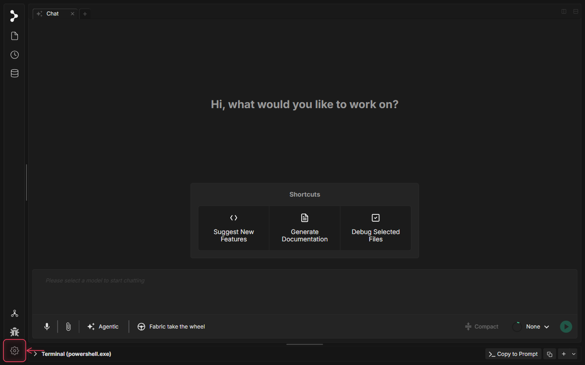
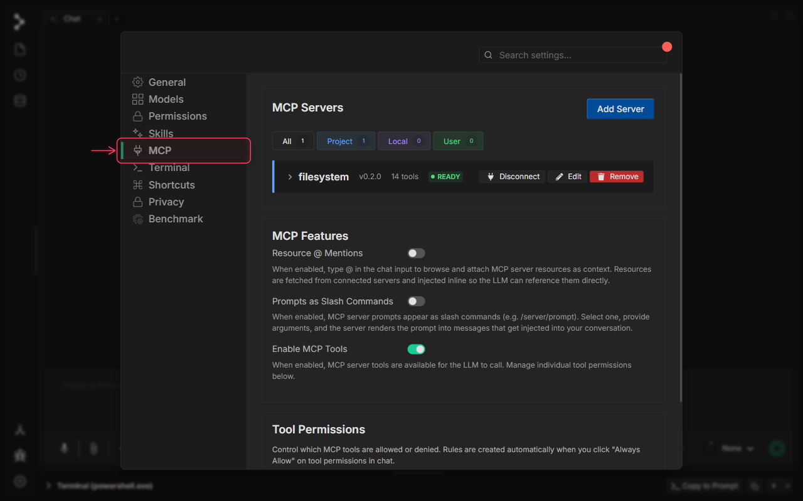
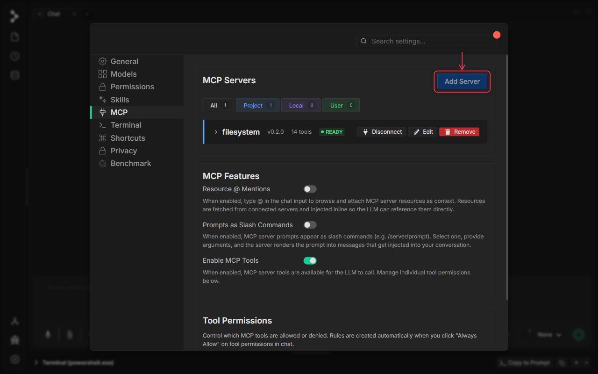
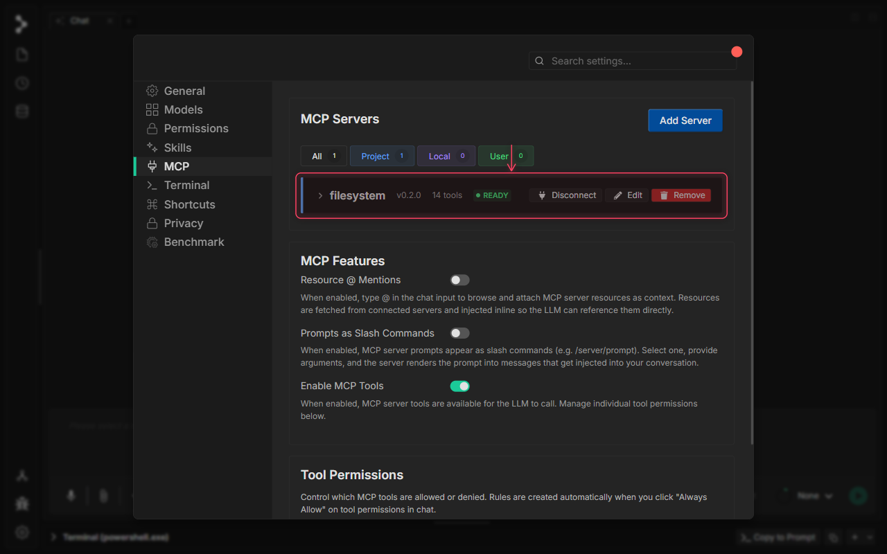
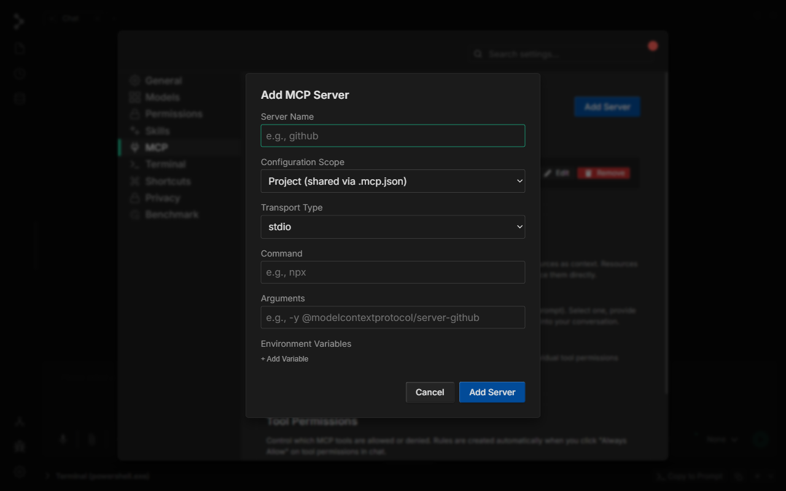
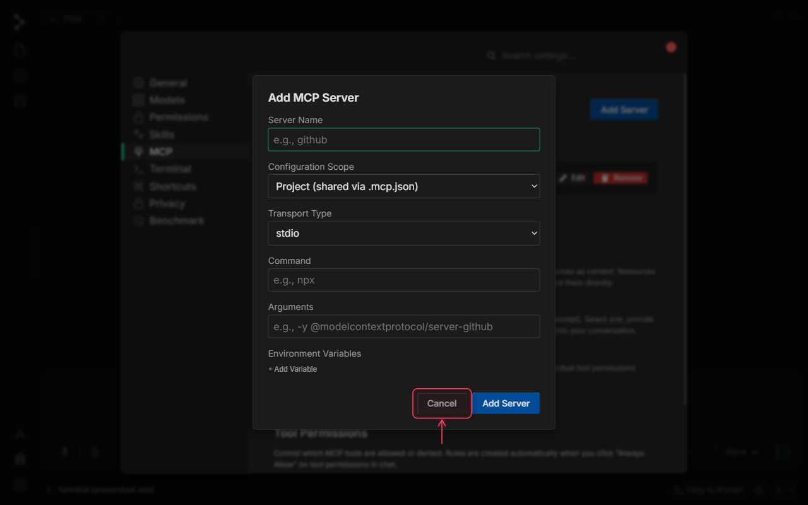
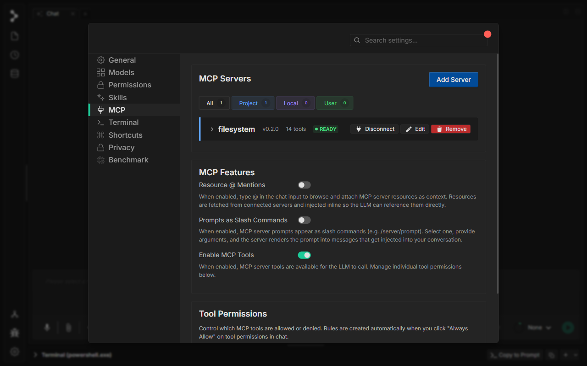
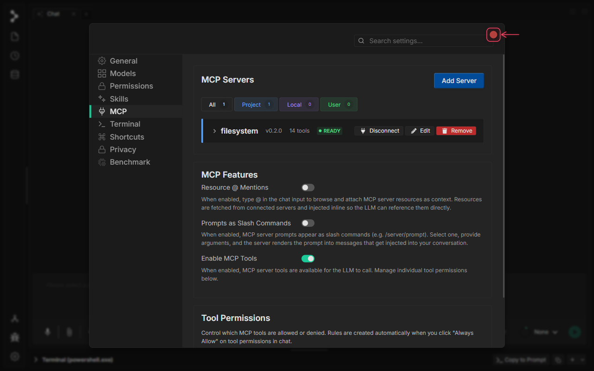

# Model Context Protocol (MCP) in Fabric

🚧 Video tutorial is in progress.

## What is Model Context Protocol (MCP) in Fabric?

The **Model Context Protocol (MCP)** integration in Fabric provides a standardized way to extend your AI assistant's capabilities through external tools and services. MCP is an open protocol that enables secure, bidirectional communication between Fabric and external MCP servers, allowing the AI to access real-time data, execute specialized tools, and interact with third-party services.

Through the MCP Settings interface, you can configure server connections, manage authentication, monitor server health, and control which tools are available to the AI assistant. Each MCP server can expose multiple tools that appear alongside Fabric's native capabilities during tool-use sessions.

MCP servers run in isolated worker processes with their own permission model, ensuring that external tool access is explicit, auditable, and under your control.

## When to use Model Context Protocol (MCP) in Fabric

Use MCP in Fabric when you want to:

* **Connect to External Services** — Integrate real-time data sources like databases, APIs, or cloud services that the AI can query during conversations.
* **Extend Tool Capabilities** — Add specialized tools for domain-specific tasks (e.g., Jira integration, Slack notifications, custom CI/CD workflows).
* **Enable Multi-Server Workflows** — Configure multiple MCP servers simultaneously to compose complex automation pipelines.
* **Maintain Security Boundaries** — Use MCP's permission system to explicitly approve or deny tool access on a per-server basis.

## How to use Model Context Protocol (MCP) in Fabric

### Step 1: Open Application Settings

Click the settings gear icon at the bottom of the left sidebar to open the Settings modal.

### Step 2: Navigate to MCP Settings

Click the **MCP** tab in the Settings navigation sidebar to access the Model Context Protocol configuration panel.

### Step 3: MCP Settings Panel Overview

The MCP Settings panel shows all configured servers in the **MCP Servers** section at the top. Use the scope filter tabs — **All**, **Project**, **Local**, and **User** — to view servers by where their configuration is stored.

### Step 4: Understanding Server Cards

Each server card shows its name, version, tool count, and live connection status. A green **READY** badge means the server is connected and its tools are available. Use the **Disconnect**, **Edit**, and **Remove** buttons on each card to manage the server.

### Step 5: MCP Feature Toggles

The **MCP Features** section controls how MCP integrates with the chat interface. **Resource @ Mentions** lets you attach MCP resources using `@` in the chat input. **Prompts as Slash Commands** exposes server prompts as `/server/prompt` slash commands. **Enable MCP Tools** is the master switch — when off, no MCP tools can be invoked regardless of per-server settings.

### Step 6: Add a New MCP Server

Click **Add Server** to open the configuration dialog for registering a new MCP server connection.

### Step 7: Enter a Server Name

Give your server a descriptive name (e.g., `github-mcp`, `postgres-tools`). This name appears in the server card and in permission prompts during chat sessions.

### Step 8: Choose Server Type and Command

Select the server **Transport Type**: use **stdio** for local processes launched by a command (e.g., `npx @modelcontextprotocol/server-github`), or **http/sse** for remote HTTP endpoints. For stdio servers, enter the executable and its arguments. For http/sse, enter the endpoint URL.

### Step 9: Set Configuration Scope

Choose the **Configuration Scope** to control where the config is saved: **Project (shared via .mcp.json)** commits it to your repo so the whole team shares it, **Local** stores a machine-only override, and **User** saves to your global Fabric profile.

### Step 10: Save or Cancel

Click **Add Server** to register and connect immediately, or click **Cancel** to discard. Once saved, Fabric launches the server process and the new card appears in the list with its live status.

### Step 11: Tool Permissions

The **Tool Permissions** section gives granular control over which MCP tools the AI is allowed to call. Permission rules are created automatically when you click **Always Allow** on a tool prompt during a chat session, and can be reviewed or removed here at any time.

### Step 12: Close Settings

Click the **×** button or press **Escape** to close the Settings modal. All connected MCP servers are now active — their tools are available to the AI in every chat session.

