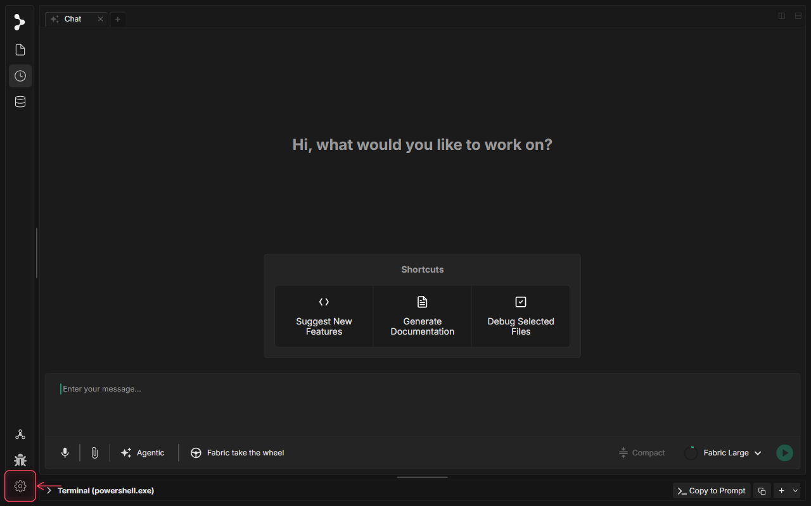
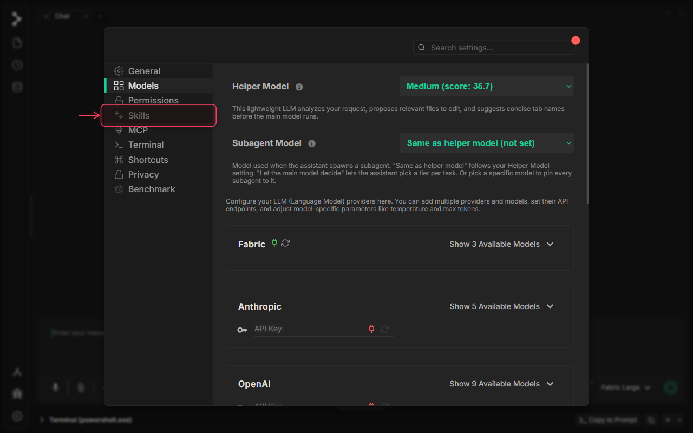
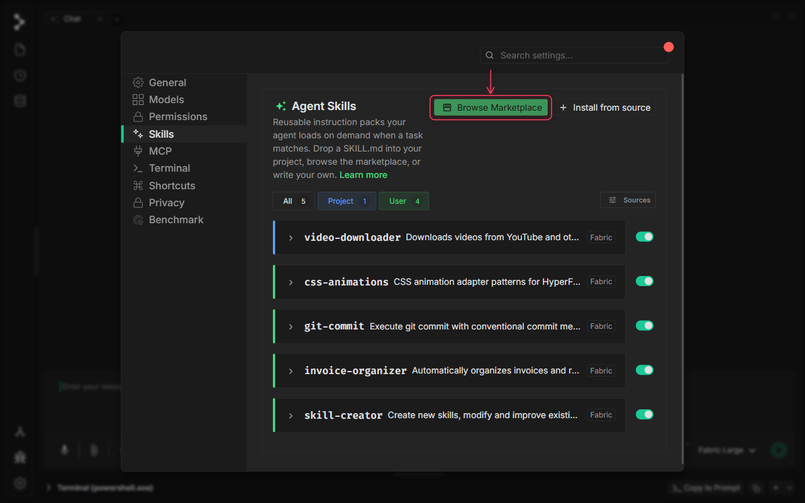
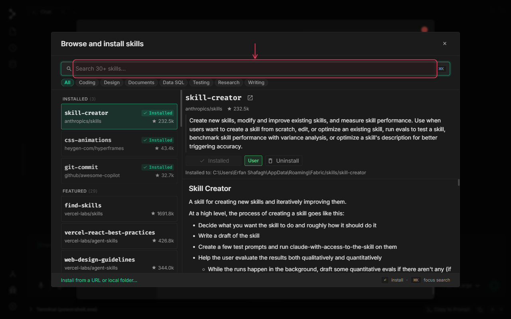
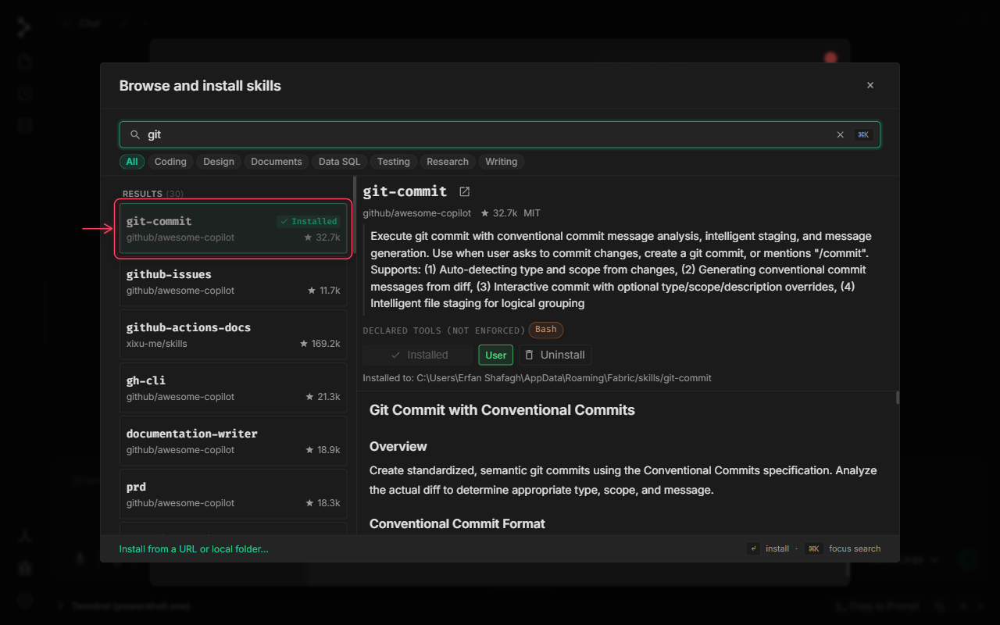
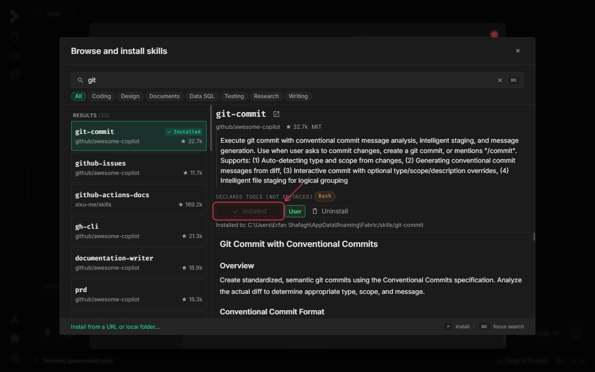

# Agent Skills Marketplace

🚧 Video tutorial is in progress.

## What is Agent Skills Marketplace in Fabric?

The Agent Skills Marketplace is a centralized registry and discovery hub built directly into Fabric for finding, installing, and managing reusable instruction packs called **Skills**.

Skills act as specialized behavior profiles or add-ons that customize the capabilities of your AI assistant for specific domains, languages, or tasks. Conceptually, a Skill is represented as a structured markdown file (`SKILL.md`) containing system prompt guidelines, capability declarations, and tool restrictions. The Marketplace fetches published skills from the global `skills.sh` registry, enabling developers to search the catalog, view previews, install them to global (user) or local (project) scopes, and keep them updated seamlessly without manual prompt duplication.

## When to use Agent Skills Marketplace

Integrate skills from the marketplace into your workflow when you need to:

* **Specialize Agent Behavior**: Eliminate repetitive context prompting by equipping your agent with dedicated skills for complex roles (such as a vitest unit-test writer, code refactorer, or database auditor).
* **Standardizing Workflows**: Ensure all team members' local agents generate code that adheres to the same stylistic guidelines, linting rules, and pull request structures by installing project-scoped skills.
* **Leverage Optimized Prompts**: Deploy community-vetted, highly-optimized system prompts and instruction sets for specific frameworks, tools, or APIs without having to write and iterate on them yourself.

## How to use Agent Skills Marketplace

### Step 1: Open Application Settings

Click the settings gear icon at the bottom of the left sidebar to open the Settings modal.

### Step 2: Navigate to the Skills Settings

Click the 'Skills' tab in the Settings navigation sidebar to view your currently installed agent skills and configuration options.

### Step 3: Launch the Skills Marketplace

Click the 'Browse Marketplace' button in the top header action strip to open the skills.sh marketplace overlay.

### Step 4: Search the Marketplace Catalog

Type a search query (e.g., 'git') into the search input field at the top of the marketplace overlay to filter skills by keywords.

### Step 5: Select a Skill to Preview

Click on a skill row from the search results on the left column to view its README preview, description, version, and details in the preview pane on the right.

### Step 6: Install the Skill

Click the 'Install' button at the top of the skill preview pane to download and register the skill in your environment.

