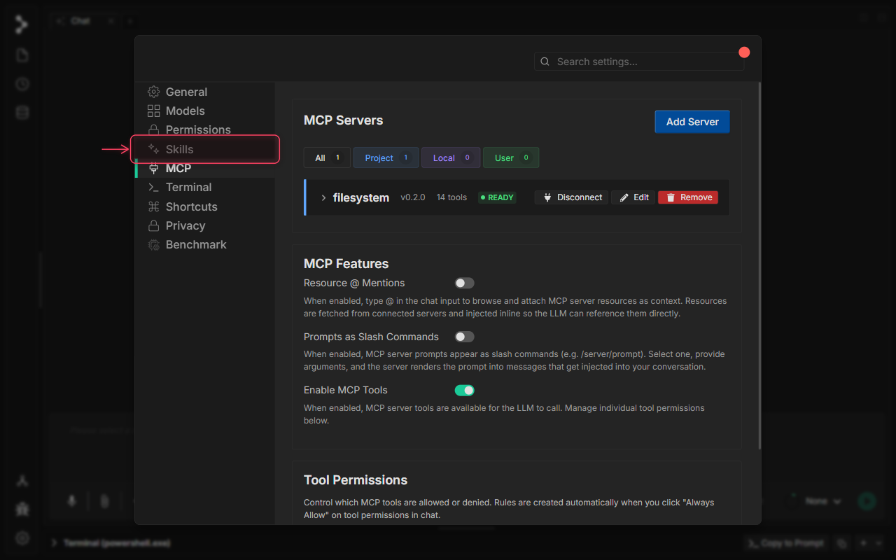
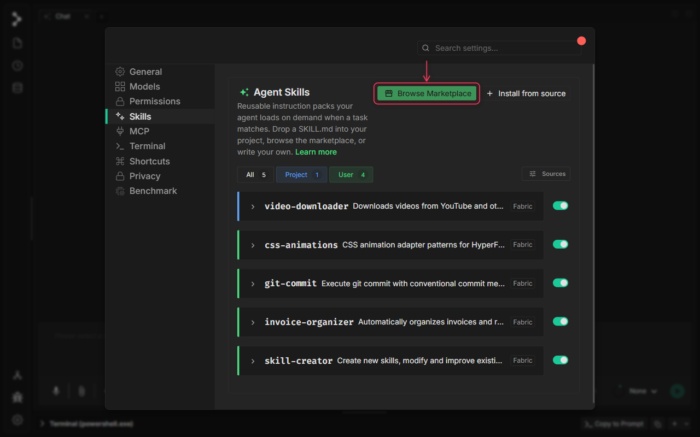
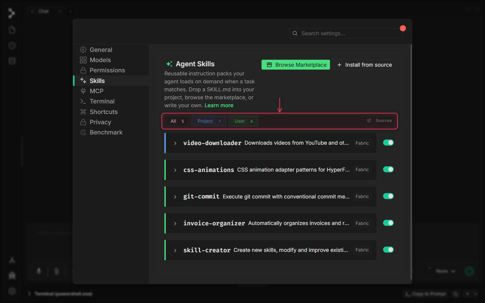
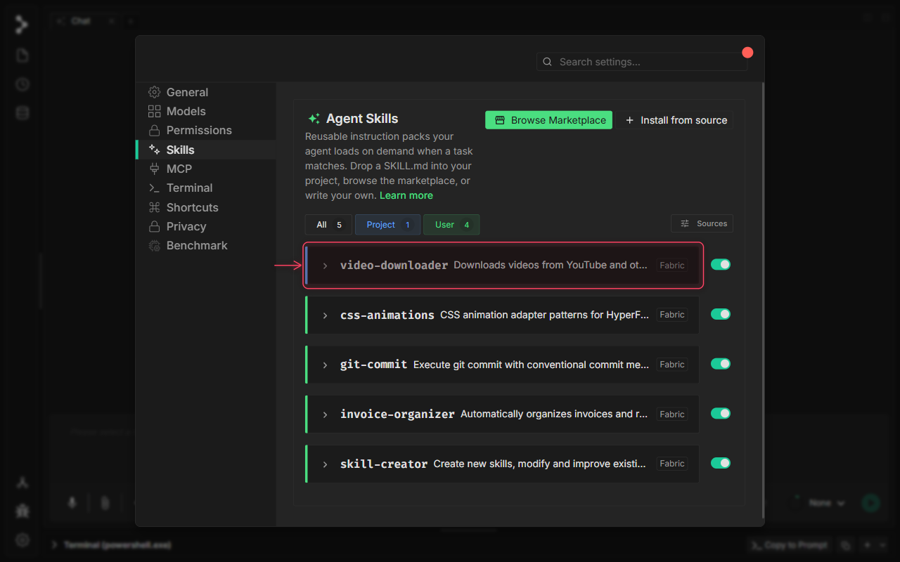
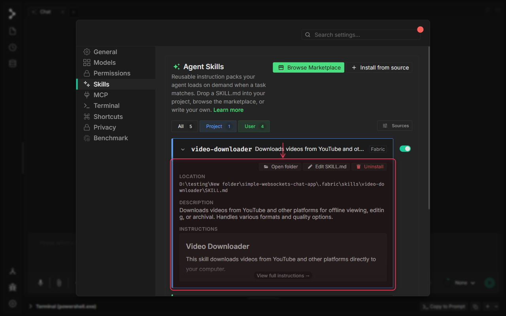
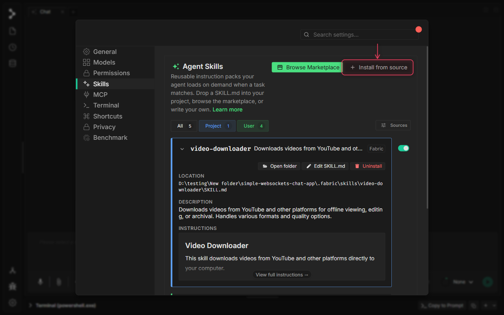
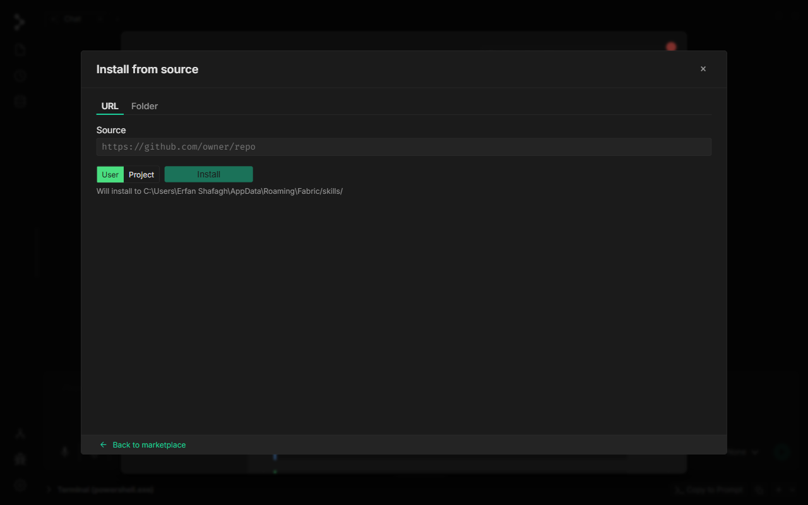

# Fabric のエージェントスキル

🚧 ビデオチュートリアルは作成中です。

## Fabric のエージェントスキルとは？

**エージェントスキル** は、タスクがそのスコープに一致したときに Fabric の AI エージェントがオンデマンドで読み込む、再利用可能な指示パックです。各スキルは、システムプロンプトのガイドライン、機能の宣言、オプションのツール制限を含む `SKILL.md` ファイルによって定義され、設定画面では切り替え可能なカードとして表示されます。

スキルを使うと、チームのコーディングスタイル、特定のフレームワークの慣習、あるいはあらゆる専門的なワークフローを、会話のたびにコンテキストを説明し直すことなく AI に教えられます。コミュニティのマーケットプレイスからスキルをインストールしたり、Fabric に URL やローカルフォルダを指定したり、`SKILL.md` をプロジェクトに直接配置したりできます。

## Fabric でエージェントスキルを使うべきとき

次のような場合に Fabric でスキルを使用します。

* **エージェントの動作を専門化する** — 複雑な役割（vitest の作成者、データベース監査者、コードのリファクタリング担当）のための専用の専門知識を、毎回コンテキストを繰り返すことなく AI に装備させます。
* **チームのワークフローを標準化する** — プロジェクトスコープのスキルをインストールして、各チームメンバーのエージェントが同じスタイルガイドラインと PR 構造に従ったコードを生成するようにします。
* **コミュニティのプロンプトを活用する** — 特定のフレームワーク、ツール、API 向けに最適化され、コミュニティで検証された指示セットを、自分で書くことなくデプロイします。
* **カスタムスキルを書く** — プロジェクトの `.fabric/skills/` フォルダに `SKILL.md` を配置すると、Fabric が自動的に検出します。

## Fabric でエージェントスキルを使う方法

### ステップ 1: アプリケーション設定を開く

左サイドバーの下部にある設定の歯車アイコンをクリックして、設定モーダルを開きます。

### ステップ 2: スキルタブに移動する

設定サイドバーの **Skills** をクリックして、エージェントスキルパネルを開きます。ここで、インストール済みのすべてのスキルを表示および管理できます。

### ステップ 3: スキルパネルの概要

スキルパネルは、インストール済みのすべてのスキルを、名前、説明、バージョン、スコープとともに一覧表示します。**Browse Marketplace** を使ってコミュニティスキルを見つけたり、**Install from source** を使って URL やローカルフォルダからスキルを追加したりできます。

### ステップ 4: スコープでスキルをフィルターする

スコープフィルターバーを使ってリストを絞り込みます。**All** はすべてを表示し、**Project** はリポジトリ（`.fabric/skills/`）に保存されたスキルを表示し、**User** はすべてのプロジェクトで利用できるホームディレクトリ内のスキルを表示します。**Sources** ボタンを使うと、Fabric が `.claude/`、`.cursor/`、`.agents/` フォルダからもスキルを読み込むかどうかを制御できます。

### ステップ 5: スキルカードを展開する

スキルカードの任意の場所をクリックすると展開され、ファイルパス、スコープ、許可されたツール、バンドルされたファイル、レンダリングされた SKILL.md の本文など、すべての詳細が表示されます。もう一度クリックすると折りたたまれます。

### ステップ 6: スキルカードの詳細

展開されたビューには、スキルファイルがディスク上のどこにあるか、その互換性メタデータ、SKILL.md の指示のレンダリングされたプレビューが表示されます。**Edit** ボタンを使ってファイルを Fabric で直接開いたり、**ゴミ箱** アイコンを使ってアンインストールしたりできます。アンインストール後、**Undo** オプション付きの確認トーストが 6 秒間表示されます。

### ステップ 7: URL またはフォルダからスキルをインストールする

**Install from source** をクリックしてインストールダイアログを開きます。ここで、GitHub の URL、SKILL.md への直接 URL を貼り付けたり、ディスク上のローカルフォルダを指定したりできます。

### ステップ 8: インストールダイアログ

インストールダイアログには 2 つのタブがあります。skills.sh レジストリを閲覧するための **Marketplace** と、直接インストールするための **URL / Folder** です。公開されている任意の `SKILL.md` の URL、またはスキルを指す GitHub リポジトリの URL を貼り付け、スコープ（**Project** または **User**）を選択し、**Install** をクリックします。

### ステップ 9: インストールダイアログを閉じる

**×** をクリックするか **Escape** を押してダイアログを閉じ、スキルパネルに戻ります。

