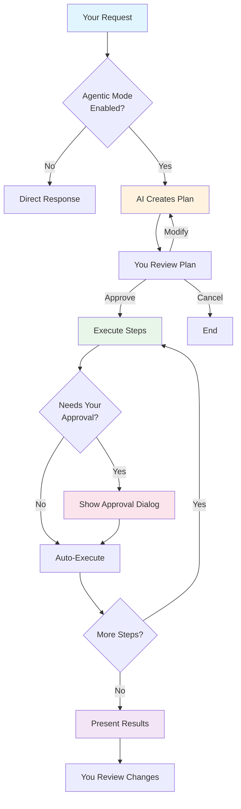

# Agentic Mode

Let AI autonomously plan and execute complex, multi-step tasks.

## What is Agentic Mode?

Agentic mode transforms Fabric from a conversational assistant into an autonomous agent that can:

- **Break down** complex tasks into manageable steps
- **Execute** code, commands, and file operations
- **Read and modify** files in your project
- **Make decisions** based on results and errors
- **Iterate** until the task is complete

All with your approval at key checkpoints, so you maintain full control.

!!! example "When to Use Agentic Mode"
    - Refactoring entire modules
    - Creating new features with multiple files
    - Running test suites and fixing failures
    - Setting up project configurations
    - Debugging complex multi-file issues

---

## How It Works



### 1. Planning Phase

When you send a request with agentic mode enabled, the AI first creates a detailed plan:

```
Task: Refactor UserService to use dependency injection

Plan:
┌─────────────────────────────────────────────────────────────┐
│ Step 1: Analyze current UserService implementation          │
│ Step 2: Create interfaces for dependencies                  │
│ Step 3: Refactor UserService constructor                    │
│ Step 4: Update all call sites                               │
│ Step 5: Update tests with mocked dependencies               │
│ Step 6: Run tests to verify changes                         │
└─────────────────────────────────────────────────────────────┘

[Approve] [Modify Plan] [Cancel]
```

### 2. Execution Phase

With your approval, the AI executes each step:

- **File reads** - Automatically executed
- **File writes/edits** - Require approval (configurable)
- **Command execution** - Require approval (configurable)
- **Destructive operations** - Always require approval

You'll see progress updates as each step completes:

```
✓ Step 1: Analyzed UserService (3 dependencies found)
✓ Step 2: Created IUserRepository, IEmailService interfaces
→ Step 3: Refactoring UserService... [In Progress]
○ Step 4: Pending
○ Step 5: Pending
○ Step 6: Pending
```

### 3. Review Phase

After completion, review all changes:

```
Completed! Here's what changed:

Files Created:
  + src/interfaces/IUserRepository.ts
  + src/interfaces/IEmailService.ts

Files Modified:
  ~ src/services/UserService.ts (47 lines changed)
  ~ src/tests/UserService.test.ts (23 lines changed)
  ~ src/app.ts (5 lines changed)

Tests: 12 passed, 0 failed

[Accept All] [Review Changes] [Revert All]
```

---

## Enabling Agentic Mode

### Quick Toggle

Click the **Agent** toggle in the toolbar to enable agentic mode for the current chat.

---

## Approval Controls

Configure what requires your approval:

### Permission Settings

For each chat, you can configure:

| Setting | Options | Default |
|---------|---------|---------|
| **Bash Commands** | Allow / Blocklist per chat | Blocklist |
| **File Editing** | Enabled / Disabled per chat | Disabled |
| **Screenshots** | Enabled / Disabled per chat | Disabled |

These settings are configured within individual chat sessions, allowing you to have fine-grained control over what the agentic agent can do in each conversation.

### Approval Dialog

When approval is needed, you'll see:

```
┌─────────────────────────────────────────────────────────────┐
│ 🔧 Tool: File Write                                         │
│                                                             │
│ Path: src/services/UserService.ts                           │
│                                                             │
│ Changes:                                                    │
│ ┌─────────────────────────────────────────────────────────┐│
│ │ - export class UserService {                            ││
│ │ + export class UserService implements IUserService {    ││
│ │     constructor(                                        ││
│ │ -     private db: Database                              ││
│ │ +     private userRepo: IUserRepository,                ││
│ │ +     private emailService: IEmailService               ││
│ │     ) {}                                                ││
│ └─────────────────────────────────────────────────────────┘│
│                                                             │
│ [Approve] [Skip] [Approve All Similar] [Cancel Task]       │
└─────────────────────────────────────────────────────────────┘
```

**Options:**

- **Approve** - Allow this action
- **Skip** - Skip this action, continue task
- **Approve All Similar** - Auto-approve similar actions (e.g., all file writes)
- **Cancel Task** - Stop the entire task

---

## Available Tools

In agentic mode, Fabric can use these tools:

### File Operations

| Tool | Description | Default Permission |
|------|-------------|-------------------|
| **Read** | Read file contents | Auto-approve |
| **Write** | Create new files | Ask once |
| **Edit** | Modify existing files | Ask once |
| **Delete** | Remove files | Always ask |
| **Rename** | Rename/move files | Ask once |
| **Glob** | Search for files by pattern | Auto-approve |

### Code Execution

| Tool | Description | Default Permission |
|------|-------------|-------------------|
| **Bash** | Execute shell commands | Ask once |
| **Node** | Run JavaScript/TypeScript | Ask once |
| **Python** | Run Python scripts | Ask once |

### Search

| Tool | Description | Default Permission |
|------|-------------|-------------------|
| **Grep** | Search file contents | Auto-approve |
| **Find** | Find files by name | Auto-approve |

### System

| Tool | Description | Default Permission |
|------|-------------|-------------------|
| **Screenshot** | Capture screen regions | Always ask |

---

## Best Practices

### Good Prompts for Agentic Mode

Be specific about what you want:

```
Refactor the authentication module:
1. Extract password hashing into a separate utility
2. Add rate limiting to login attempts
3. Create unit tests for the new utilities
4. Update existing tests
5. Run all tests to verify changes
```

Include constraints:

```
Create a REST API for the Product model.
- Use Express.js patterns from our existing routes
- Follow our error handling conventions in src/middleware/errors.ts
- Include validation using Zod
- Generate tests using Jest
- Don't modify any existing files except routes/index.ts
```

### Not Ideal for Agentic Mode

❌ **Vague requests:**
```
Make my code better
```

❌ **Simple questions:**
```
What is TypeScript?
```

❌ **Single-step tasks:**
```
Add a console.log to this function
```

### Task Decomposition

For very large tasks, break them into phases:

```
Let's refactor the user module in phases:

Phase 1 (now): Create the new interfaces and base classes
Phase 2 (next): Migrate UserService to new interfaces
Phase 3 (later): Update all consumers and tests

Start with Phase 1.
```

---

## Safety Features

### Automatic Safeguards

Fabric includes built-in protections:

- **No infinite loops** - Tasks have a maximum of 100 steps
- **Rollback capability** - All changes can be reverted
- **User approval** - Sensitive operations require explicit approval
- **Structured planning** - AI creates a plan before execution

### Manual Controls

| Control | Description |
|---------|-------------|
| **Pause** | Pause execution at any point |
| **Cancel** | Stop the task immediately |
| **Revert** | Undo all changes from the current task |
| **Review** | See all changes before accepting |

---

## Real-World Examples

### Example 1: Create a New Feature

```
Create a notification system for the application:

Requirements:
- Support email, SMS, and push notifications
- Use a factory pattern for notification types
- Store notification preferences per user
- Queue notifications for batch sending
- Include unit tests for all components

Follow our existing patterns in src/services/
```

### Example 2: Debug and Fix

```
The user search is returning duplicate results.

Debug the issue:
1. Check the UserSearchService
2. Look for duplicate joins or missing DISTINCT
3. Fix the issue
4. Add a test case that would catch this
5. Run all search-related tests
```

### Example 3: Upgrade Dependencies

```
Upgrade React from 17 to 18:

1. Update package.json
2. Run npm install
3. Fix any type errors
4. Update deprecated API usage (componentWillMount, etc.)
5. Update tests to use React 18 testing utilities
6. Run full test suite
7. List any breaking changes I need to review
```

---

## Troubleshooting

### Task Gets Stuck

If the AI seems stuck in a loop:

1. Press **Escape** or click **Pause**
2. Review the current step
3. Provide additional guidance or cancel

### Unexpected Changes

If the AI makes changes you didn't expect:

1. Click **Revert All** to undo changes
2. Be more specific in your next request
3. Set stricter approval permissions

### Running Out of Context

For long tasks, the AI may lose track:

1. Let the current task complete
2. Start a new task for the remaining work
3. Reference the previous work: "Continuing from the previous refactor..."

---

## Comparison: Chat vs. Agentic

| Aspect | Chat Mode | Agentic Mode |
|--------|-----------|--------------|
| **Interaction** | Back-and-forth | Autonomous with checkpoints |
| **File changes** | Suggestions only | Direct modifications |
| **Commands** | Manual execution | Automated execution |
| **Best for** | Questions, exploration | Implementation, refactoring |
| **Control** | Full control | Supervised autonomy |

---

## Next Steps

- [Tool Calling](tool-calling.md) - Understand available tools
- [Settings Reference](../reference/settings.md) - Configure agentic behavior
- [Chat Interface](../guide/chat.md) - Master the chat for non-agentic tasks
