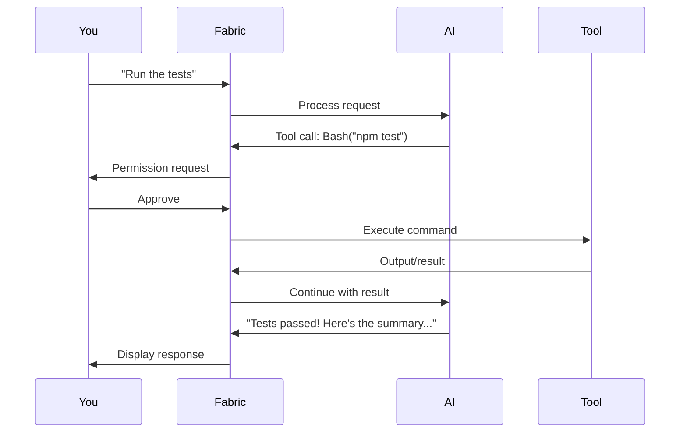

# Tool Calling

Understand how Fabric's AI uses tools to interact with your development environment.

## What is Tool Calling?

Tool calling allows the AI to go beyond text responses and take actions in your environment:

- **Read files** to understand your code
- **Write and edit files** to implement changes
- **Execute commands** to run tests, builds, and scripts
- **Search** through your codebase
- **Take screenshots** for visual context
- **Ask questions** when it needs clarification

These tools enable powerful workflows while keeping you in control through permission settings.

---

## How Tools Work



### Tool Call Flow

1. **You send a message** - Your request may require tool use
2. **AI decides** - The AI determines which tools are needed
3. **Permission check** - Fabric checks if approval is needed (via prepare phase)
4. **Execution** - The tool runs if approved
5. **Result processing** - AI uses the result to continue
6. **Response** - You see the final response with tool outputs

---

## Available Tools

### File Operations

#### Read

Read file contents to understand code.

| Property | Value |
|----------|-------|
| **Tool Name** | `Read` |
| **Permission** | Auto-approved (no prepare phase) |
| **Concurrency** | 4 concurrent reads |
| **Use case** | Understanding code, getting context |

```
Can you explain what src/utils/auth.ts does?
```

The AI will read the file and provide an explanation.

**Parameters:**
- `file_path` (required): Path to the file (relative to project root or absolute)

**Output Format:**
Returns content with line numbers in `cat -n` format (1-indexed).

#### Write

Create new files or completely replace existing file contents.

| Property | Value |
|----------|-------|
| **Tool Name** | `Write` |
| **Permission** | Requires approval (prepare phase) |
| **Concurrency** | 10 concurrent writes |
| **Use case** | Creating new components, utilities |
| **Max file size** | 10MB |

```
Create a new React component for displaying user profiles
```

**Parameters:**
- `file_path` (required): Absolute path to the file
- `content` (required): Complete file content
- `what` (required): What is being created/changed (concise description)
- `why` (required): Why this file is needed (explanation)

**Permission Info:**
Shows a diff with SEARCH/REPLACE blocks and indicates whether this is a "create" or "overwrite" action.

#### Edit

Modify existing files with surgical precision using exact string find-and-replace.

| Property | Value |
|----------|-------|
| **Tool Name** | `Edit` |
| **Permission** | Requires approval (prepare phase) |
| **Concurrency** | 1 (sequential edits only) |
| **Use case** | Bug fixes, refactoring, adding features |
| **Max file size** | 10MB |

```
Add error handling to the fetchUser function in api.ts
```

The AI shows you the exact changes before applying.

**Parameters:**
- `file_path` (required): Absolute path to the file
- `edits` (required): Array of edit operations, each containing:
    - `old_string` (required): Exact string to find (must be unique in file)
    - `new_string` (required): Replacement string
    - `what` (required): What this edit changes
    - `why` (required): Why this change is needed

**Features:**
- Each `old_string` must be unique in the file
- Supports fuzzy matching for minor whitespace/indentation differences
- Multiple edits are applied sequentially
- Shows helpful error messages with similar content suggestions if match fails

### Search Tools

#### Glob

Find files by pattern using glob syntax.

| Property | Value |
|----------|-------|
| **Tool Name** | `Glob` |
| **Permission** | Auto-approved (no prepare phase) |
| **Concurrency** | 3 concurrent searches |
| **Use case** | Finding files, understanding structure |
| **Max results** | 1000 files |

```
Find all TypeScript files in the components directory
```

**Parameters:**
- `pattern` (required): Glob pattern (e.g., `**/*.ts`, `src/**/*.tsx`)
- `path` (optional): Directory to search in (defaults to project root)

**Output:**
Returns file paths sorted by modification time (newest first).

**Auto-ignored:**
`node_modules`, `.git`, `dist`, `build`, `out` directories are automatically excluded.

#### Grep (Ripgrep)

Search file contents using patterns with ripgrep.

| Property | Value |
|----------|-------|
| **Tool Name** | `Grep` |
| **Permission** | Auto-approved (no prepare phase) |
| **Concurrency** | 2 concurrent searches |
| **Use case** | Finding usages, locating code |
| **Max results** | 200 matches (configurable) |

```
Where is the UserContext defined and used?
```

The AI searches your codebase and shows relevant locations.

**Parameters:**
- `query` (required): Search pattern (supports regex)
- `isRegex` (optional): Treat query as regex pattern
- `caseSensitive` (optional): Enable case-sensitive search
- `kind` (optional): Filter by file type
- `maxResults` (optional): Maximum results (default: 200)
- `includeGlobs` (optional): File patterns to include
- `excludeGlobs` (optional): File patterns to exclude

### Code Execution

#### Bash

Execute shell commands.

| Property | Value |
|----------|-------|
| **Tool Name** | `Bash` |
| **Permission** | Conditional (prepare phase checks command safety) |
| **Concurrency** | 1 (sequential execution only) |
| **Use case** | Running tests, builds, installations |
| **Timeout** | 30s default, 2min max |
| **Max output** | 100KB default, 512KB max |

**Safe commands** (often auto-approved):
```
npm test
npm run build
git status
ls -la
```

**Risky commands** (always require approval):
```
rm -rf
sudo
npm publish
git push --force
```

!!! warning "Command Safety"
    Fabric validates commands for dangerous patterns and paths outside the project directory. Always review commands before approving.

**Parameters:**
- `cmd` or `command` (required): Shell command to execute
- `cwd` (optional): Working directory (defaults to project root)
- `timeoutMs` (optional): Timeout in milliseconds (1s min, 2min max)
- `maxOutputBytes` (optional): Maximum output size

**Special Features:**
- Automatic bundled ripgrep (`rg`) support
- Exit code 1 handling for ripgrep (no matches) and test commands (test failures)
- Sanitized environment (colors disabled for clean LLM output)
- Path validation (blocks access to home directory and paths outside project)

### Visual Tools

#### Discover Screenshot Targets

Discover all available windows that can be captured.

| Property | Value |
|----------|-------|
| **Tool Name** | `DiscoverScreenshotTargets` |
| **Permission** | Requires approval (prepare phase) |
| **Concurrency** | 1 |
| **Use case** | Finding windows before taking screenshots |
| **Platforms** | macOS, Linux, Windows |

```
Show me what windows are available to screenshot
```

**Parameters:**
- `includeMinimized` (optional): Include minimized windows (may not work on all platforms)

**Output:**
Returns a list of windows with app name, title, and unique window ID.

#### Capture Screenshot

Capture a screenshot of a specific window.

| Property | Value |
|----------|-------|
| **Tool Name** | `CaptureScreenshot` |
| **Permission** | Requires approval (prepare phase) |
| **Concurrency** | 1 |
| **Use case** | UI debugging, visual verification |
| **Platforms** | macOS, Linux, Windows |
| **Optimization** | Auto-resized to max 1280x1280, JPEG compressed |

```
Take a screenshot of the current page and identify any layout issues
```

**Parameters:**
- `windowId` (required): Window ID from DiscoverScreenshotTargets
- `windowTitle` (optional): Window title for reference/logging
- `appName` (optional): Application name for reference/logging
- `outputPath` (optional): Custom output path (defaults to `.fabric/screenshots/` or temp dir)
- `format` (optional): Image format (`png` or `jpg`, default: `png`)

**Output:**
Returns the screenshot as a base64-encoded image block (optimized for LLM consumption) with metadata including file path, size, and compression ratio.

### Interaction Tools

#### Ask User Question

Ask the user a question and wait for their response.

| Property | Value |
|----------|-------|
| **Tool Name** | `AskUserQuestion` |
| **Permission** | Always requires approval (prepare phase) |
| **Concurrency** | Unlimited |
| **Use case** | Clarifying requirements, getting user input |
| **Caching** | Disabled (noCache: true) |

```
AI: "Should I use TypeScript or JavaScript for the new component?"
```

**Parameters:**
- `question` (required): The question to ask the user
- `context` (optional): Context explaining why this information is needed

**Output:**
Returns the user's answer from the permission response.

**Usage:**
Use ONLY when you genuinely need information you cannot determine yourself. This interrupts the user's workflow, so use sparingly.

### Workflow Tools

#### Task Modify

Modify approved implementation or test plans (used in agentic workflows).

| Property | Value |
|----------|-------|
| **Tool Name** | `TaskModify` |
| **Permission** | Auto-approved (no prepare phase) |
| **Concurrency** | Unlimited |
| **Use case** | Managing task workflows in agentic mode |
| **Caching** | Disabled (noCache: true) |

**Parameters:**
- `operations` (required): Array of task modification operations (add, update, delete, complete)
- `reason` (optional): Reason for the modification
- `nextTaskId` (optional): Next task to work on
- `targetPlan` (optional): Which plan to modify (`implementation` or `test`)

**Note:** This tool is primarily used by Fabric's internal agentic orchestration system.

---

## Permission System

### How Permissions Work

Tools use a two-phase execution model:

1. **Prepare Phase** - Validates inputs and determines if permission is needed
2. **Execute Phase** - Performs the actual operation (only called if permission granted)

Some tools skip the prepare phase entirely (auto-approved), while others always request permission.

### Permission Types

| Permission Check | Behavior | Examples |
|-----------------|----------|----------|
| **No prepare phase** | Always executes without asking | Read, Glob, Grep, TaskModify |
| **Conditional permission** | Asks only if needed based on validation | Bash (safe vs risky commands) |
| **Always ask** | Always requires approval | Write, Edit, Screenshots, AskUserQuestion |
| **Session-based** | "Always allow" option persists for the chat session | File editing tools |

### Permission Context

When requesting permission, tools provide rich context:

**File Editing:**
- SEARCH/REPLACE diff blocks
- Old vs new content comparison
- What and why explanations
- File path and action type (create/overwrite/edit)

**Bash Commands:**
- Full command string
- Disallowed command portion (if risky)
- Description of what the command does

**Screenshots:**
- Window title and app name
- Description of what's being captured

**Questions:**
- The question text
- Optional context explaining why it's needed

### Concurrency Limits

Tools have hard-coded concurrency limits to prevent runaway execution:

| Tool | Concurrent Limit | Why |
|------|-----------------|-----|
| **Read** | 4 | Balance between speed and resource usage |
| **Write** | 10 | Allow batch file creation |
| **Edit** | 1 | Sequential edits prevent conflicts |
| **Bash** | 1 | Prevent command interference |
| **Glob** | 3 | Fast file discovery |
| **Grep** | 2 | Resource-intensive searches |
| **Screenshots** | 1 | Screen capture operations |

**Important:** These are concurrent execution limits, NOT rate limits per minute. They control how many tool calls can run simultaneously.

---

## Tool Output Display

### In Chat

Tool outputs appear in collapsible sections:

```
┌─ 🔧 Bash: npm test ────────────────────────────────────────┐
│                                                            │
│ PASS src/utils/auth.test.ts                               │
│   ✓ should hash password correctly (12ms)                 │
│   ✓ should verify token (8ms)                             │
│   ✓ should reject expired tokens (5ms)                    │
│                                                            │
│ Tests: 3 passed                                           │
│ Time: 1.234s                                              │
│                                                            │
└────────────────────────────────────────────────────────────┘
```

### Tool Call History

View all tool calls in the current conversation:

1. Click the **Tools** icon in the message header
2. See a list of all tool calls
3. Expand any call to see full input/output

---

## Safety Features

### Blocked Commands

Fabric blocks dangerous patterns by default:

```bash
# Always blocked
rm -rf /
sudo rm -rf
:(){ :|:& };:
> /dev/sda

# Blocked without explicit approval
git push --force
npm publish
docker run --privileged
```

### Path Restrictions

Bash commands are validated for paths:

- **Auto-allowed:** Paths within project directory
- **Requires permission:** Paths outside project (e.g., `/tmp`)
- **Always blocked:** Home directory paths (`~` or `$HOME`)

The validation resolves absolute paths intelligently to detect when a command attempts to access restricted locations.

### Command Safety Checks

The Bash tool validates commands through multiple layers:

1. **String validation** - Blocks empty, overly long, or binary-containing commands
2. **Path validation** - Smart path resolution with project boundary checks
3. **Pipeline validation** - Checks each command in a pipeline against allowed/disallowed lists
4. **Permission checks** - Uses a configurable allowlist of safe commands

### File Size Limits

Write and Edit tools enforce a 10MB maximum file size to prevent memory issues. Larger files must be edited manually.

---

## Best Practices

### Be Specific About Files

Instead of:
```
Update the component
```

Try:
```
Update src/components/UserCard.tsx to add a loading state
```

### Verify Before Approving

Always review:

- **File paths** - Is it modifying the right file?
- **Changes** - Do the edits look correct?
- **Commands** - Is the command safe?

### Use Read-Only First

When exploring unfamiliar code:

1. Ask questions first (read-only)
2. Understand the codebase
3. Then request modifications

### Review Command Output

After running commands:

- Check exit codes (0 = success)
- Review any errors or warnings
- Verify expected behavior

### Understand Tool Limits

- **Concurrency limits** prevent too many simultaneous operations, not total operations
- **File size limits** are hard-coded at 10MB
- **Search result limits** can be configured but default to 200 (Grep) or 1000 (Glob)
- **Command timeouts** range from 1 second minimum to 2 minutes maximum

---

## Troubleshooting

### Tool Not Working

**File not found:**
```
Error: ENOENT: no such file or directory
```
- Check the file path is correct
- Ensure you're in the right project directory
- Use relative paths from project root

**Permission denied:**
```
Error: EACCES: permission denied
```
- Check file system permissions
- Ensure Fabric has access to the directory

**File too large:**
```
File too large: 15.32MB (maximum: 10MB)
```
- Edit tools can't handle files over 10MB
- Consider manual editing or alternative approaches

### Command Fails

**Command not found:**
```
bash: npm: command not found
```
- The tool may not be in PATH
- Try using full path: `/usr/local/bin/npm`

**Timeout:**
```
Command timed out after 60s
```
- Command took too long (max 2 minutes)
- Try breaking into smaller steps
- Check for infinite loops

**Path outside project:**
```
Error: path_outside_project
```
- Command tried to access files outside project directory
- Approve the permission request if legitimate
- Paths to home directory are always blocked

### Unexpected Behavior

**Wrong file modified:**
- Be more specific with file paths
- Use absolute paths or paths relative to project root

**Changes didn't apply:**
- Check for syntax errors in the changes
- Verify the file wasn't locked
- For Edit tool: ensure `old_string` is unique in the file

**Edit string not found:**
```
Edit 1: old_string not found in file
```
- The exact string doesn't exist in the file
- Re-read the file to get the current content
- Check for whitespace/indentation differences
- Tool will suggest similar content if available

---

## Tool Reference

### Quick Reference Card

| Tool | Internal Name | Concurrency | Permission | Use For |
|------|--------------|-------------|------------|---------|
| **Read** | `Read` | 4 | Auto | Understanding code |
| **Write** | `Write` | 10 | Always ask | Creating files |
| **Edit** | `Edit` | 1 | Always ask | Modifying files |
| **Bash** | `Bash` | 1 | Conditional | Running commands |
| **Glob** | `Glob` | 3 | Auto | Finding files |
| **Grep** | `Grep` | 2 | Auto | Searching content |
| **Discover Screenshots** | `DiscoverScreenshotTargets` | 1 | Always ask | Finding windows |
| **Capture Screenshot** | `CaptureScreenshot` | 1 | Always ask | Visual capture |
| **Ask User** | `AskUserQuestion` | Unlimited | Always ask | Getting clarification |
| **Task Modify** | `TaskModify` | Unlimited | Auto | Workflow management |

### Tool Capabilities Summary

**Read-only tools (safe):**
- Read
- Glob
- Grep

**Write tools (require permission):**
- Write (create/overwrite files)
- Edit (modify files with SEARCH/REPLACE)

**Execution tools (potentially dangerous):**
- Bash (shell command execution with safety checks)

**Visual tools (require permission):**
- DiscoverScreenshotTargets
- CaptureScreenshot

**Interaction tools (always ask):**
- AskUserQuestion

**Workflow tools (internal):**
- TaskModify

---

## Next Steps

- [Agentic Mode](agentic-mode.md) - Use tools autonomously
- [Chat Interface](../guide/chat.md) - Basic chat interface guide
- [Settings Reference](../reference/settings.md) - Configure Fabric settings
