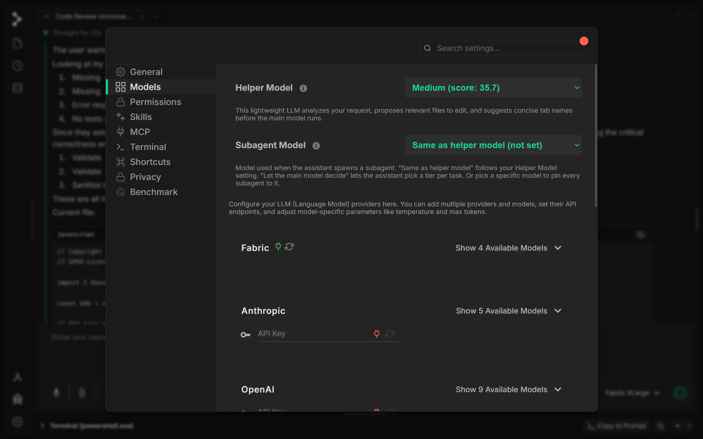

# Models

Fabric works with two types of models: **Fabric's own hosted models** (no API key needed) and **external providers** you connect with your own API key. You can mix and match — use Fabric models for day-to-day work and bring in Anthropic or OpenAI when you need a specific capability.

---

## Changing Your Model

Open **Settings → Models** to manage your model setup. From here you can:

- Set the **Helper Model** — the lightweight model Fabric uses for background tasks like editing files and suggesting tab names
- Set the **Subagent Model** — the model used when Fabric spawns a sub-agent (defaults to the same as your helper model)
- Add API keys for external providers
- See and toggle which models are available for each provider

You can also switch the active model per conversation directly from the **model selector** in the chat input bar without opening settings.

---

## Fabric Models

Fabric's own models run on Fabric's infrastructure and are available as soon as you sign in — no API key required.

| Model | Best for |
|-------|----------|
| **XLarge** | Hard problems, complex reasoning, architecture decisions |
| **Large** | Feature development, code review, large context tasks |
| **Medium** | Everyday coding, refactoring, explanations |
| **Small** | Quick edits, tab naming, background helper tasks |

All Fabric models support vision (image input), tool use, and long context windows up to 262K tokens.

---

## External API Providers

Connect your own API key to access models from any of the supported providers. Go to **Settings → Models**, find the provider, paste your key, and the models become available in the selector.

### Anthropic

Anthropic's Claude models are strong at reasoning, following complex instructions, and long document tasks.

- **API key**: Get one at [console.anthropic.com](https://console.anthropic.com)
- **Supports**: Vision, PDF input, tool use, extended thinking

Available tiers: Opus (most capable), Sonnet (balanced), Haiku (fast and lightweight)

### OpenAI

OpenAI's GPT models are widely used and well-supported across the ecosystem.

- **API key**: Get one at [platform.openai.com](https://platform.openai.com)
- **Supports**: Vision, PDF input, tool use, web search, reasoning modes

Available tiers range from high-capability reasoning models to fast, cost-efficient options.

### Google

Google's Gemini models excel at long context, multimodal input, and tasks that benefit from code execution.

- **API key**: Get one at [aistudio.google.com](https://aistudio.google.com)
- **Supports**: Vision, PDF, tool use, web search, code execution, reasoning

Available tiers: Pro (most capable) and Flash (fast, cost-efficient).

### OpenRouter

OpenRouter gives you access to a wide range of third-party models through a single API key — useful if you want to try models from xAI, DeepSeek, Qwen, and others without managing multiple accounts.

- **API key**: Get one at [openrouter.ai](https://openrouter.ai)
- **Supports**: Tool use, streaming

### DeepSeek

DeepSeek offers strong coding and reasoning models at low cost.

- **API key**: Get one at [platform.deepseek.com](https://platform.deepseek.com)
- **Supports**: Tool use, reasoning (on/off), streaming

### Cerebras

Cerebras runs inference on custom hardware, delivering very fast token generation speeds.

- **API key**: Get one at [cloud.cerebras.ai](https://cloud.cerebras.ai)
- **Supports**: Tool use, streaming

### Local Models

Fabric can connect to a locally running model server (Ollama, LM Studio, vLLM, LocalAI, and other OpenAI-compatible endpoints). No API key needed — Fabric auto-detects what's running on your machine.

- **Setup**: Start your local server and select **Local** in Settings → Models
- Fabric probes common ports automatically and lists available models

---

## Choosing the Right Model

A few rules of thumb:

- **For complex tasks** (architecture, debugging hard problems, writing migrations) — use a large or XLarge tier model. Slower and costlier, but fewer mistakes.
- **For everyday tasks** (quick edits, answering questions, reformatting) — a medium or small model is faster and cheaper with no quality loss.
- **For background work** (the helper and subagent model) — Fabric defaults to a cost-efficient model automatically. You can change this in Settings → Models if you want more power for automated steps.
- **Free options** — Google (Gemini Flash), Mistral, and OpenRouter all have free tiers or free models. Good for getting started without spending anything.

!!! tip "Switch mid-conversation"
    You can change the model in the middle of a conversation from the dropdown in the chat bar. The new model picks up from the current context — no need to start over.
