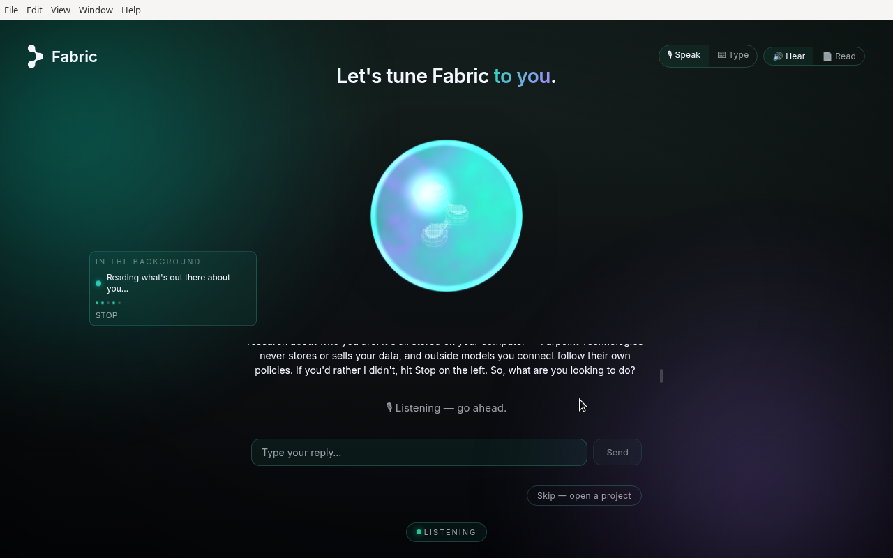
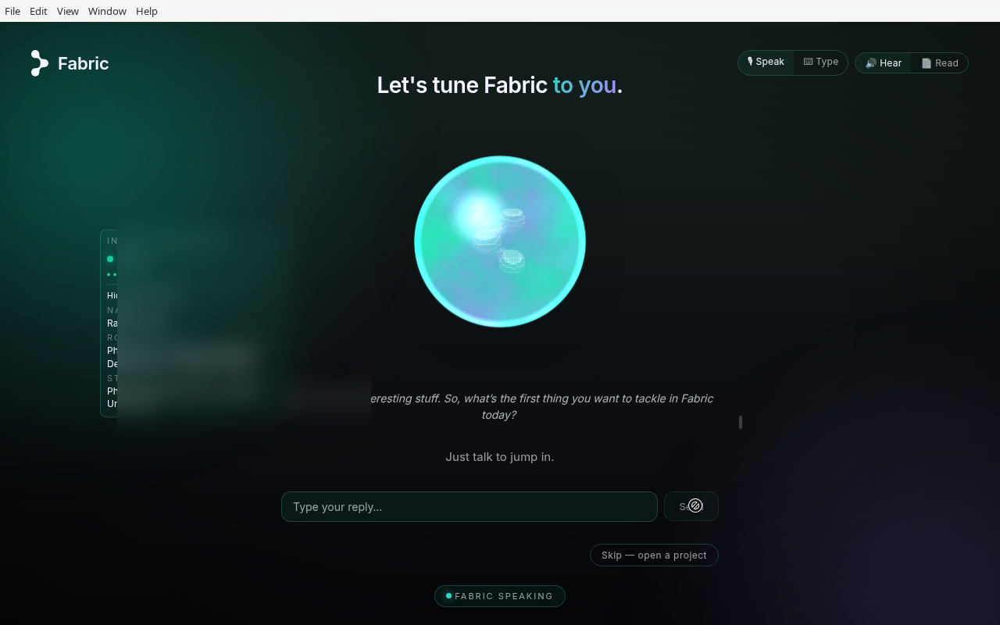
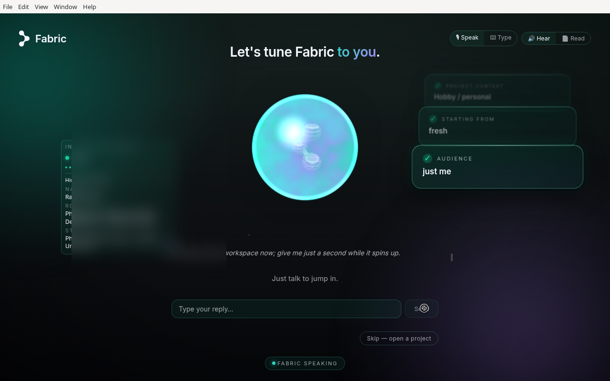
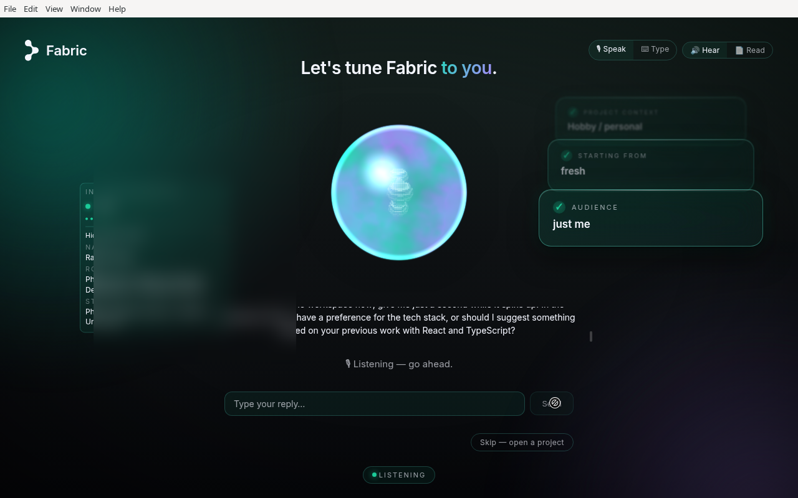
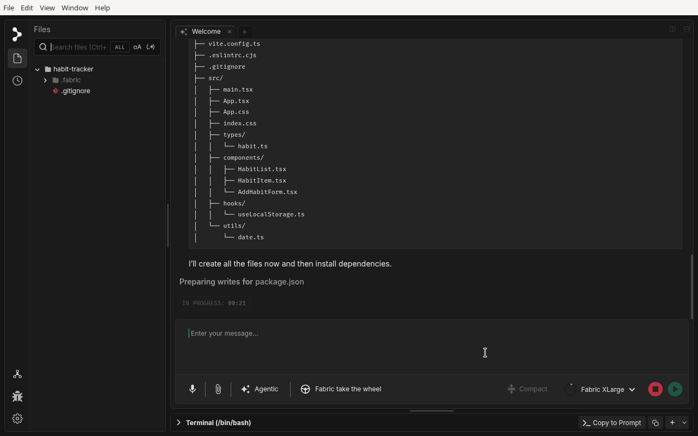
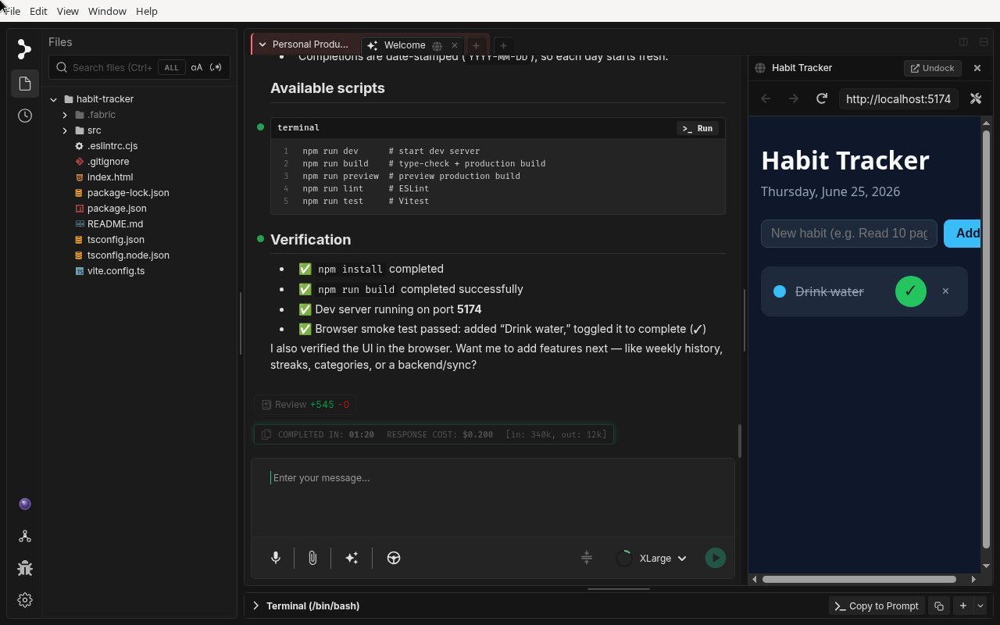

# Onboarding: Meet Visr

## What is Onboarding in Fabric?

The first time you open Fabric, you're greeted by **Visr** (rhymes with "wiser") — a voice-first setup agent that tunes Fabric around the work you actually do. Instead of a click-through tour, you have a short conversation: you say what you're working on, Visr asks a few quick questions about your project and how you like to work, and while you talk it quietly researches your public and on-disk footprint to skip questions it can already answer. When you're done, Visr opens a workspace built for that project — often with the first files already scaffolded and the dev server running — so your very first screen in Fabric is your own project, not a blank page.

The whole thing is voice-first but works just as well if you type, and you can skip straight to a blank workspace at any time.

## When to use Onboarding

Onboarding is most useful when you want to:

* **Get set up fast on your first launch**: It starts automatically the first time you open Fabric after installing it.
* **Spin up a brand-new project**: Re-run it when you want Fabric to create and tailor a fresh workspace through conversation rather than wiring it up by hand.
* **Let Fabric learn your context**: The facts Visr gathers — your stack, your audience, how much detail you like — personalize Fabric's later suggestions.

## How to use Onboarding

### Step 1: Say hello to Visr

On first launch, Visr introduces itself over the glowing orb and opens with a simple question: *"So, what are you looking to do?"* The orb reacts as it listens and speaks. Just talk — or type your reply in the box — to answer. A privacy line spells out that the background research stays on your machine and that you can stop it at any time.

### Step 2: Tell Visr what you're working on

Describe your project in your own words ("a habit-tracker web app, mostly a personal project"). As you talk, the background-research panel fills in on the left — a "Done" card with what Visr found about you (name, role, what you build). This is what lets Visr skip questions it can already answer, like which languages and frameworks you tend to use. The research stays local, and you can stop it at any time.

### Step 3: Confirm the details

Each thing Visr learns appears as a small fact card on the right — "Hobby / personal", "Just me", and so on. Visr plays the details back to you so you can correct anything before it acts on them.

### Step 4: Let Visr propose your setup

Once it has enough, Visr stops asking and starts proposing — weaving in what the research found: *"…based on your previous work with React and TypeScript, want me to set it up that way?"* Confirm or steer it somewhere else.

### Step 5: Watch your workspace build

Visr hands off to Fabric, which scaffolds the project for real — creating the file tree, writing the starter files, and installing dependencies. You can watch the plan run in the chat while the file explorer fills in on the left.

### Step 6: Start building

When it's finished, you land in a working workspace: the project files on the left, a live preview of the running app on the right, and a verification summary in the chat (install built, dev server up, a quick smoke test passed). From here you're in normal Fabric — keep the conversation going to add the next feature.

## Typing instead of talking

Prefer to read and type? Use the **Speak / Type** and **Hear / Read** toggles at the top of the onboarding screen to switch input and output modes independently. Everything works the same — the orb, the research panel, the fact cards, and the handoff.

## Skipping and redoing onboarding

* **Skip it**: Choose **Skip — open a project** at any point to jump straight to a blank workspace or open an existing folder.
* **Redo it later**: Open **Settings → Companion → Redo onboarding** and choose **Start onboarding again**. The app relaunches and runs the welcome flow from scratch. Anything you told Visr in conversation is cleared; facts the background scan inferred about you are kept.
