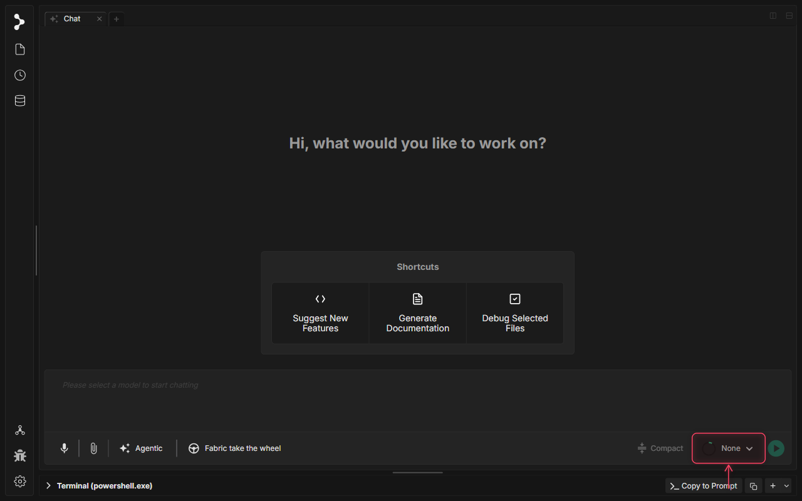
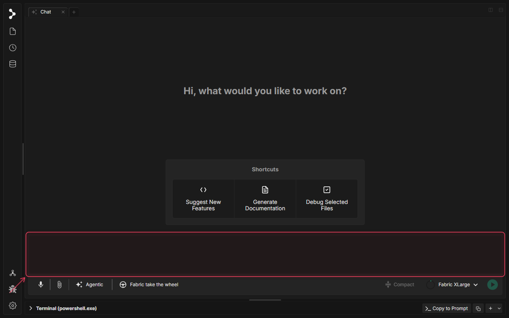
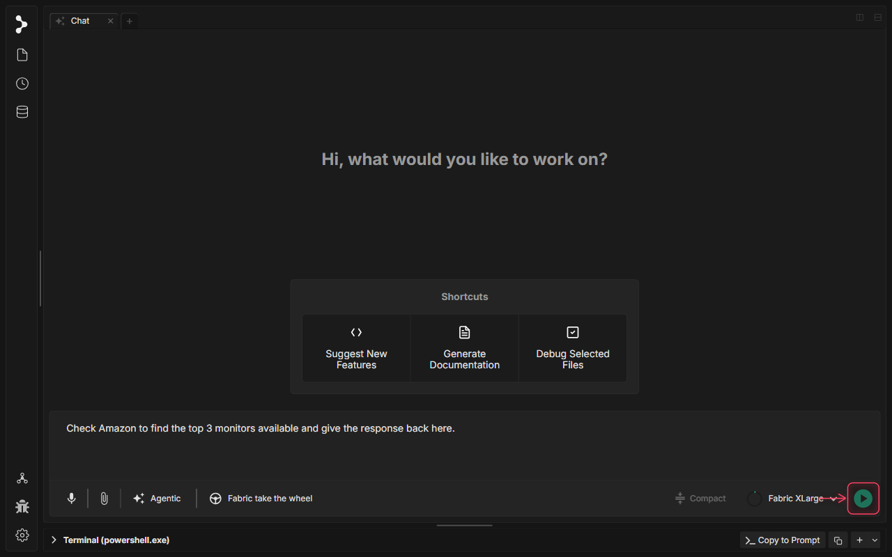
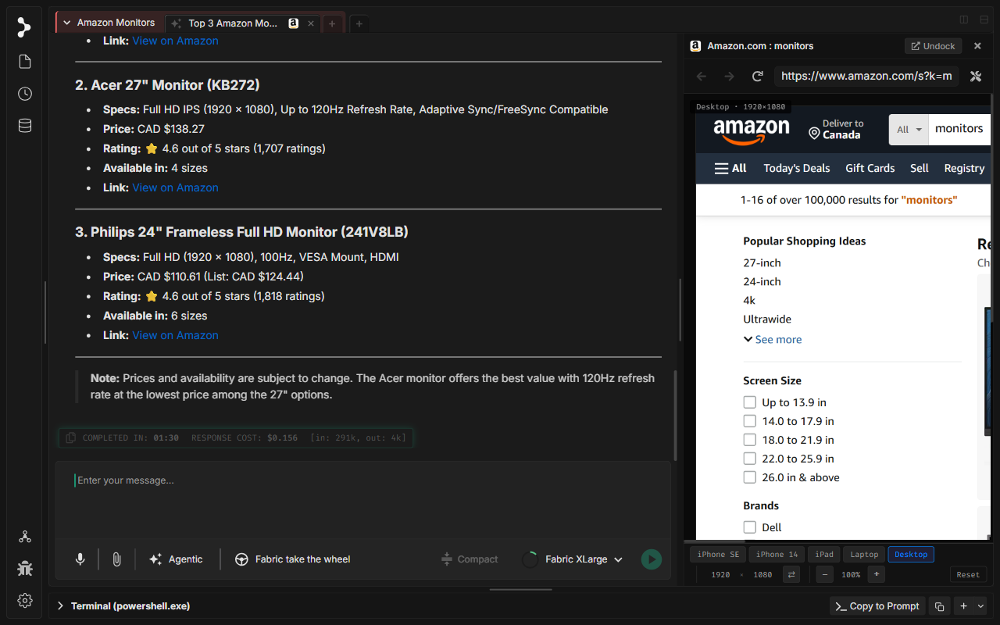

# Utilisation du navigateur par l'agent

🚧 Le tutoriel vidéo est en cours de préparation.

## Qu'est-ce que l'Utilisation du navigateur par l'agent dans Fabric ?

Le navigateur agentique dans Fabric permet à l'assistant IA de parcourir le web, d'interroger des bases de données et d'extraire des informations structurées directement en votre nom. Plutôt que de copier-coller manuellement, l'agent peut ouvrir des pages par programmation, exécuter des scripts de scraping du DOM, prendre des instantanés et compiler les résultats directement dans votre historique de chat.

## Quand utiliser l'Utilisation du navigateur par l'agent

Utilisez le navigateur agentique dans Fabric lorsque vous souhaitez que l'assistant IA :

* **Effectue des recherches de marché ou de produits** : Laissez l'agent rechercher dans les boutiques en ligne (comme Amazon) pour comparer les prix, les spécifications et les avis.
* **Extraie des données de sites** : Faites en sorte que l'agent explore des annonces, des tableaux de documentation ou des points de terminaison d'API.
* **Automatise des flux de travail en plusieurs étapes** : Permettez à l'agent d'interagir avec des formulaires, de cliquer sur des sélecteurs et de suivre des séquences multipages pour collecter des données.

## Comment utiliser l'Utilisation du navigateur par l'agent

### Étape 1 : Sélectionner un modèle agentique

Pour activer l'utilisation d'outils par l'agent, cliquez sur le sélecteur de modèle principal dans la barre d'outils du chat.

### Étape 2 : Sélectionner le modèle Fabric XLarge

Choisissez le modèle « Fabric XLarge » (ou tout modèle prenant en charge l'exécution d'outils de navigateur) pour activer la navigation web autonome.

### Étape 3 : Soumettre une invite de navigation

Demandez à l'agent de vérifier des informations spécifiques sur Amazon, par exemple trouver les 3 meilleurs moniteurs disponibles. Saisissez la demande dans le compositeur de chat.

### Étape 4 : Envoyer la demande

Appuyez sur Entrée ou cliquez sur Envoyer pour soumettre l'invite. Fabric va lancer les outils de navigateur, ouvrir un webview en volet partagé et commencer à exécuter les scripts de navigation et de scraping.

### Étape 5 : Attendre et lire les résultats consolidés

Fabric gère automatiquement l'interaction avec les pages web en coulisses. Une fois terminé, il consolide les annonces de produits récupérées et présente les 3 meilleurs moniteurs directement dans le chat.

