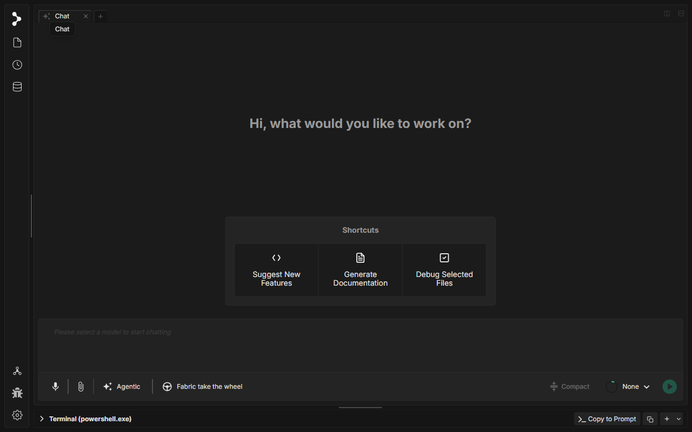
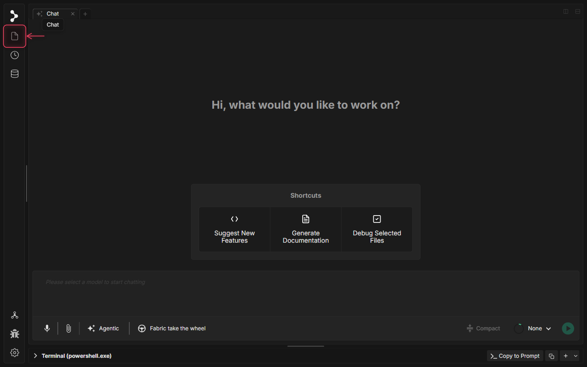

# Fonctionnalités de base

Une référence rapide pour les interactions principales dans Fabric.

---

## Ouvrir un projet

Fabric fonctionne sur un dossier, et non sur des fichiers individuels. La première chose à faire est de le pointer vers votre projet.

Sur l'écran d'accueil, cliquez sur **Open Project Folder** et sélectionnez le répertoire racine de votre projet depuis le sélecteur du système. Fabric indexera les fichiers et les rendra disponibles dans l'explorateur de fichiers ainsi que comme contexte pour l'IA.

Vous pouvez basculer vers un autre projet à tout moment en cliquant sur l'**icône de dossier** en haut de la barre latérale gauche.

---

## Discuter avec l'IA

La barre du bas est votre espace de travail principal. Voici le rôle de chaque élément :

- **Zone de texte** — Saisissez votre message ici. Appuyez sur `Enter` pour envoyer. Utilisez `Shift Enter` pour passer à la ligne.
- **Sélecteur de modèle** — Le menu déroulant sur la droite (`None` tant qu'il n'est pas configuré). Sélectionnez le modèle d'IA que vous souhaitez utiliser pour cette conversation.
- **Mode agentique** — Donne à l'IA l'accès à des outils : lire et modifier des fichiers, exécuter des commandes de terminal, effectuer des recherches sur le web. Utilisez-le pour les tâches qui nécessitent des modifications réelles du code.
- **Fabric take the wheel** — Un mode entièrement autonome dans lequel Fabric pilote la tâche de bout en bout avec un minimum d'interruptions.
- **Compact** — Résume les messages plus anciens pour libérer de l'espace dans la fenêtre de contexte lorsque les conversations s'allongent.
- **Send** — Le bouton vert, ou appuyez simplement sur `Enter`.

> Vous devez avoir sélectionné un modèle avant de pouvoir envoyer un message. Accédez à **Paramètres → Models** pour ajouter une clé API.

---

## Ajouter un fichier à votre chat

Il existe trois façons d'ajouter des fichiers comme contexte pour l'IA :

**Depuis l'explorateur de fichiers** — Cliquez sur l'**icône de fichier** dans la barre latérale gauche (mise en évidence ci-dessus) pour ouvrir le panneau des fichiers. Cliquez sur n'importe quel fichier pour l'ouvrir dans l'éditeur. Faites un clic droit sur un fichier et choisissez **Add to Chat** pour le joindre comme contexte.

**Via le bouton de pièce jointe** — Cliquez sur l'**icône de trombone** (`🖇`) en bas à gauche de la barre de saisie du chat. Un sélecteur de fichiers s'ouvre — sélectionnez n'importe quel fichier de votre machine. Les types pris en charge incluent les fichiers de code, le texte, les PDF et les images.

**Via le glisser-déposer** — Faites glisser n'importe quel fichier depuis le gestionnaire de fichiers de votre système d'exploitation directement sur la zone de saisie du chat. Il apparaîtra sous forme de puce au-dessus du champ de texte.

Les fichiers joints apparaissent sous forme de puces dans la zone de saisie. Cliquez sur le **×** d'une puce pour supprimer un fichier avant l'envoi.

---

## Saisie vocale

Fabric intègre une dictée en mode appuyer-pour-parler. Parlez naturellement — Fabric transcrit vos paroles dans la zone de saisie du chat, où vous pouvez les relire et les modifier avant de les envoyer.

| Méthode | Mac | Windows / Linux |
|--------|-----|-----------------|
| Appuyer-pour-parler (maintenir) | Maintenez `Right ⌥` | Maintenez `Right Alt` |
| Activer/désactiver le micro | Cliquez sur l'**icône de micro** en bas à gauche de la barre de chat | Identique |

Pendant que vous parlez, une animation de forme d'onde apparaît dans la zone de saisie. Relâchez la touche (ou cliquez à nouveau sur le micro) pour arrêter l'enregistrement. La transcription apparaît dans le champ de texte — modifiez-la si nécessaire, puis appuyez sur `Enter` pour envoyer.

---

## Travailler avec les onglets

Chaque onglet dans Fabric est une session de chat indépendante avec son propre historique de conversation et son propre contexte de fichiers.

**Pour créer un nouvel onglet** — Cliquez sur le bouton **+** dans la barre d'onglets en haut de la fenêtre. Utilisez `⌘ W` / `Ctrl W` pour fermer un onglet.

**Quand utiliser plusieurs onglets :**

- Exécuter une longue tâche agentique dans un onglet tout en posant des questions rapides dans un autre.
- Conserver des onglets distincts pour des fonctionnalités ou des branches différentes sur lesquelles vous travaillez en parallèle.
- Ouvrir un onglet dédié à la recherche (navigation, lecture de documentation) afin de ne pas encombrer votre contexte de codage.

Les onglets sont indépendants : arrêter la génération ou compacter le contexte dans un onglet n'affecte pas les autres.
