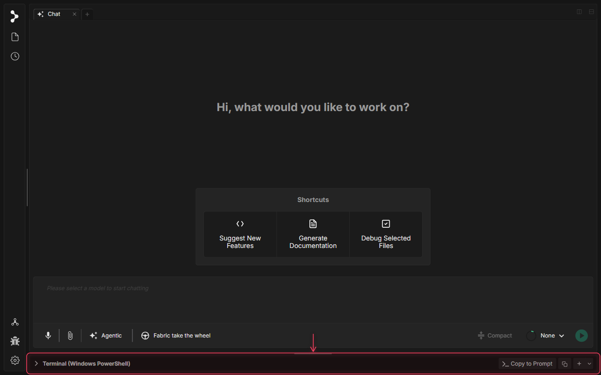
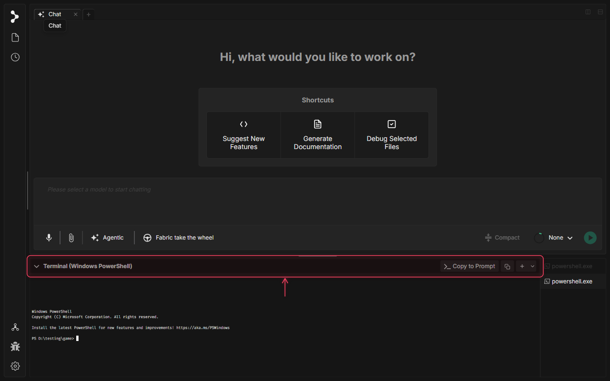

# 組み込みターミナル

Fabric には、アプリに直接組み込まれた本格的なターミナルが付属しています。コマンドを実行し、タブで複数のセッションを管理し、ペインを左右に分割し、ターミナルの出力をそのまま AI チャットに渡す — すべてウィンドウを離れることなく行えます。

---

## ターミナルを開く

`Ctrl Shift ` `（Windows/Linux）または `⌃ Shift ` `（Mac）を押すと、新しいターミナルが開きます。ターミナルパネルがウィンドウの下部に表示されます — チャットと並んで実行される完全なシェルセッションです。

`Ctrl ` ` / `⌃ ` ` でいつでもパネルを折りたたんだり展開したりできます。

---

## ターミナルの操作

ターミナルヘッダーから、よく使うアクションにすばやくアクセスできます：新しいセッションの作成、現在のペインの分割、出力のコピー、チャット入力への貼り付けです。右側のタブバーで、開いている複数のセッションを切り替えられます。

- **新しいターミナル** — 追加のセッションを開きます。各ターミナルは独自のスクロールバックを持つ独立したものです。
- **ペイン分割** — 現在のターミナルを分割し、2 つのセッションを並べて表示できます（例：一方で開発サーバー、もう一方でテストランナー）。
- **コピー** — ターミナルの選択範囲またはバッファをクリップボードにコピーします。
- **プロンプトに貼り付け** — ターミナルの出力をそのままチャット入力に送信するので、手動でコピー＆ペーストすることなく、エラーやコマンド結果について AI に質問できます。

---

## AI との連携

組み込みターミナルは Fabric のチャットと緊密に統合されています。これが単なるシェル以上のものである理由です：

- Fabric が**エージェントモード**でコマンドを実行すると、ターミナルでリアルタイムに実行される様子が見えます。
- **プロンプトに貼り付け**を使って、スタックトレースや失敗したテストの出力を会話に直接渡せます：*「これがエラーです — 修正してください。」*
- AI が変更を加えている間、開発サーバーやウォッチプロセスを分割ペインで実行することで、その効果をすぐに確認できます。

---

## キーボードショートカット

| アクション | Mac | Windows / Linux |
|-----------|-----|-----------------|
| 新しいターミナル | `⌃ Shift \`` | `Ctrl Shift \`` |
| ターミナルを分割 | `⌘ \` | `Ctrl Shift 5` |
| パネルの折りたたみ / 展開 | `⌃ \`` | `Ctrl \`` |
| 次のペインにフォーカス | `⌥ ⌘ →` | `Alt →` |
| 前のペインにフォーカス | `⌥ ⌘ ←` | `Alt ←` |
| ターミナルタブにフォーカス | `⌘ Shift \` | `Ctrl Shift \` |
| ターミナルに貼り付け | `⌘ V` | `Ctrl V` |
| ターミナルを終了（タブフォーカス時） | `⌘ ⌫` | `Del` |

---

## ヒント

- **長時間実行するプロセスには分割ペインを使いましょう。** 開発サーバーや `tail -f` のログを一方のペインで実行しながら、もう一方で作業できます。
- **各タブは履歴を保持します。** ターミナルタブを切り替えてもスクロールバックは保持されるため、セッション間を移動しても出力を失いません。
- **終了したターミナルも表示されたままです。** プロセスが終了するとタブは薄く表示されますが残るため、閉じる前に最終出力を読むことができます。
