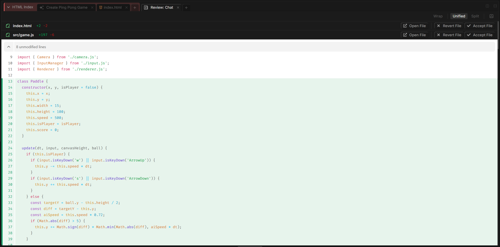
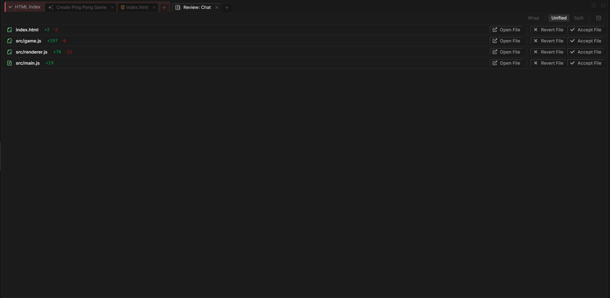

# Code Diff

When the AI edits your files, nothing is written blindly. Every proposed change is shown in an interactive diff viewer where you review it, accept the parts you want, reject the parts you don't, and stay fully in control of what actually lands on disk.

---

## How It Works

When the AI uses its edit tool, Fabric captures the original file alongside the proposed version and presents the difference. You see the change in context — what's being added, what's being removed — and decide hunk by hunk what to keep.

Nothing is final until you act on it. You can accept individual changes, reject them, accept everything at once, or undo a decision you've already made.

---

## Accepting and Rejecting Changes

The diff viewer works at the level of **hunks** — contiguous blocks of change within a file. For each hunk you have controls to:

- **Accept** the change (✓) — keep the proposed edit
- **Reject / revert** the change (✗) — discard it and keep the original
- **Open the file** at that location — jump to the exact spot in the editor

You can also accept or reject **all** changes in a file at once from the file-level controls, and undo decisions if you change your mind — the viewer keeps an undo stack so nothing is locked in.

---

## Keyboard Shortcuts

When a diff block is focused, you can move through it without touching the mouse:

| Key | Action |
|-----|--------|
| `A` | Accept the highlighted change |
| `D` | Discard / reject the highlighted change |
| `W` | Scroll to the previous change |
| `S` | Scroll to the next change |

This makes reviewing a large set of edits fast: navigate with `W` / `S`, decide with `A` / `D`.

---

## Reviewing Changes Across Files

When the AI edits several files in one task, the changes are grouped so you can work through them file by file. A side panel lists every changed file with its own accept/reject controls, so you can approve a whole file at once or dive into individual hunks where you want a closer look.

---

## Why Review Diffs

- **Catch unintended edits.** The AI occasionally touches more than you expected. The diff is where you spot that before it's saved.
- **Keep partial changes.** You don't have to take all or nothing — accept the good hunks and reject the rest.
- **Understand what changed.** Reading the diff is the fastest way to understand exactly what the AI did and why.

---

## Related

- [Code Review](../code-review/code-review.md) — request a structured review of a file, then apply the suggested fixes through this same diff viewer.
- [Run a Code Review Workflow](../../../learn/cookbooks/ai-code-review-workflow/ai-code-review-workflow.md) — a full cookbook on the review-then-apply cycle.
