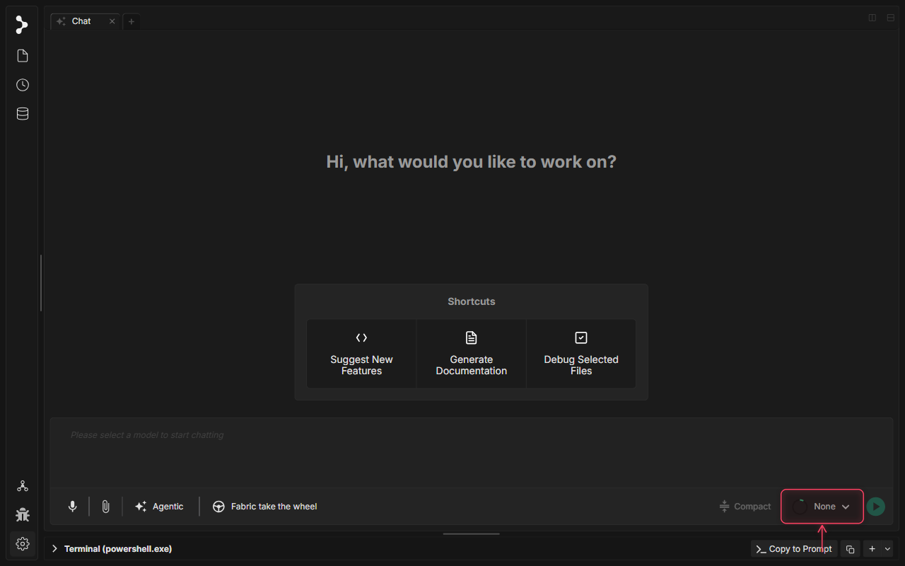
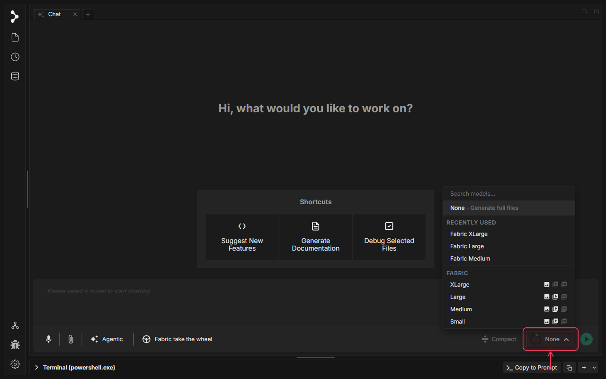
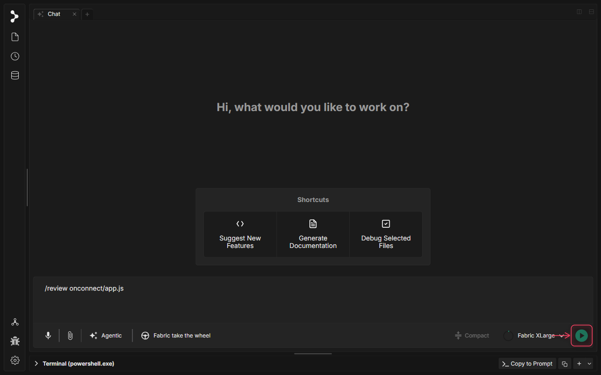
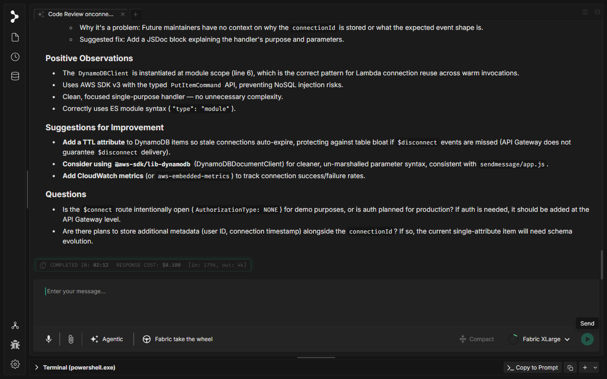
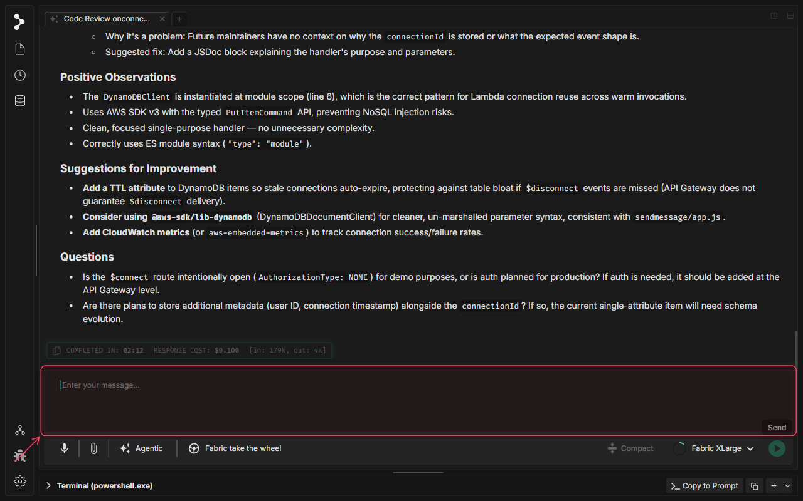
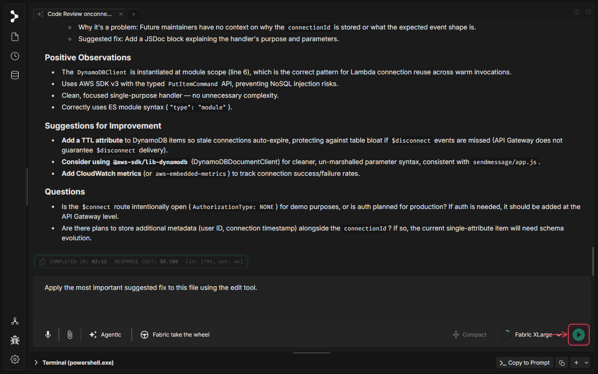
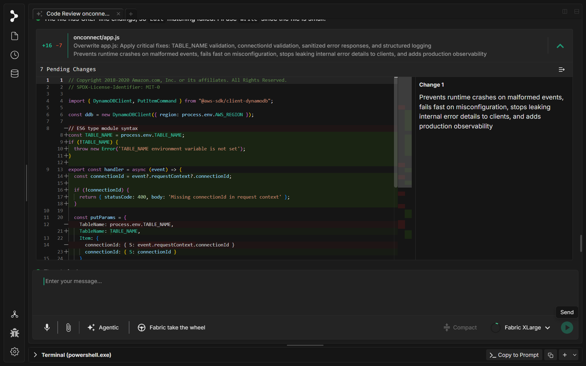

# Revue de code avec Fabric

<video controls playsinline width="100%">
  <source src="../../../../../assets/videos/code-review.mp4" type="video/mp4">
  Your browser does not support the video tag.
</video>

## Qu'est-ce que la revue de code avec Fabric ?

La fonctionnalité intégrée de **Revue de code** de Fabric vous permet de demander une analyse approfondie et structurée de n'importe quel fichier de votre espace de travail à l'aide de la commande slash `/review`. L'IA examine le code selon six dimensions — Exactitude, Sécurité, Performance, Maintenabilité, Tests et Bonnes pratiques — et renvoie un rapport priorisé avec des notes de gravité et des correctifs concrets.

Lorsque vous êtes prêt à agir sur la base de la revue, vous pouvez demander à Fabric d'appliquer directement les modifications suggérées. L'assistant utilise l'outil `edit` pour effectuer des modifications précises et ciblées, présentées dans une **visionneuse de différences côte à côte** interactive. Vous pouvez accepter ou rejeter des blocs individuels, annuler des décisions, ou accepter toutes les modifications en une seule fois avant de les enregistrer sur le disque.

## Quand utiliser la revue de code avec Fabric

Utilisez la fonctionnalité de revue de code dans Fabric lorsque vous souhaitez :

* **Détecter les bugs tôt** — Faites examiner par un second regard le nouveau code à la recherche d'erreurs de logique, de cas limites et de vulnérabilités de sécurité avant la fusion.
* **Améliorer la qualité du code** — Obtenez des retours constructifs sur le nommage, l'abstraction, les violations du principe DRY et la rigueur de TypeScript.
* **Valider les PR** — Examinez les différences des pull requests ou des fichiers spécifiques sans quitter votre éditeur.
* **Appliquer les correctifs en toute sécurité** — Laissez l'IA générer des modifications et inspectez chaque changement dans l'interface de différences interactive avant de valider.

## Comment utiliser la revue de code avec Fabric

### Étape 1 : Ouvrir le sélecteur de modèle

Cliquez sur le sélecteur de modèle principal dans la barre d'outils du chat pour choisir un modèle qui prend en charge l'utilisation d'outils pour la revue de code et les modifications.

### Étape 2 : Sélectionner Fabric XLarge

Sélectionnez le modèle « Fabric XLarge » pour activer les capacités avancées d'utilisation d'outils requises pour la revue de code et l'édition de fichiers.

### Étape 3 : Saisir la commande de revue

Tapez la commande slash `/review` suivie du chemin du fichier que vous souhaitez analyser. L'indication d'argument montre que vous pouvez également passer un numéro de PR ou une description.

### Étape 4 : Soumettre la demande de revue

Appuyez sur Entrée ou cliquez sur le bouton Send pour soumettre la demande de revue. Fabric lit le fichier, l'analyse et commence à diffuser un rapport de revue structuré.

### Étape 5 : Examiner le rapport d'analyse

Fabric diffuse un rapport de revue de code complet organisé par gravité : Critical, Major et Minor. Chaque constatation inclut l'emplacement exact, une description du problème et une suggestion concrète pour le corriger.

### Étape 6 : Demander l'application des correctifs

Après avoir lu la revue, demandez à Fabric d'appliquer les correctifs suggérés. L'IA utilisera l'outil edit pour effectuer des modifications précises et ciblées dans le fichier.

### Étape 7 : Soumettre la demande de correctif

Appuyez sur Entrée ou cliquez sur Send pour déclencher l'application du correctif. Fabric génère les modifications proposées et les présente dans la visionneuse de différences interactive.

### Étape 8 : Inspecter les différences interactives

Fabric présente les modifications proposées dans une visionneuse de différences côte à côte. Chaque bloc affiche le code original à gauche et la modification proposée à droite. Utilisez le bouton de coche pour accepter une modification, le bouton X pour la rejeter, ou le bouton d'annulation pour revenir sur une décision. Vous pouvez également accepter ou rejeter toutes les modifications au niveau du fichier.

