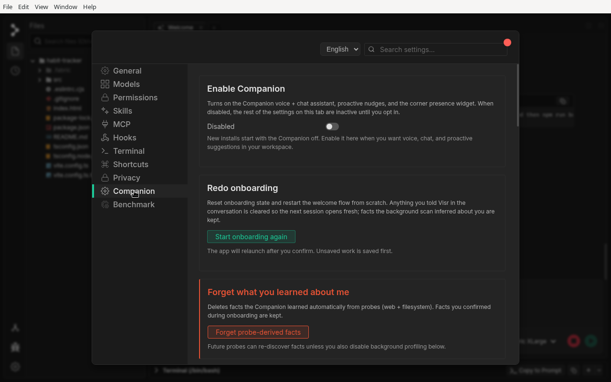
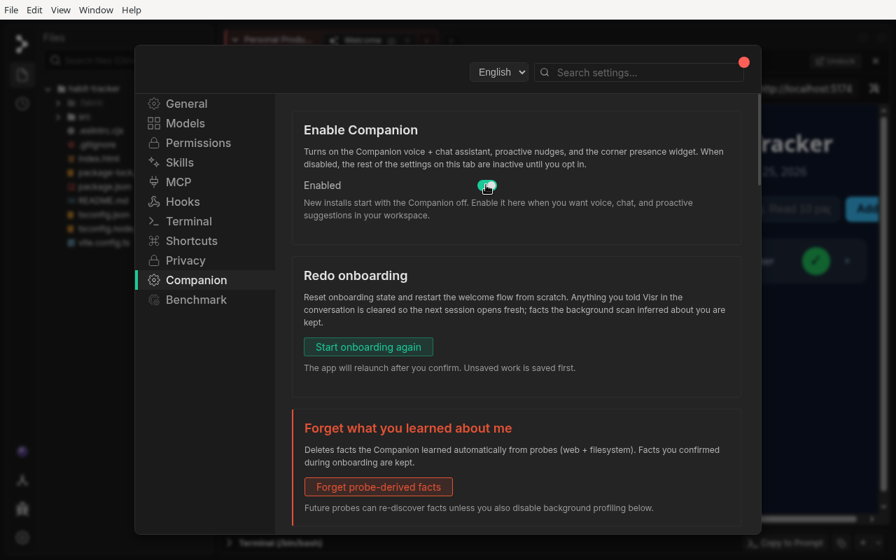
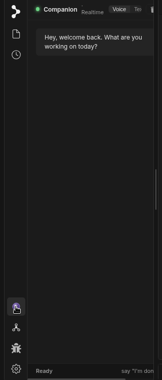
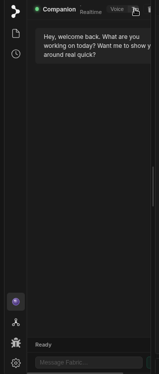

# The Companion

## What is the Companion in Fabric?

The **Companion** is an on-demand assistant that lives in your workspace sidebar. Open it and you can **talk or type** to ask for help — it knows your project context and answers by voice or text. It also keeps a light eye on what you're doing and, when it looks like you're stuck (for example, opening the model picker over and over without choosing one), it raises a gentle **nudge** offering to help. Think of it as the same friendly presence that set you up during onboarding, now riding along while you work.

The Companion is **off by default** — you turn it on when you want voice, chat, and proactive suggestions in your workspace.

## When to use the Companion

Use the Companion when you want to:

* **Get quick help without leaving your flow**: Ask a question by voice or text while you keep working in the main chat and editor.
* **Work hands-free**: Talk to it when you'd rather speak than type.
* **Get a nudge when you're stuck**: Let it watch for friction — model-picker churn, slash-menu hunting, repeated MCP-setup attempts — and offer a tip at the right moment.

## How to use the Companion

### Step 1: Enable the Companion

Open **Settings → Companion**. The first toggle, **Enable Companion**, turns on the voice + chat assistant, proactive nudges, and the corner presence widget. New installs start with it off, so flip it on here when you want it.

Once enabled, the toggle reads **Enabled** and a small Companion presence widget appears at the bottom of the sidebar.

!!! note
    This tab is also where you can **Mute** the Companion (suppress its voice), **Redo onboarding**, or **Forget what it learned about you** (clear facts the background scan inferred). When the Companion is disabled, the rest of these settings stay inactive until you opt in.

### Step 2: Open the Companion

Click the **Companion** presence widget in the sidebar. A panel slides in with a greeting — *"Hey, what are you working on today?"* — and a status line at the bottom showing **Ready**, **Listening**, or **Speaking**. In **Voice** mode you just talk; say *"I'm done"* to end your turn.

### Step 3: Type instead, if you prefer

Use the **Voice / Text** toggle in the panel header to switch to **Text** mode. A composer appears at the bottom — *"Message Fabric…"* — so you can type your question and send it just like a chat. Switch back to Voice any time; the conversation carries over.

### Step 4: Respond to proactive nudges

When the Companion notices friction — opening the model picker repeatedly without picking one, hunting through the slash menu, or retrying an MCP-server setup — a small badge appears on the Companion icon in the sidebar to signal it has a suggestion. Click the badge (or the icon) to open the panel, where it offers a relevant tip, like *"Want me to pick a model based on what you're doing?"* If you'd rather it stayed quiet, turn off **Proactive nudges** on the Companion settings tab — the panel still opens on demand.
