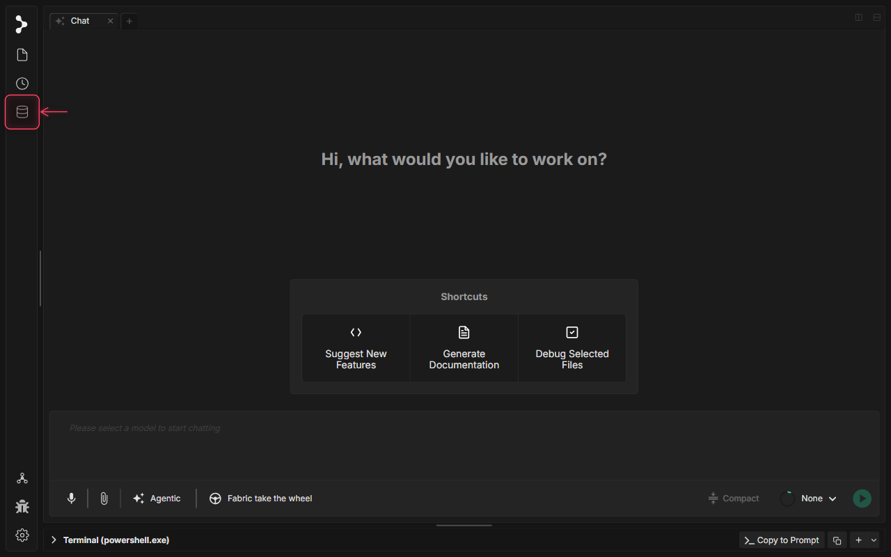
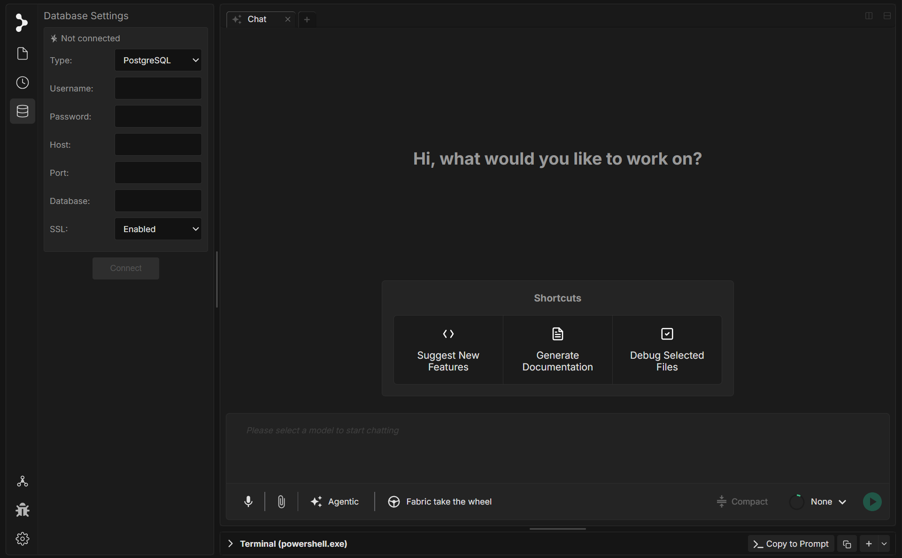

# Databases

Fabric can connect directly to your database, browse its schema, and automatically include the relevant table definitions as context when you ask the AI to write queries, migrations, or data-layer code.

---

## Supported Databases

| Database | Status |
|----------|--------|
| PostgreSQL | Supported |
| MySQL | Supported |

---

## Connecting to a Database

Open the **DB Browser** from the left sidebar (the database icon). Fill in the connection form:

- **Type** — PostgreSQL or MySQL
- **Host** — Your database hostname or IP address
- **Port** — Default is `5432` for Postgres and `3306` for MySQL
- **Username / Password** — Your database credentials
- **Database** — The name of the database to connect to
- **Schema** — The schema to use (Postgres only; defaults to `public`)
- **SSL** — Toggle SSL on or off. Fabric tries SSL first and falls back to a plain connection automatically if SSL is not available

Click **Connect**. Fabric will verify the connection and load your schema. If the connection fails, an error message describes what went wrong (wrong credentials, unreachable host, etc.).

Click **Disconnect** at any time to close the connection and clear the cached schema.

---

## Browsing Your Schema

Once connected, the DB Browser lists every table in your database. Click any table name to expand it and see its columns, data types, primary keys, indexes, and constraints — the same information you'd get from `\d tablename` in psql or `DESCRIBE` in MySQL.

Fabric fetches this structure by querying the database's information schema directly, so it always reflects the current state of your schema.

---

## Giving the AI Database Context

This is where the databases feature becomes useful for day-to-day work. You can select one or more tables using the checkboxes next to each table name. When tables are selected, Fabric automatically includes their full `CREATE TABLE` definitions — columns, types, constraints, and indexes — in the context it sends to the AI.

This means you can ask things like:

- *"Write a query that joins `orders` and `customers` and returns revenue by region for the last 30 days"*
- *"Add a migration that adds a `deleted_at` timestamp column to `users` with a corresponding index"*
- *"Review this query for performance — here's the relevant schema"*

Without selecting tables, the AI has no way to know your column names, types, or relationships. Selecting the tables that matter for a task is the fastest way to get accurate, schema-aware code.

Select only the tables relevant to the current task. Sending a large schema with dozens of tables you don't need wastes context space and can dilute the AI's focus.

---

## Practical Workflows

**Writing queries** — Select the tables your query will touch, then ask the AI to write or optimize the SQL. It will use the actual column names and constraints from your schema.

**Writing migrations** — Select the table you're modifying. Describe the change you want (add column, rename field, add foreign key), and the AI will generate the migration file in whatever format your project uses (raw SQL, Alembic, Flyway, etc.).

**Onboarding to an unfamiliar schema** — Connect, expand the tables you're curious about, and ask the AI to explain the data model. It can describe relationships, highlight unusual design choices, and suggest how to query common patterns.

**Debugging data issues** — Attach a query that's returning unexpected results along with the relevant table schemas. The AI can spot type mismatches, missing indexes, or logic errors.

---

## Notes

- Connection settings are saved per project, so you don't need to re-enter credentials every time you open the project.
- Passwords are never logged or sent to the AI. Only the schema DDL (table structure) is included in prompts — never the actual data in your tables.
- Fabric does not execute queries on your behalf unless you explicitly ask it to run a command in agentic mode via the terminal.
