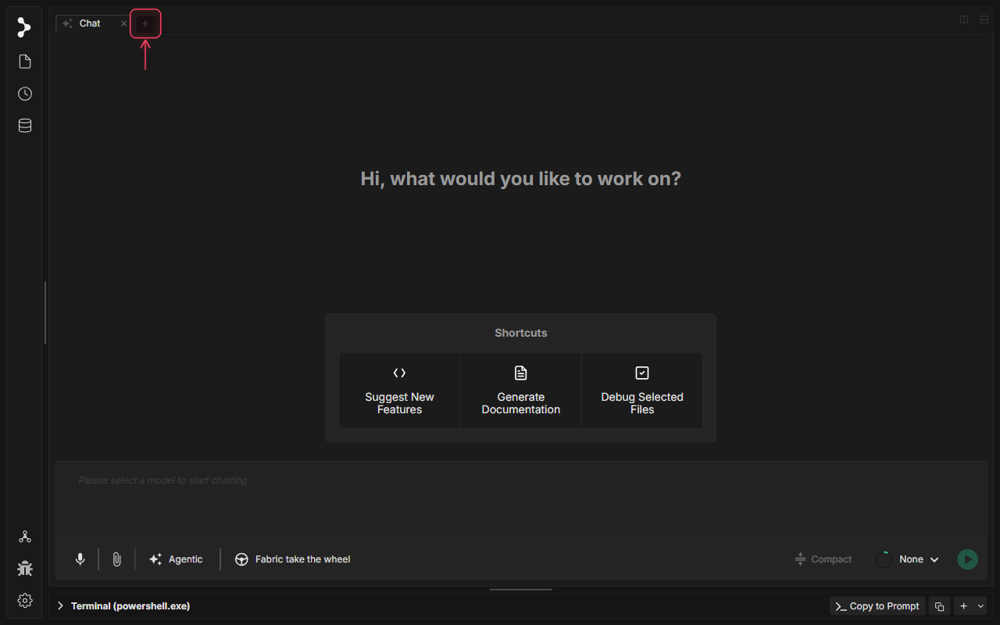
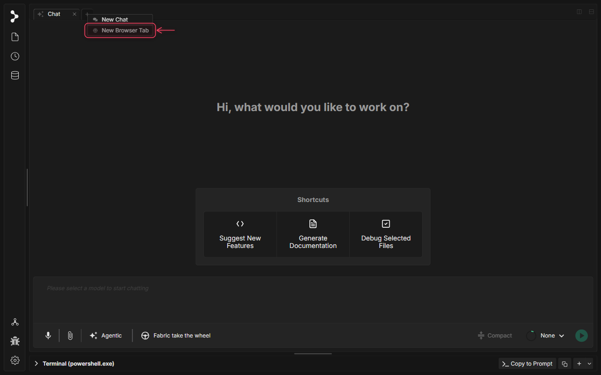
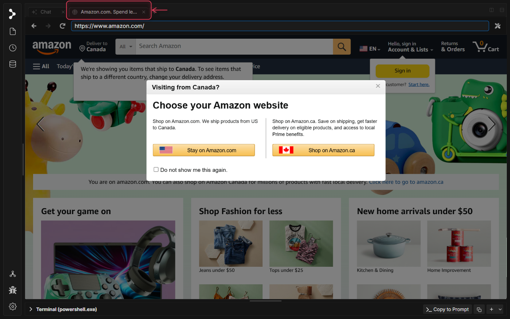

# Navigateur intégré dans Fabric

<video controls playsinline width="100%">
  <source src="../../../../../assets/videos/in-app-browser.mp4" type="video/mp4">
  Your browser does not support the video tag.
</video>

## Qu'est-ce que le Navigateur intégré dans Fabric ?

Le Navigateur intégré dans Fabric vous permet de parcourir le web, de lire la documentation et d'interagir avec des ressources externes directement au sein de votre espace de travail. Comme les onglets du navigateur s'exécutent aux côtés de vos sessions d'invite (prompt) et de vos fichiers, vous pouvez garder votre recherche dans son contexte sans changer constamment de contexte entre votre éditeur et des navigateurs web externes.

Les onglets du navigateur prennent en charge des contrôles de navigation complets, une isolation d'état sécurisée, et peuvent même être ancrés directement à côté de votre panneau de chat pour une saisie d'invites et une consultation côte à côte.

## Quand utiliser le Navigateur intégré dans Fabric

Utilisez le navigateur intégré dans Fabric lorsque vous souhaitez :

* **Lire la documentation côte à côte** : Ouvrir et ancrer des pages de documentation (comme React, Tailwind ou les docs d'API de bibliothèques) juste à côté de votre session de chat active.
* **Tester et visualiser des applications web** : Vérifier des serveurs de développement locaux (par exemple, `http://localhost:3000`) ou des ressources web distantes dans les onglets de votre espace de travail.
* **Garder la recherche web dans votre session** : Garder les onglets du navigateur regroupés avec les invites (prompts) et discussions pertinentes afin de ne pas perdre la trace des ressources.

## Comment utiliser le Navigateur intégré dans Fabric

### Étape 1 : Clic droit sur l'icône Nouvel onglet

Faites un clic droit sur l'icône plus (+) à la fin de la barre d'onglets pour ouvrir le menu contextuel des options de nouvel onglet.

### Étape 2 : Sélectionner « New Browser Tab »

Cliquez sur l'élément de menu « New Browser Tab » pour ouvrir un onglet de navigateur web intégré vierge et accéder à un site web (par exemple, `https://www.amazon.com/`).

### Étape 3 : Afficher la page web chargée

Le site web se charge directement dans le volet Webview sécurisé et isolé (sandbox) au sein de votre espace de travail Fabric.

