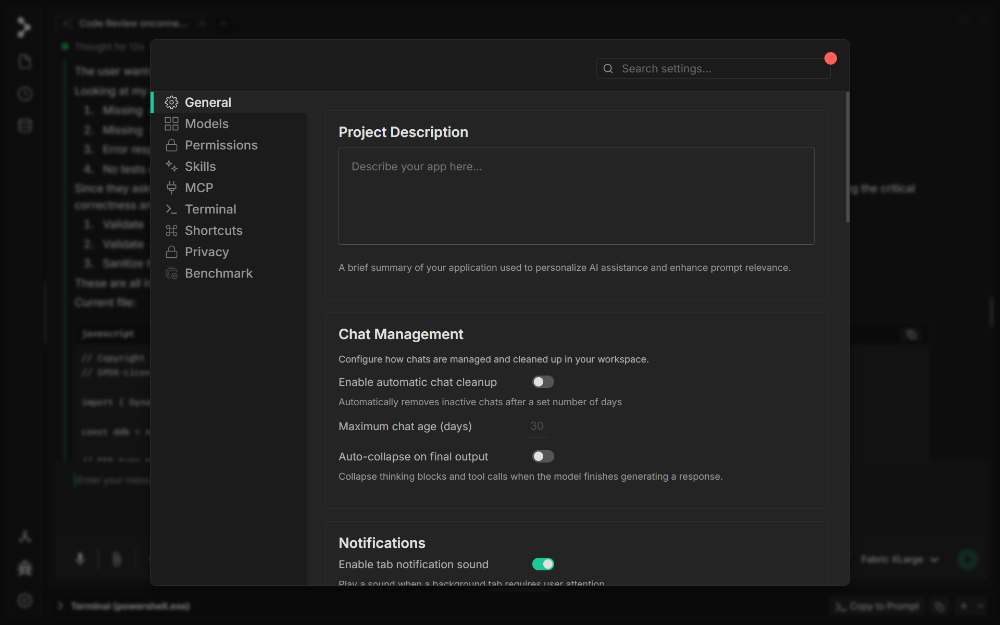
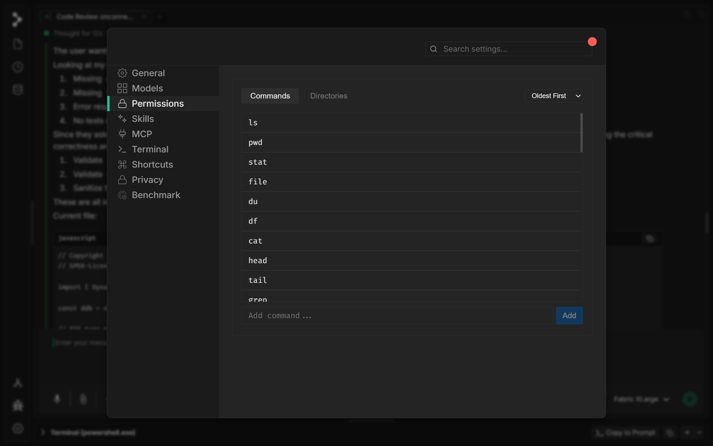
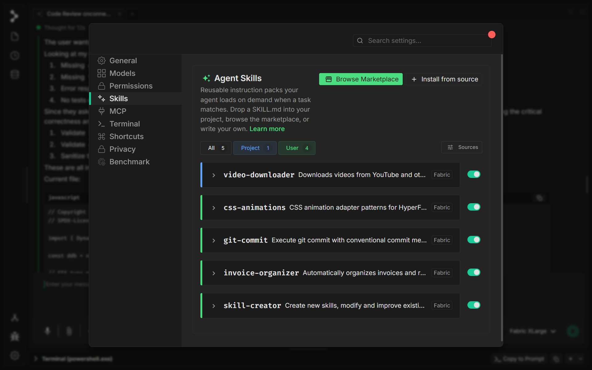
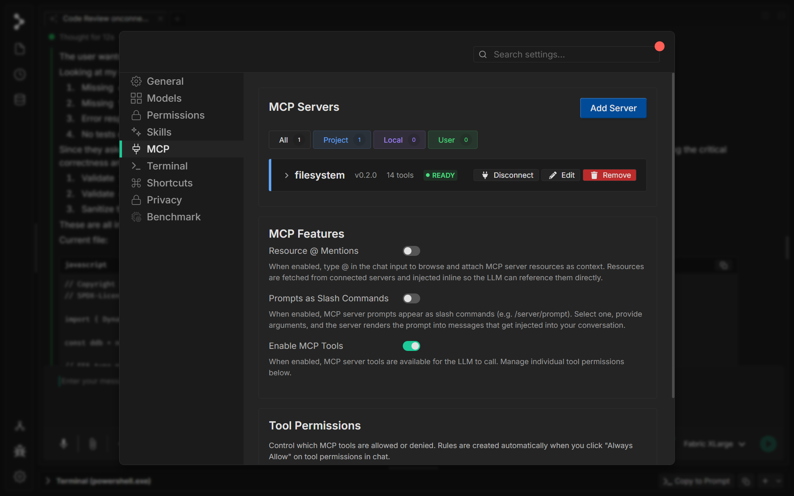
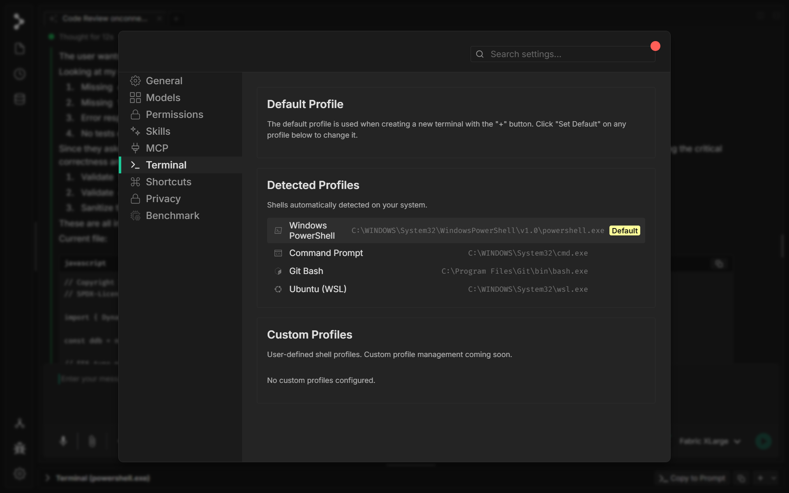
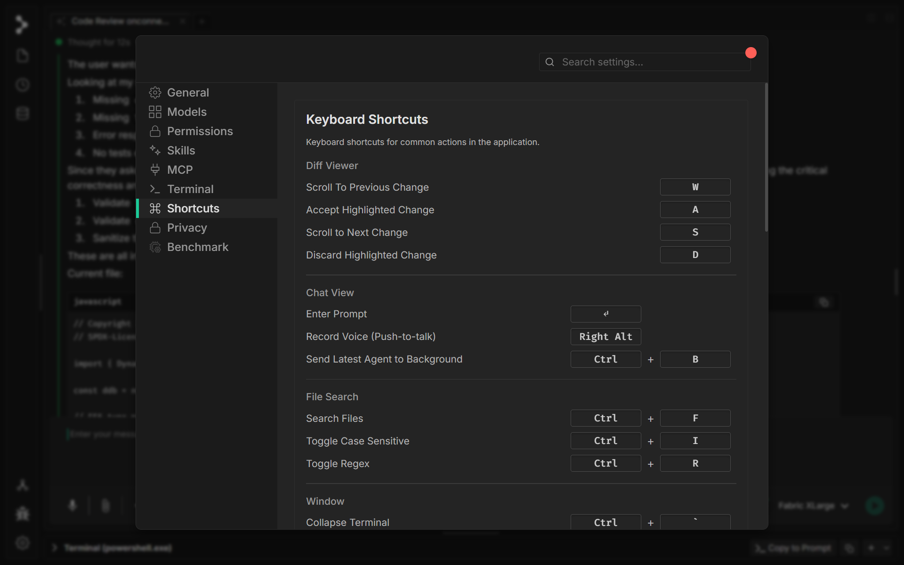
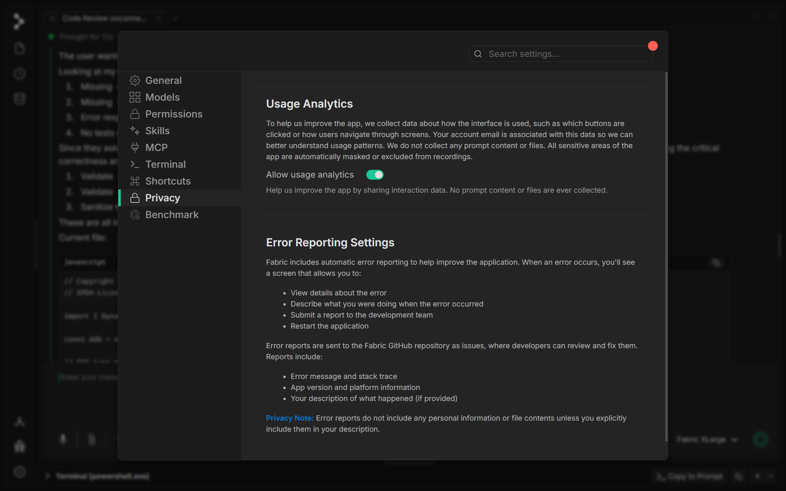
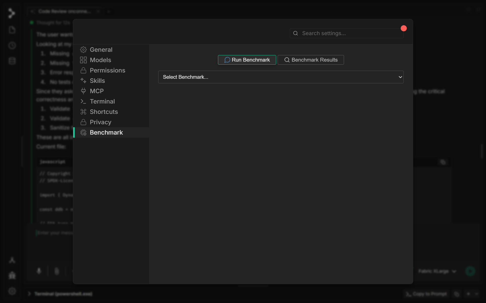

# Paramètres

Ouvrez le panneau Paramètres en cliquant sur l'icône d'engrenage dans la barre latérale gauche. Le panneau est organisé en onglets qui vous permettent de configurer les modèles, les autorisations, les intégrations, les profils de terminal, les raccourcis clavier, la confidentialité et les benchmarks.

---

## General

**Project Description** — Saisissez un bref résumé de votre application pour personnaliser l'assistance de l'IA et améliorer la pertinence des prompts.

**Chat Management**

* **Enable automatic chat cleanup** — Supprime automatiquement les chats inactifs après un nombre de jours défini.
* **Maximum chat age (days)** — Le nombre de jours pendant lesquels conserver les chats inactifs avant de les supprimer (par défaut : 30).
* **Auto-collapse on final output** — Réduit les blocs de réflexion et les appels d'outils lorsque le modèle a terminé de générer une réponse.

**Notifications**

* **Enable tab notification sound** — Joue un son lorsqu'un onglet en arrière-plan nécessite l'attention de l'utilisateur.

---

## Models

**Helper Model** — Le LLM léger qui analyse votre demande, propose les fichiers pertinents à modifier et suggère des noms d'onglets concis avant l'exécution du modèle principal. Choisissez entre Medium, Small ou d'autres niveaux.

**Subagent Model** — Le modèle utilisé lorsque l'assistant génère un sous-agent. Les options incluent :

* Identique au helper model
* Laisser le modèle principal décider
* Medium / Small (épingler un niveau spécifique)

**LLM Providers** — Ajoutez et gérez des clés API pour plusieurs fournisseurs. Développez n'importe quel fournisseur pour afficher les modèles disponibles et configurer les points de terminaison de l'API, la température et le nombre maximal de tokens.

* **Fabric** — Fournisseur de modèles intégré
* **Anthropic** — Modèles Claude (clé API requise)
* **OpenAI** — Modèles GPT (clé API requise)
* D'autres fournisseurs peuvent être ajoutés via le bouton « Add Provider »

---

## Autorisations

**Commands** — Ajoutez à la liste blanche les commandes de terminal sûres que l'IA est autorisée à exécuter sans approbation explicite. Les commandes autorisées par défaut incluent `ls`, `pwd`, `stat`, `file`, `du`, `df`, `cat`, `head`, `tail`, `grep`, et d'autres. Utilisez le bouton « Add » pour ajouter des commandes personnalisées.

**Directories** — Configurez les répertoires auxquels l'IA peut accéder pour les opérations sur les fichiers. Cela restreint la portée des lectures, écritures et recherches de fichiers aux emplacements approuvés.

---

## Compétences

**Agent Skills** — Des packs d'instructions réutilisables que l'agent charge à la demande lorsqu'une tâche correspond. Les compétences peuvent être :

* **Project-scoped** — Déposées dans votre projet sous forme de fichier `SKILL.md`
* **User-scoped** — Installées globalement pour votre compte utilisateur
* **From the Marketplace** — Parcourez et installez des compétences créées par la communauté

Chaque compétence peut être activée ou désactivée individuellement. Utilisez **Browse Marketplace** pour découvrir de nouvelles compétences ou **Install from source** pour en ajouter une personnalisée.

---

## MCP

**MCP Servers** — Ajoutez et gérez des serveurs Model Context Protocol. Les serveurs connectés exposent des outils, des ressources et des prompts que le LLM peut utiliser. Chaque serveur affiche sa version, son nombre d'outils et son état de connexion. Utilisez **Disconnect**, **Edit** ou **Remove** pour gérer les serveurs existants, ou **Add Server** pour en connecter un nouveau.

**MCP Features**

* **Resource @ Mentions** — Tapez `@` dans la zone de saisie du chat pour parcourir et joindre des ressources de serveur MCP comme contexte.
* **Prompts as Slash Commands** — Les prompts des serveurs MCP apparaissent sous forme de commandes slash (par ex. `/server/prompt`) dans le compositeur.
* **Enable MCP Tools** — Permet au LLM d'appeler les outils des serveurs MCP. Les autorisations de chaque outil peuvent être gérées individuellement.

**Tool Permissions** — Contrôlez quels outils MCP sont autorisés ou refusés. Les règles sont créées automatiquement lorsque vous cliquez sur « Always Allow » dans les invites d'autorisation d'outils dans le chat.

---

## Terminal

**Default Profile** — Le profil de shell utilisé lors de la création d'un nouveau terminal avec le bouton « + ». Cliquez sur « Set Default » sur n'importe quel profil ci-dessous pour le modifier.

**Detected Profiles** — Shells automatiquement détectés sur votre système :

* Windows PowerShell
* Command Prompt
* Git Bash
* Ubuntu (WSL)

**Custom Profiles** — Profils de shell définis par l'utilisateur. La gestion des profils personnalisés arrive bientôt.

---

## Shortcuts

**Diff Viewer**

| Action | Raccourci |
|--------|----------|
| Faire défiler vers le changement précédent | `W` |
| Accepter le changement en surbrillance | `A` |
| Faire défiler vers le changement suivant | `S` |
| Rejeter le changement en surbrillance | `D` |

**Chat View**

| Action | Raccourci |
|--------|----------|
| Saisir un prompt | `↵` |
| Enregistrer la voix (appuyer-pour-parler) | `Right Alt` |
| Envoyer le dernier agent en arrière-plan | `Ctrl + B` |

**File Search**

| Action | Raccourci |
|--------|----------|
| Rechercher des fichiers | `Ctrl + F` |
| Activer/désactiver la sensibilité à la casse | `Ctrl + I` |
| Activer/désactiver les expressions régulières | `Ctrl + R` |

**Window**

| Action | Raccourci |
|--------|----------|
| Réduire le terminal | `Ctrl + \`` |

---

## Privacy

**Usage Analytics**

* **Allow usage analytics** — Partagez les données d'interaction pour aider à améliorer l'application. Aucun contenu de prompt ni aucun fichier n'est jamais collecté.

**Error Reporting Settings**

Fabric inclut un signalement automatique des erreurs pour aider à améliorer l'application. Lorsqu'une erreur se produit, vous pouvez :

* Afficher les détails de l'erreur
* Décrire ce que vous faisiez lorsque l'erreur s'est produite
* Soumettre un rapport à l'équipe de développement
* Redémarrer l'application

Les rapports d'erreur sont envoyés au dépôt GitHub de Fabric sous forme d'issues et incluent le message d'erreur, la trace de la pile, la version de l'application, les informations sur la plateforme et votre description (le cas échéant). Les rapports d'erreur ne contiennent aucune information personnelle ni aucun contenu de fichier.

---

## Benchmark

**Run Benchmark** — Évaluez les performances d'un modèle sur des tâches de codage standardisées. Sélectionnez un benchmark dans le menu déroulant et cliquez sur **Run Benchmark** pour lancer l'évaluation.

**Benchmark Results** — Consultez l'historique des exécutions de benchmarks et comparez les scores entre différents modèles et configurations.
