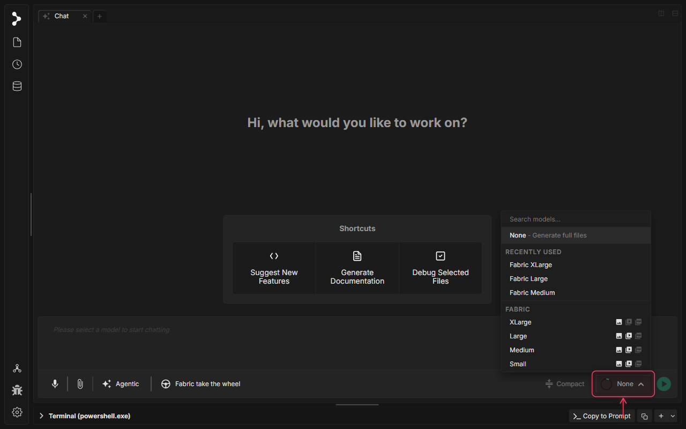
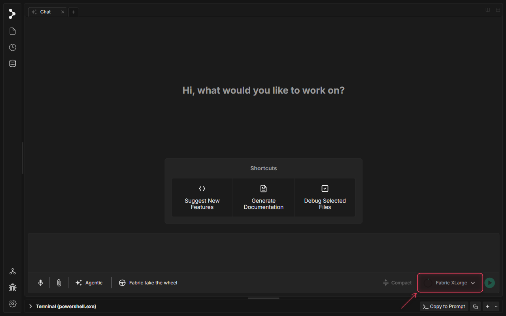
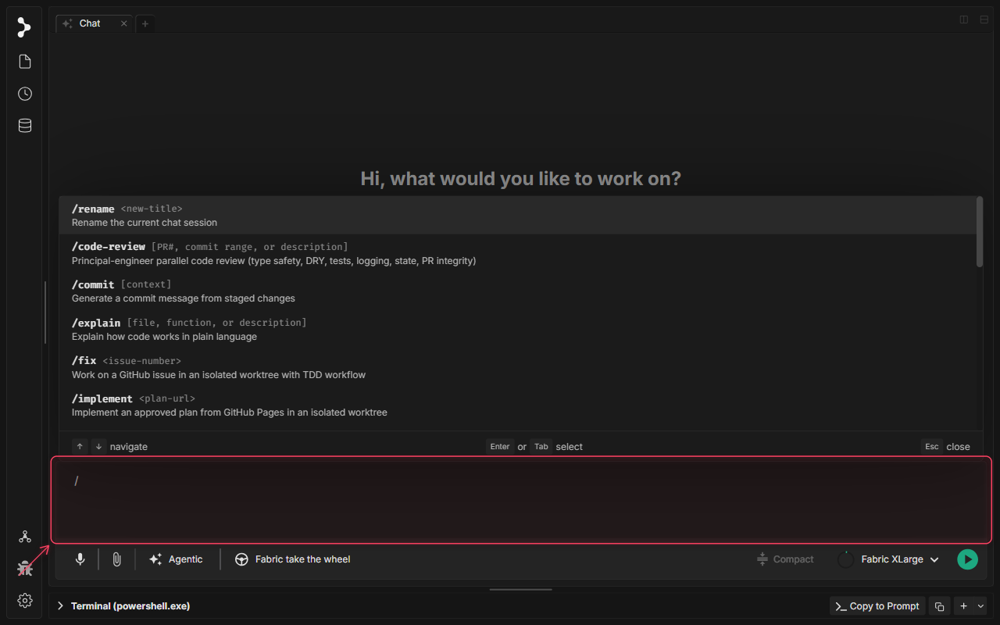
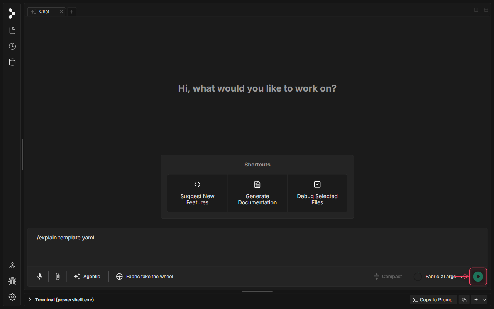
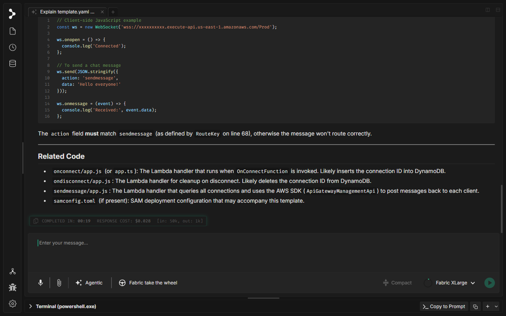

# Slash Commands

🚧 Video tutorial is in progress.

## What is Slash Commands in Fabric?

Slash commands are powerful shortcuts in Fabric that let you trigger predefined workflows, templates, or built-in actions directly from the chat box. By typing a leading slash (`/`), you open an autocomplete dropdown list containing all available built-in commands, custom prompt templates, and MCP-exposed prompts.

These commands help streamline common development tasks—such as code explanation, unit test generation, code reviews, and fixing GitHub issues—without needing to write repetitive instructions.

## When to use Slash Commands

Use slash commands in Fabric when you want to:

* **Quickly Run Workflows**: Perform operations like `/explain`, `/tests`, or `/simplify` on specific files or functions.
* **Automate Git and GitHub tasks**: Generate commit messages with `/commit` or resolve issues with `/fix`.
* **Rename Conversations**: Rename the current chat session instantly with `/rename <new-title>`.
* **Extend with Custom Prompts**: Add custom `.md` command templates in your resources directory or use MCP prompts seamlessly.

---

## Available Slash Commands

Fabric includes built-in commands, custom workflow/template commands, and supports extending commands via external MCP servers.

### Built-in Commands

* **`/rename <new-title>`**
    * **Argument Hint**: `<new-title>`
    * **Description**: Renames the current chat session to the specified title. This runs locally without LLM generation, injecting an assistant message for immediate feedback.

### Custom Workflow & Template Commands

These commands load Markdown-based prompt templates from Fabric's resources directory (`resources/commands` in development, or user settings `commands` folder in production) and expand them, leveraging the active workspace files and any arguments provided.

| Command | Argument Hint | Description |
| :--- | :--- | :--- |
| **`/explain`** | `[file, function, or description]` | Explains how target code works in plain language. Focuses on the currently active file tab if no argument is given. |
| **`/tests`** | `[file, function, or description]` | Generates comprehensive unit tests (e.g., Vitest) matching project styling and practices. |
| **`/simplify`** | `[file, function, or description]` | Refactors complex code blocks to make them cleaner, simpler, and more efficient. |
| **`/code-review`** | `[PR#, commit range, or description]` | Reviews changes in a PR or commit range for quality, styling, security, and performance. |
| **`/commit`** | `[context]` | Analyzes staged Git changes in the workspace and drafts a descriptive, semantic commit message. |
| **`/fix`** | `<issue-number>` | Automates fixing a GitHub issue in an isolated Git worktree under a strict TDD workflow. |
| **`/implement`** | `<plan-url>` | Implements changes from an approved planning document in an isolated worktree. |
| **`/implement_with_dag`**| `<plan-url>` | Implements changes across multiple files using a Directed Acyclic Graph (DAG) task orchestrator. |
| **`/issue`** | `<issue-number>` | Fetches and views detailed information of a GitHub issue. |
| **`/issue_plan`** | `<issue-number>` | Drafts a structured implementation plan to address a specific GitHub issue. |
| **`/research`** | `<topic or description>` | Researches a topic or bug within the codebase or via web search capabilities. |
| **`/review`** | `[file, PR#, or commit range]` | Reviews specific file changes or a pull request for feedback. |
| **`/test_e2e`** | `[description]` | Generates or runs end-to-end integration tests. |

> [!TIP]
> You can create your own custom commands by adding `.md` files to your custom commands directory (configurable in settings). Any markdown file with a simple YAML frontmatter metadata block containing a `description` and `argument-hint` will automatically show up as a slash command.

---

## How to use Slash Commands

### Step 1: Open Model Selector

Click the main model selector in the chat toolbar to choose an appropriate model.

### Step 2: Select Fabric XLarge Model

Select a model (like 'Fabric XLarge') that supports slash command orchestration.

### Step 3: Trigger Autocomplete Dropdown

Click into the composer textarea and type a forward slash (`/`). The autocomplete dropdown will slide open, listing all registered commands, their descriptions, and argument hints.

### Step 4: Type the Command and Arguments

Type the rest of the command (e.g. `/explain template.yaml`). The argument hint guide helps format the parameters correctly.

### Step 5: Submit and Execute

Press Enter or click the Send button to execute the slash command. Fabric will expand the command template, scan the workspace to find `template.yaml`, and start the analysis.

### Step 6: Review the Explanation Results

Wait for the command run to finish. Fabric presents a beautifully structured, comprehensive code explanation right in the chat message thread.

