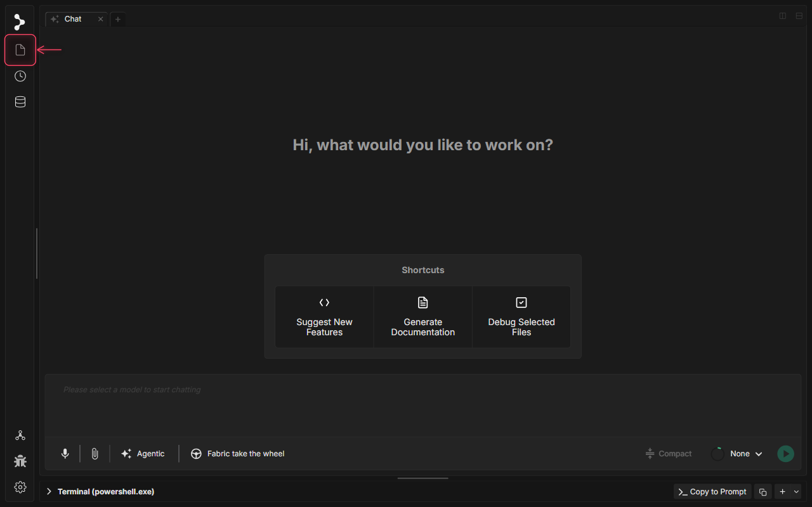
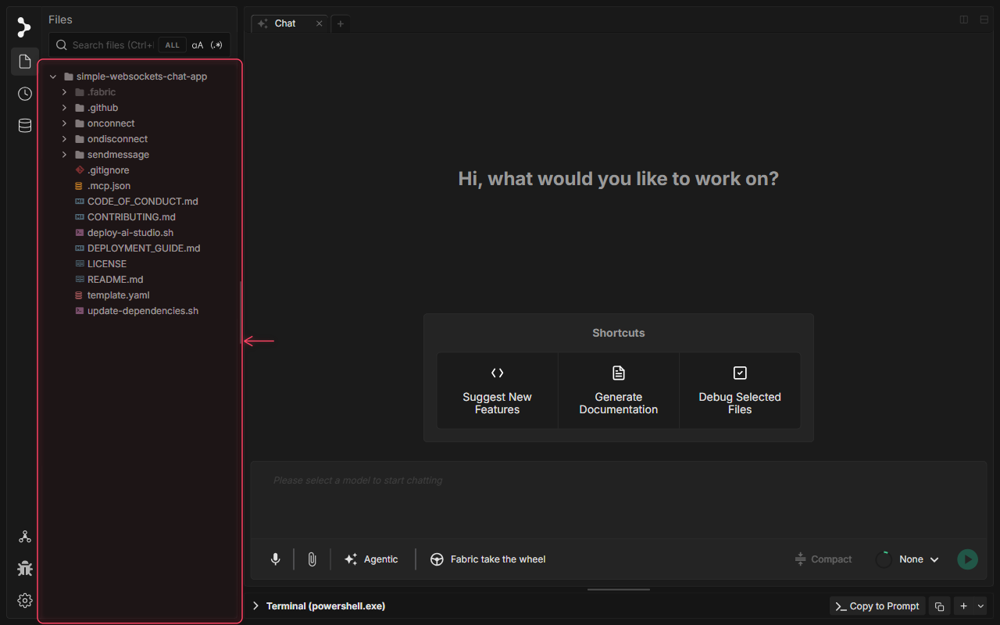
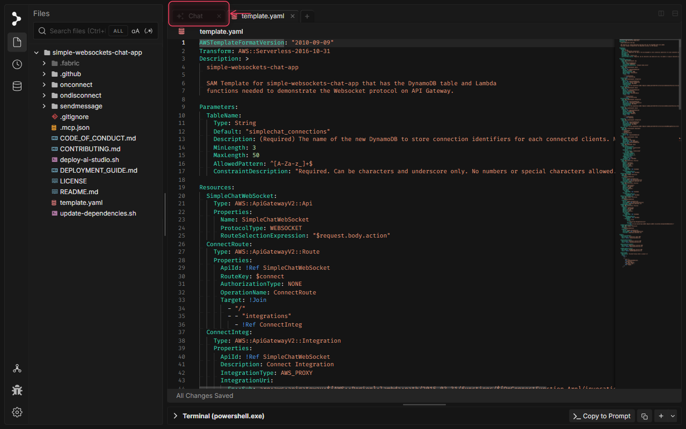
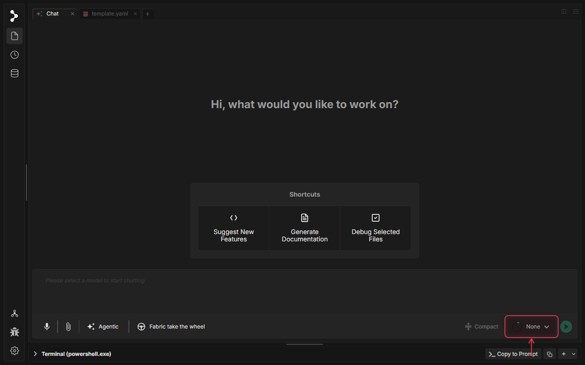
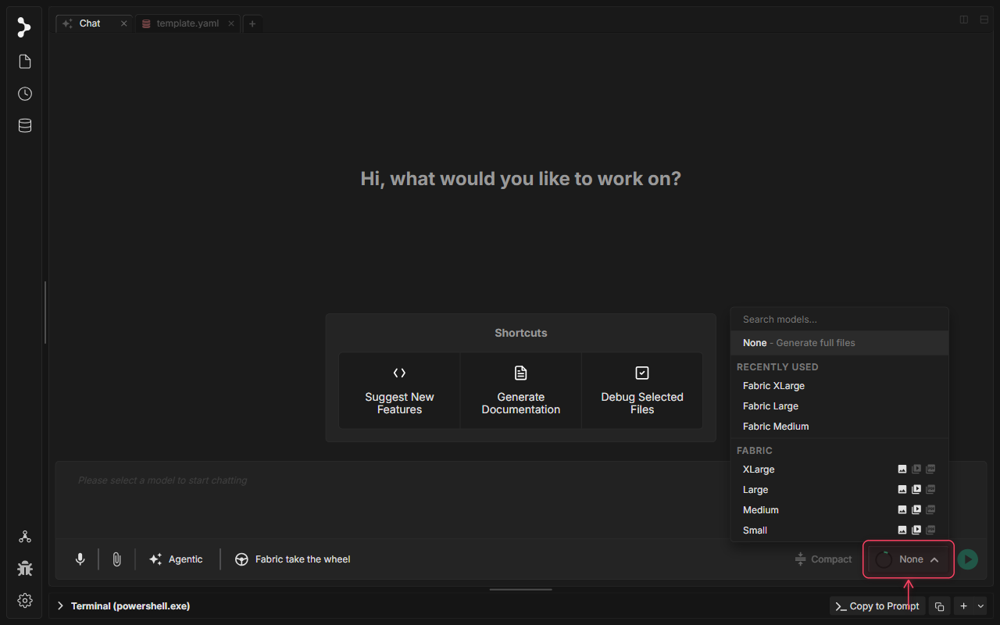
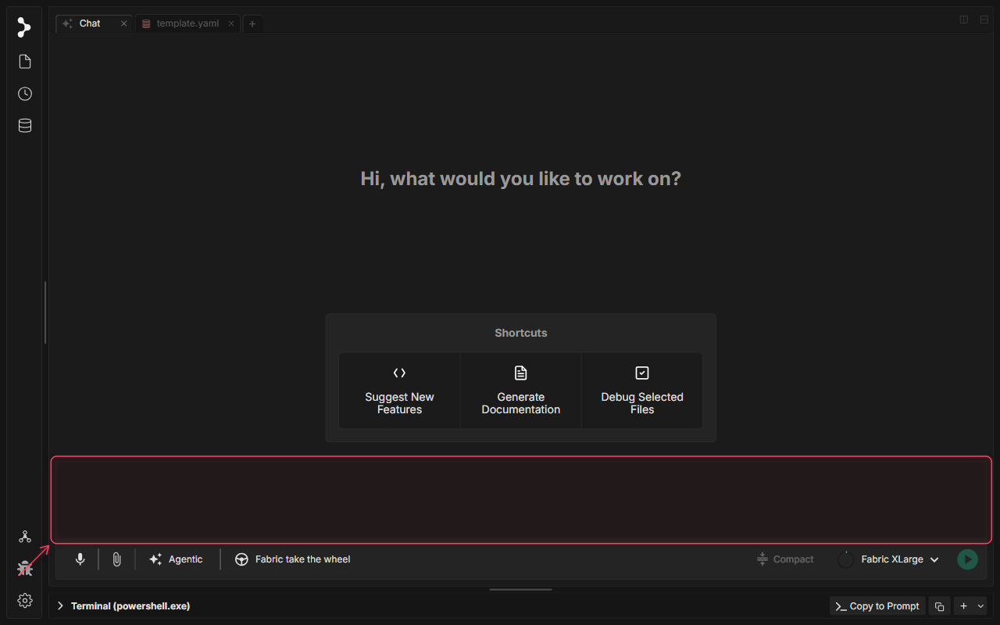
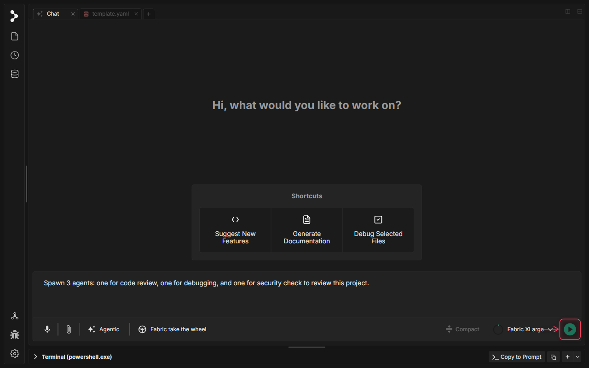
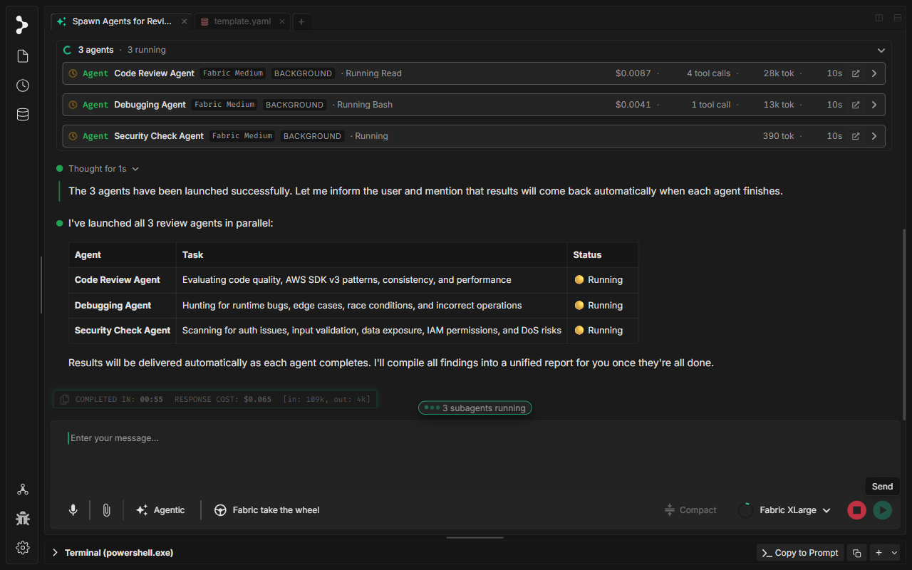

# Multi-Agent Workflows: Subagents

<video controls playsinline width="100%">
  <source src="../../../../assets/videos/sub-agents.mp4" type="video/mp4">
  Your browser does not support the video tag.
</video>

## What is Multi-Agent Workflows: Subagents in Fabric?

Subagents allow a parent chat session to delegate parallel, independent tracks of work to focused background LLM agents. This makes it possible to perform complex task breakdowns—like having one agent review code quality, another check for security issues, and a third search for bugs—and compile their findings back into a single conversation thread.

## When to use Multi-Agent Workflows: Subagents

Use subagents in Fabric when you want to:

* **Perform Parallel Tasks**: Delegate concurrent processes (e.g. security audits, performance profiling, test generation) to independent agents.
* **Leverage Specialized Expertise**: Run multiple background prompts tailored to specific domains simultaneously.
* **Review Complex codebases**: Let subagents scan different aspects of your workspace and aggregate a clean, unified report.

## How to use Multi-Agent Workflows: Subagents

### Step 1: Open the File Explorer

Open the file explorer panel on the left navigation bar to access the project files.

### Step 2: Open a Project File

Open a file (for example, `template.yaml`) to view its contents in a separate editor tab.

### Step 3: Switch Back to the Chat Tab

Keep the file tab open for reference, and click the 'Chat' tab in the tab bar to return to your main conversation session.

### Step 4: Open Model Selector

Click the main model selector in the chat toolbar.

### Step 5: Select Fabric XLarge Model

Select a model (like 'Fabric XLarge') that supports subagent orchestration tool-use.

### Step 6: Prompt Subagents in Chat

Type a prompt asking Fabric to spawn three subagents: one for code review, one for debugging, and one for security check to review the project.

### Step 7: Submit and Initiate Delegation

Press Enter or click the Send button to launch the query. Fabric will interpret the delegation command, spawn the focused background subagents, and display their progress.

### Step 8: Await and Read Consolidated Results

Wait for the subagents to complete their background execution. Once finished, the parent agent consolidates all three reports and presents a unified summary in the chat.

