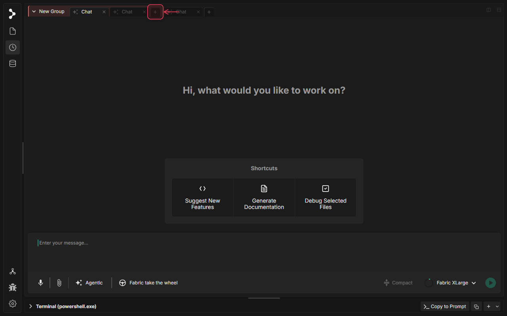
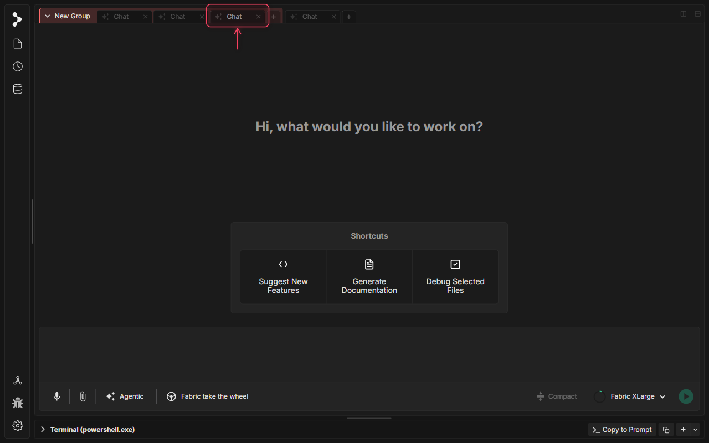
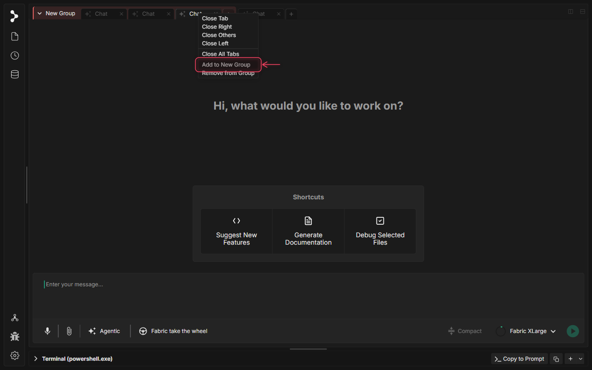
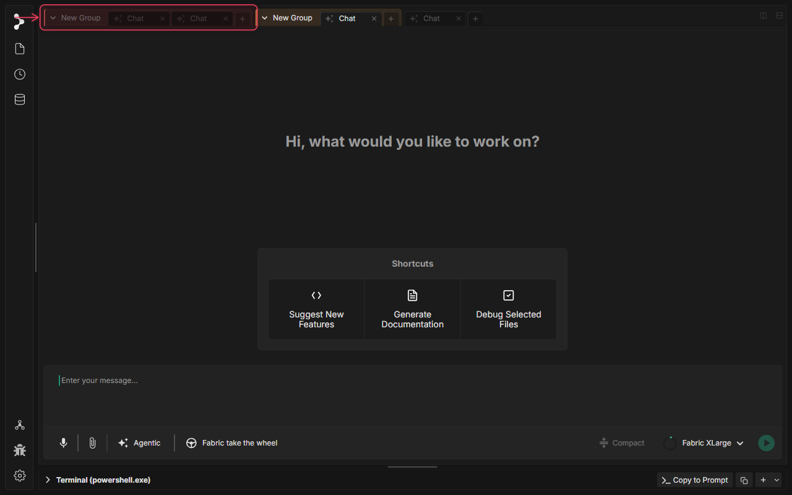
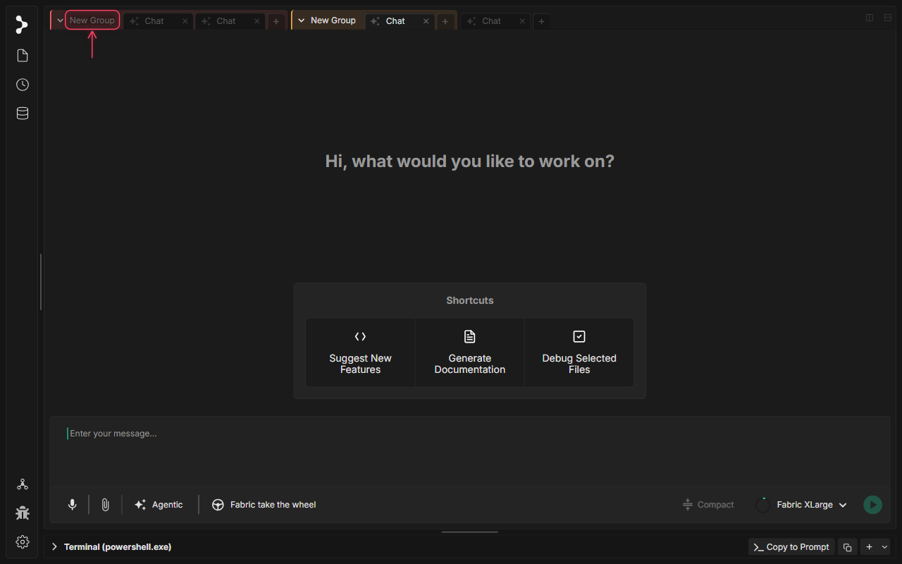
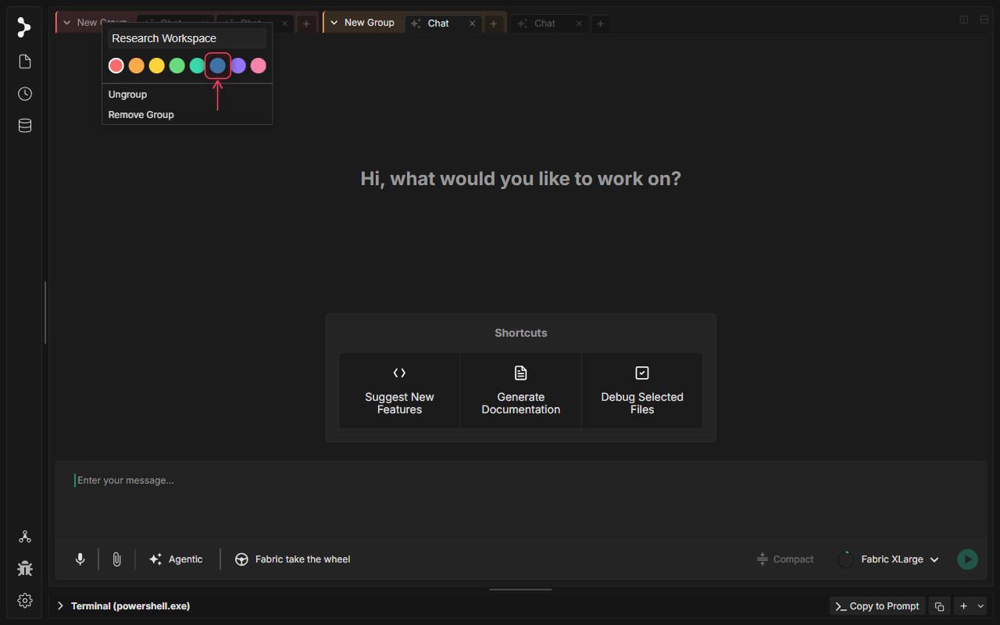
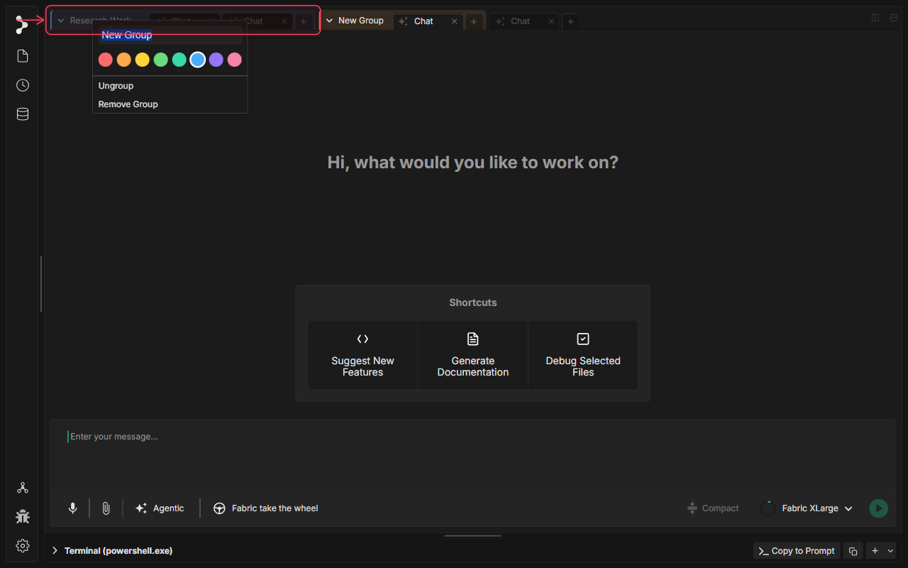

# Tab Grouping in Fabric

🚧 Video tutorial is in progress.

## What is Tab Grouping in Fabric?

Tab Grouping in Fabric provides a flexible and visually intuitive way to organize your workspace tabs—including active chat sessions, code files, and browser instances—into custom, color-coded collections. Grouping helps keep related project contexts clustered, reducing cognitive load and workspace clutter. 

When a tab group is created, Fabric automatically initiates an AI-driven naming service to suggest a descriptive label based on the topic of the active tabs, while letting you rename, collapse, color-code, and manage the group.

## When to use Tab Grouping in Fabric

Use tab grouping in Fabric when you want to:

* **Isolate Feature Contexts**: Keep chat logs, database browsers, and file editors for distinct tasks (e.g., "OAuth Setup" and "CSS Refactor") organized in separate visual groups.
* **Group Multi-Agent Processes**: Clutter-proof your tab bar by grouping a parent orchestrator chat alongside all background subagents spawned for that workflow.
* **Manage Web Research**: Keep multiple in-app browser tabs together with the prompt sessions they support.

## How to use Tab Grouping in Fabric

### Step 1: Open a Second Chat Tab

Click the plus (+) icon on the right side of the tab bar to open a second chat session, providing multiple tabs to group.

### Step 2: Right-Click a Tab Header

Right-click the active tab header to open the tab context options menu.

### Step 3: Select 'Add to New Group'

Click the 'Add to New Group' menu item. This creates a new tab group containing the selected tab.

### Step 4: Inspect the Generated Group

A new tab group is created with a color-coded left border. By default, the name generator service automatically titles the group based on the tab's topic.

### Step 5: Right-Click the Group Header

Right-click the colored group header to open the group context menu, exposing customization options.

### Step 6: Customize Group Name and Color

Type a descriptive name (e.g., 'Research Workspace') into the input field at the top of the context menu, or select a different color swatch to customize the group's theme.

### Step 7: Choose a Group Color Swatch

Select a custom color swatch from the picker to visual-code the group header.

### Step 8: Save Your Customizations

Press Enter to commit the name changes and dismiss the context menu.

### Step 9: View the Finished Tab Group

Your customized tab group is now set up. You can collapse or expand it by clicking the chevron icon, drag additional tabs into it, or close the group as a whole.

