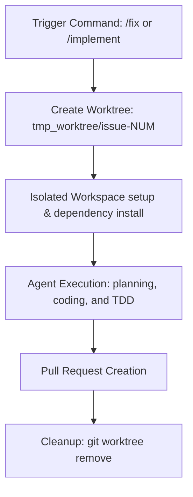

# Git Worktrees dans Fabric

🚧 Le tutoriel vidéo est en cours de réalisation.

## Que sont les Git Worktrees dans Fabric ?

Dans Fabric, les **Git Worktrees** sont utilisés pour fournir des environnements isolés et concurrents pour les tâches de codage par IA. Un worktree Git vous permet d'extraire simultanément plusieurs branches du même dépôt dans des répertoires distincts.

Lorsque vous utilisez des commandes comme `/fix <issue-number>` ou `/implement <plan-url>`, Fabric crée un worktree temporaire sous le répertoire `tmp_worktree/` à la racine de votre projet. L'agent IA effectue toutes ses analyses de fichiers, modifications et exécutions de tests exclusivement à l'intérieur de cet environnement isolé.

---

## Pourquoi Fabric utilise les Git Worktrees

L'utilisation des worktrees Git offre plusieurs avantages essentiels, tant pour les flux de travail d'agents automatisés que pour les développeurs :

1. **Isolation de l'espace de travail** : toute modification de fichier, compilation ou exécution de test se produit dans un répertoire distinct. Votre dossier de projet principal reste totalement intact et impeccable pendant que l'agent code.
2. **Exécution de tâches en parallèle** : plusieurs agents IA peuvent travailler sur différentes tâches (par exemple, corriger différents bogues, examiner des pull requests) simultanément, sans que leurs modifications de fichiers ou leurs états Git n'entrent en conflit.
3. **Sécurité du TDD** : l'agent peut exécuter librement des cycles de développement piloté par les tests — y compris l'écriture de tests qui échouent, la modification du code et la vérification des résultats — sans affecter votre branche de travail active.
4. **Contexte ciblé** : le navigateur de fichiers de l'agent et la limite de l'espace de travail sont restreints au worktree cible, ce qui garantit qu'il ne lit ni ne modifie accidentellement des fichiers sans rapport avec la tâche qui lui est assignée.

---

## Cycle de vie d'un worktree dans Fabric



### 1. Déclenchement de la tâche
La création du worktree est lancée automatiquement lorsque vous exécutez une commande agentique :
* `/fix <issue-number>` : corrige une issue GitHub dans un worktree isolé.
* `/implement <plan-url>` : implémente un plan approuvé dans un worktree isolé.

### 2. Création et configuration
Fabric exécute des commandes git pour configurer le worktree :
1. Vérifie que `tmp_worktree/` est ignoré dans le fichier `.gitignore` du projet principal.
2. Crée le répertoire cible (par exemple, `tmp_worktree/issue-102`).
3. Exécute `git worktree add -b fix/issue-<number> <path> dev` pour extraire une nouvelle branche basée sur la branche de développement.
4. Installe les modules node et dépendances nécessaires à l'intérieur du répertoire du worktree.

### 3. Exécution de l'agent
Une fois l'environnement prêt :
* L'agent change son répertoire courant pour le chemin du worktree.
* Toutes les modifications de fichiers, les appels d'outils et les commandes de test sont exécutés dans ce répertoire.
* L'éditeur de Fabric se concentre sur les fichiers du worktree, en affichant les fichiers sur lesquels l'agent travaille.

### 4. Création de la PR et vérification
Une fois l'implémentation et la vérification (tests adversariaux) terminées :
* L'agent valide les modifications, pousse la branche et ouvre une Pull Request sur GitHub.
* Le worktree reste actif au cas où des ajustements manuels seraient nécessaires avant l'approbation de la PR.

### 5. Nettoyage
Une fois la PR créée et vérifiée avec succès :
* Fabric nettoie le répertoire temporaire en exécutant :
  ```bash
  git worktree remove <path>
  git worktree prune
  ```
* Cela supprime le répertoire temporaire et nettoie l'état interne de git.

---

## Intégration à l'interface

Lorsque Fabric s'exécute à l'intérieur d'un worktree (par exemple, en développement ou pendant des exécutions d'agent actives), l'application fournit des repères visuels :

* **Titre de la fenêtre** : le titre de la fenêtre passe de `Fabric` à `Fabric - issue-<number>` (ou le nom du dossier du worktree actif) pour indiquer explicitement que vous travaillez dans un espace de travail isolé.
* **Barre latérale de l'espace de travail** : le panneau latéral du navigateur de fichiers affiche uniquement les fichiers du répertoire du worktree actif, garantissant un contexte clair.

---

## Bonnes pratiques et dépannage

### 1. La vérification du `.gitignore`
Assurez-vous toujours que `tmp_worktree/` est ignoré dans votre fichier `.gitignore` global ou au niveau du dépôt, afin d'éviter que des dossiers de worktree non suivis ne soient réintégrés dans votre dépôt principal. Fabric tente de gérer cela automatiquement lors de la configuration.

### 2. Nettoyage manuel
Si une exécution d'agent est interrompue prématurément (par exemple, le processus est arrêté ou l'ordinateur est éteint), le worktree peut rester enregistré dans Git. Vous pouvez les lister et les supprimer (prune) manuellement à l'aide de :

```bash
# List all active worktrees
git worktree list

# Remove a specific worktree directory
git worktree remove tmp_worktree/issue-<number>

# Prune any stale worktree metadata
git worktree prune
```

### 3. Verrous de worktree partagé
Lorsque plusieurs agents collaborent dans un environnement de worktree partagé, Fabric utilise des fichiers de verrouillage (`auth-tools` sous le serveur MCP) pour gérer l'accès et empêcher les conflits d'écriture de fichiers concurrents :
* `fabric_acquire_lock({ worktree: "issue-NUM" })`
* `fabric_release_lock({ worktree: "issue-NUM" })`
Cela garantit qu'un seul agent écrit dans une portée spécifique à tout moment.
