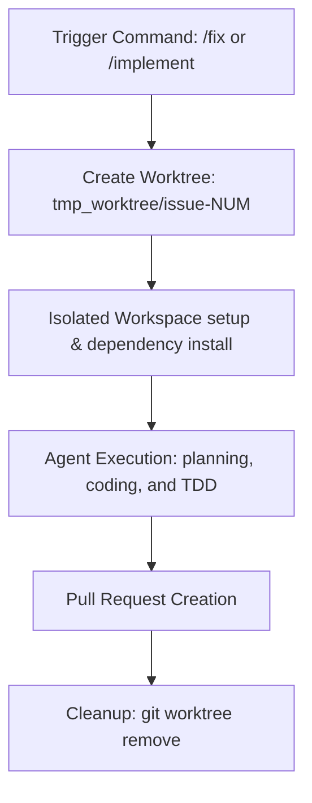

# Fabric における Git Worktrees

🚧 ビデオチュートリアルは現在作成中です。

## Fabric における Git Worktrees とは？

Fabric では、**Git Worktrees** は AI コーディングタスクのために隔離された並行環境を提供するために使用されます。Git ワークツリーを使うと、同じリポジトリの複数のブランチを別々のディレクトリに同時にチェックアウトできます。

`/fix <issue-number>` や `/implement <plan-url>` などのコマンドを使用すると、Fabric はプロジェクトルートの `tmp_worktree/` ディレクトリ配下に一時的なワークツリーを作成します。AI エージェントは、ファイルのスキャン、変更、テスト実行のすべてを、この隔離された環境内でのみ実行します。

---

## Fabric が Git Worktrees を使う理由

Git ワークツリーを使用することで、自動化されたエージェントワークフローと開発者の双方にとって、いくつかの重要なメリットがもたらされます。

1. **ワークスペースの隔離**: ファイルの変更、ビルド、テスト実行はすべて別のディレクトリで行われます。エージェントがコーディングしている間も、メインのプロジェクトフォルダはまったく手を加えられず、きれいなままに保たれます。
2. **並列タスクの実行**: 複数の AI エージェントが、ファイル編集や Git の状態を衝突させることなく、異なるタスク（例: 異なるバグの修正、プルリクエストのレビュー）を同時に処理できます。
3. **TDD の安全性**: エージェントは、失敗するテストの記述、コードの編集、結果の検証を含むテスト駆動開発のサイクルを、アクティブな作業ブランチに影響を与えることなく自由に実行できます。
4. **集中したコンテキスト**: エージェントのファイルブラウザとワークスペースの境界は対象のワークツリーに限定されるため、割り当てられたタスクとは無関係なファイルを誤って読み取ったり変更したりすることがありません。

---

## Fabric におけるワークツリーのライフサイクル



### 1. タスクのトリガー
ワークツリーの作成は、エージェントコマンドを実行すると自動的に開始されます。
* `/fix <issue-number>`: 隔離されたワークツリー内で GitHub の issue を修正します。
* `/implement <plan-url>`: 隔離されたワークツリー内で承認済みのプランを実装します。

### 2. 作成とセットアップ
Fabric は git コマンドを実行してワークツリーをセットアップします。
1. メインプロジェクトの `.gitignore` ファイルで `tmp_worktree/` が無視されていることを確認します。
2. 対象のディレクトリ（例: `tmp_worktree/issue-102`）を作成します。
3. `git worktree add -b fix/issue-<number> <path> dev` を実行して、開発ブランチをベースにした新しいブランチをチェックアウトします。
4. ワークツリーのディレクトリ内に、必要な node モジュールと依存関係をインストールします。

### 3. エージェントの実行
環境の準備が整うと、次のことが行われます。
* エージェントは現在のディレクトリをワークツリーのパスに切り替えます。
* ファイルの変更、ツール呼び出し、テストコマンドはすべてこのディレクトリ内で実行されます。
* Fabric のエディタはワークツリーのファイルにフォーカスし、エージェントが作業しているファイルを表示します。

### 4. PR の作成と検証
実装と検証（敵対的テスト）が完了すると、次のことが行われます。
* エージェントは変更をコミットし、ブランチをプッシュして、GitHub でプルリクエストを開きます。
* PR が承認される前に手動での調整が必要になる場合に備えて、ワークツリーはアクティブなまま維持されます。

### 5. クリーンアップ
PR が正常に作成され検証されると、次のことが行われます。
* Fabric は以下を実行して一時ディレクトリをクリーンアップします。
  ```bash
  git worktree remove <path>
  git worktree prune
  ```
* これにより一時ディレクトリが削除され、git の内部状態がクリーンアップされます。

---

## UI 統合

Fabric がワークツリー内で実行されている場合（例えば、開発中やアクティブなエージェント実行中）、アプリケーションは視覚的な手がかりを提供します。

* **ウィンドウタイトル**: ウィンドウタイトルが `Fabric` から `Fabric - issue-<number>`（またはアクティブなワークツリーのフォルダ名）に変わり、隔離されたワークスペースで操作していることを明示的に示します。
* **ワークスペースサイドバー**: ファイルブラウザのサイドパネルには、アクティブなワークツリーディレクトリ内のファイルのみが表示され、明確なコンテキストが確保されます。

---

## ベストプラクティスとトラブルシューティング

### 1. `.gitignore` のチェック
追跡されていないワークツリーフォルダがメインリポジトリに誤ってコミットされないように、グローバルまたはリポジトリレベルの `.gitignore` ファイルで `tmp_worktree/` が必ず無視されるようにしてください。Fabric はセットアップ中にこれを自動的に処理しようとします。

### 2. 手動クリーンアップ
エージェントの実行が途中で中断された場合（例: プロセスが強制終了された、コンピュータがシャットダウンされた）、ワークツリーが Git に登録されたまま残ることがあります。次のコマンドを使って、手動で一覧表示および削除（prune）できます。

```bash
# List all active worktrees
git worktree list

# Remove a specific worktree directory
git worktree remove tmp_worktree/issue-<number>

# Prune any stale worktree metadata
git worktree prune
```

### 3. 共有ワークツリーのロック
複数のエージェントが共有ワークツリー環境で協調作業する場合、Fabric はロックファイル（MCP サーバー配下の `auth-tools`）を使ってアクセスを管理し、同時のファイル書き込みの衝突を防ぎます。
* `fabric_acquire_lock({ worktree: "issue-NUM" })`
* `fabric_release_lock({ worktree: "issue-NUM" })`
これにより、特定のスコープに対して書き込みを行うエージェントが常に 1 つだけになるようにします。
