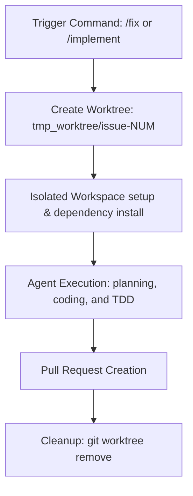

# Git Worktrees in Fabric

🚧 Video tutorial is in progress.

## What are Git Worktrees in Fabric?

In Fabric, **Git Worktrees** are used to provide isolated, concurrent environments for AI coding tasks. A Git worktree allows you to check out multiple branches of the same repository simultaneously into separate directories. 

When you use commands like `/fix <issue-number>` or `/implement <plan-url>`, Fabric creates a temporary worktree under the `tmp_worktree/` directory in your project root. The AI agent performs all its file scans, modifications, and test executions exclusively inside this isolated environment.

---

## Why Fabric Uses Git Worktrees

Using Git worktrees provides several critical benefits for both automated agent workflows and developers:

1. **Workspace Isolation**: Any file modifications, builds, or test runs occur in a separate directory. Your main project folder remains completely untouched and pristine while the agent is coding.
2. **Parallel Task Execution**: Multiple AI agents can work on different tasks (e.g., fixing different bugs, reviewing pull requests) concurrently without their file edits or Git states colliding.
3. **TDD Safety**: The agent can freely run test-driven development cycles—including writing failing tests, editing code, and verifying outcomes—without affecting your active working branch.
4. **Focused Context**: The agent's file browser and workspace boundary are limited to the target worktree, ensuring it doesn't accidentally read or modify files unrelated to its assigned task.

---

## Lifecycle of a Worktree in Fabric



### 1. Triggering the Task
Worktree creation is automatically initiated when you execute an agentic command:
* `/fix <issue-number>`: Fixes a GitHub issue in an isolated worktree.
* `/implement <plan-url>`: Implements an approved plan in an isolated worktree.

### 2. Creation and Setup
Fabric executes git commands to set up the worktree:
1. Verifies that `tmp_worktree/` is ignored in the main project's `.gitignore` file.
2. Creates the target directory (e.g., `tmp_worktree/issue-102`).
3. Runs `git worktree add -b fix/issue-<number> <path> dev` to check out a new branch based on the development branch.
4. Installs the necessary node modules and dependencies inside the worktree directory.

### 3. Agent Execution
Once the environment is ready:
* The agent shifts its current directory to the worktree path.
* All file modifications, tool calls, and test commands are run within this directory.
* The editor in Fabric focuses on the worktree files, showing the files the agent is working on.

### 4. PR Creation and Verification
After implementation and verification (adversarial testing) are complete:
* The agent commits the changes, pushes the branch, and opens a Pull Request on GitHub.
* The worktree stays active in case manual adjustments are needed before the PR is approved.

### 5. Cleanup
Once the PR is successfully created and verified:
* Fabric cleans up the temporary directory by executing:
  ```bash
  git worktree remove <path>
  git worktree prune
  ```
* This removes the temporary directory and cleans up git's internal state.

---

## UI Integration

When Fabric is running inside a worktree (for example, in development or during active agent runs), the application provides visual cues:

* **Window Title**: The window title changes from `Fabric` to `Fabric - issue-<number>` (or the folder name of the active worktree) to explicitly indicate that you are operating in an isolated workspace.
* **Workspace Sidebar**: The File Browser side panel displays only the files inside the active worktree directory, ensuring clear context.

---

## Best Practices and Troubleshooting

### 1. The `.gitignore` Check
Always ensure `tmp_worktree/` is ignored in your global or repository-level `.gitignore` file to prevent untracked worktree folders from being committed back to your main repository. Fabric attempts to handle this automatically during setup.

### 2. Manual Cleanup
If an agent run is aborted prematurely (e.g., the process is killed or the computer is shut down), the worktree might remain registered in Git. You can manually list and prune them using:

```bash
# List all active worktrees
git worktree list

# Remove a specific worktree directory
git worktree remove tmp_worktree/issue-<number>

# Prune any stale worktree metadata
git worktree prune
```

### 3. Shared Worktree Locks
When multiple agents collaborate in a shared worktree environment, Fabric employs lock files (`auth-tools` under the MCP server) to manage access and prevent concurrent file write collisions:
* `fabric_acquire_lock({ worktree: "issue-NUM" })`
* `fabric_release_lock({ worktree: "issue-NUM" })`
This ensures only one agent writes to a specific scope at any given time.
