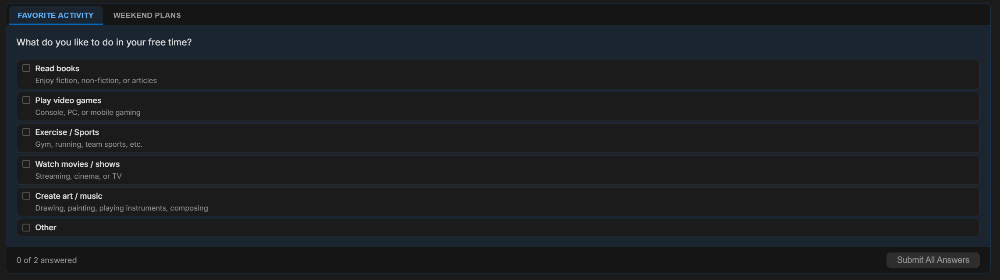

# 確認のための質問

AI が処理を進める前に、あなたの判断を必要とする場合があります。どのフレームワークを使うか、テストを含めるかどうか、2 つのアプローチのどちらを好むか、などです。推測したり、プレーンテキストで質問して止まったりする代わりに、Fabric は会話の中で構造化された多肢選択式の質問を提示し、あなたはクリックして答えられます。

---

## 仕組み

AI が自分では推測できない情報が本当に必要だと判断すると、構造化された質問をします。コンパクトなダイアログがチャット内にインラインで表示され、次の要素を含みます：

- **質問** のテキスト
- それぞれに任意の短い説明が付いた **選択可能なオプション** のセット
- どのオプションも当てはまらない場合のための、自由入力フィールド付きの **「その他」** の選択肢

オプションを選ぶ（または自分で入力する）と、あなたの回答がそのまま AI に返され、AI はあなたの判断を踏まえて処理を続けます。

---

## 単一選択と複数選択

質問には 2 つのモードがあります：

- **単一選択** — ラジオボタン形式。1 つだけ選びます。選択後、ダイアログは自動的に次へ進むことがあります。
- **複数選択** — チェックボックス形式。当てはまるオプションを好きなだけ選んでから送信します。

1 つのプロンプトで複数の質問をまとめることもできます。その場合、ダイアログ上部に各質問に対応するタブが表示され、`2 of 3 answered`（3 問中 2 問回答済み）のような進捗インジケーターが付きます。各タブを順に回答していき、すべて回答すると一括で送信されます。

---

## 質問への回答

- **オプションをクリック** して選択します。複数選択の質問では、選びたいオプションをそれぞれクリックします。
- 一覧にない回答が必要な場合は、**「その他」を選んで** フィールドに入力します。
- 下部のボタンで **送信** します（単一選択の質問は、選択すると自動的に次へ進む／送信されることがあります）。
- タブを切り替えても下書きの回答は保持されるため、移動しても選択を失いません。

---

## プレーンテキストの質問より優れている理由

- **曖昧さがない。** 構造化されたオプションにより選択肢が明示されるため、AI は自由形式のテキストを解析するのではなく、明確で曖昧さのない回答を得られます。
- **より速い。** ボタンをクリックする方が、返信を全部入力するより速いです。
- **誤った方向転換が減る。** AI が想定で進めるのではなく判断を提示するため、AI が自信を持って誤ったものを作り、あなたが後戻りする事態を避けられます。

---

## いつ表示されるか

AI は本当に必要なときだけ質問するように設計されています。つまり、判断によって次の行動が実質的に変わり、妥当なデフォルトを選べない場合です。確認のための質問は通常、次のような場面で表示されます：

- 複数の妥当なアプローチがある、自由度の高いタスクの開始時
- リクエストが曖昧で、選択肢によって結果が大きく変わる場合
- 元に戻しにくいステップの前で、方向性を確認する価値があるとき

AI に最善の判断でそのまま進めてほしい場合は、そう伝えてください。質問する代わりに妥当なデフォルトに頼ります。

> 完全に自律的な実行では、確認のための質問は完全にスキップされます。来ない入力を待つのではなく、AI が最善の判断で進めます。
