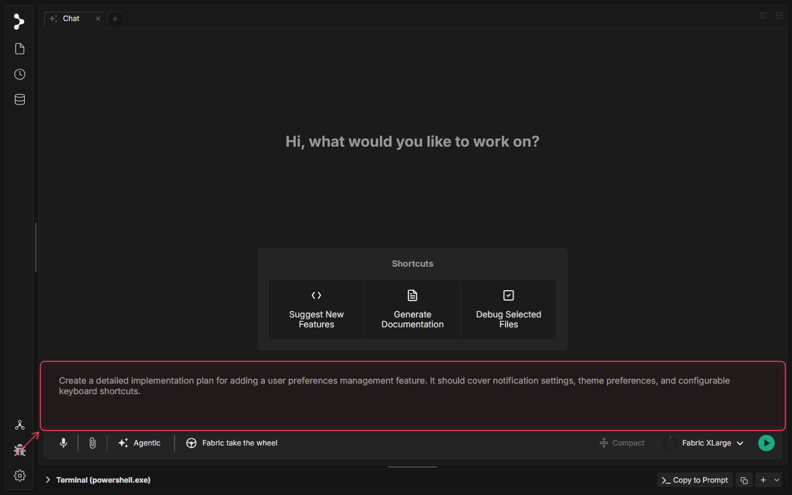
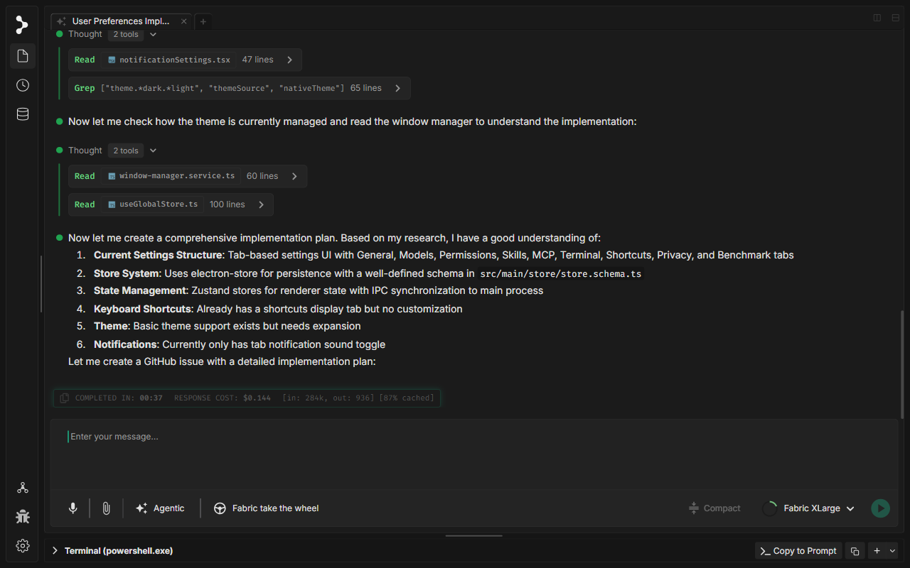

# Code Planning with Fabric

<video controls width="100%" style="border-radius: 8px; margin: 1rem 0;">
  <source src="../../../../assets/videos/code-planning.mp4" type="video/mp4">
  Your browser does not support the video tag.
</video>

## What is Code Planning with Fabric?

Before you write a single line of code, Fabric can produce a comprehensive engineering blueprint for your feature or change — scanning your actual codebase, understanding its patterns, and delivering a structured plan that covers everything from architecture to test strategy.

Code Planning is not a generic outline generator. Fabric reads the files that are relevant to your request, analyses how your codebase is currently structured (stores, services, UI patterns, data flow), and produces a plan that is **specific to your project**. The result is a detailed document you can hand off directly to `/implement` or delegate to parallel subagents.

### What the plan includes

A typical plan covers:

| Section | What it contains |
| :--- | :--- |
| **Overview & Goals** | A precise restatement of the feature and its acceptance criteria |
| **Codebase Research Summary** | What Fabric found while reading your files — existing patterns, relevant stores, potential conflicts |
| **Proposed Architecture** | Where new code lives, what it depends on, and why |
| **File-Level Changes** | An ordered list of files to create or modify, with descriptions of each change |
| **Implementation Sequence** | Step-by-step ordering that respects dependencies and avoids regressions |
| **Test Strategy** | Unit, integration, and E2E test recommendations tied to the specific code paths |
| **Risks & Mitigations** | Known gotchas, edge cases, and how to handle them |
| **SOLID Principles Check** | Analysis of how the proposed design upholds or challenges SOLID principles |

---

## How the Planning Process Works

### Step 1 — Describe what you want to build

Open a chat tab and describe your feature in plain language. You do not need to use a special command or slash syntax — just write naturally. Fabric uses your message, together with any files open in your workspace, to gather the full context it needs.

The more specific you are about **goals and constraints**, the sharper the plan. For example:

> *"Create a detailed implementation plan for adding a user preferences management feature. It should cover notification settings, theme preferences, and configurable keyboard shortcuts."*

### Step 2 — Fabric researches your codebase and plans

After you submit, Fabric does not immediately generate a generic plan. Instead, it performs **active research** before writing a single word of the plan:

* It reads relevant files — for example, existing settings screens, store schemas, IPC handlers, and related UI components.
* It runs targeted searches (`grep`, file reads) to understand the current implementation state.
* It reasons through what already exists versus what needs to be built.
* Once it has a clear picture, it summarises its research findings in the chat and then produces the full, structured plan.

You can watch this process live in the chat — each tool call (file read, grep, etc.) is shown inline, giving you full transparency into what Fabric is examining.

---

## Build the Plan

Once the plan is ready, you don't have to copy it anywhere or run a command by hand. Every generated plan comes with a **Build** button. Click it, and Fabric takes the plan and starts implementing it directly — setting up the work and turning each planned change into real code.

This is the one-click path from blueprint to working code:

1. **Review** the plan in the chat — expand sections, ask for changes, adjust the scope.
2. When you're happy with it, click **Build**.
3. Fabric implements the plan, working through the file-level changes in the order the plan laid out, so you can watch the design become code.

Because Build works from the plan Fabric already researched, the implementation follows the architecture, sequence, and test strategy you reviewed — not a fresh guess.

---

## After the Plan is Generated

Besides clicking **Build**, once the plan is in the chat you have several options:

* **Refine it conversationally** — Ask follow-up questions to expand any section, request alternative approaches, or adjust scope. Fabric will update the plan in place.
* **Hand it off to `/implement`** — Save the plan to a markdown file and pass its URL to the `/implement` slash command to execute it in an isolated Git worktree.
* **Delegate to subagents** — Use the plan as a task breakdown and spawn parallel subagents (via `/implement_with_dag`) to work on different sections simultaneously.
* **Use it as a review checkpoint** — Share the plan with your team before any code is written, catching architectural issues early.

> [!TIP]
> Open the files most relevant to your feature in editor tabs before submitting your planning request. Fabric uses workspace context — the more relevant files are visible, the more precise the plan.

> [!NOTE]
> Code Planning works best with models that have strong reasoning capabilities. **Fabric XLarge** is recommended for complex, multi-file planning requests.
