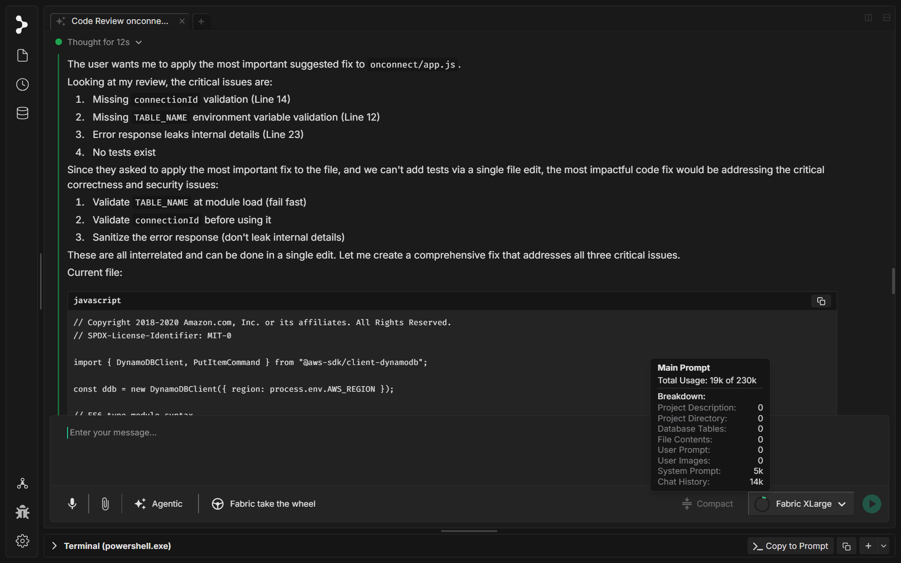

# コンテキストウィンドウの追跡

すべての AI モデルには、**コンテキストウィンドウ** があります。これは、1 回の会話の間にモデルが「作業メモリ」に保持できるテキストの最大量です。ホワイトボードのようなものだと考えてください。いっぱいになると、新しいことを書く前に古いものを消さなければなりません。コンテキストウィンドウには、モデルが一度に見るすべてのもの — あなたのプロンプト、ファイルの内容、チャット履歴、システム命令 — が含まれます。

Fabric はトークンの使用量をリアルタイムで追跡し、チャットの入力欄にそのまま表示します。

---

## 仕組み

チャットをするにつれて、送信するすべてのメッセージ、コードスニペット、ファイル読み込み、画像がトークンを消費します。Fabric はこれらのトークンを継続的に集計し、選択したモデルの上限に対する現在の使用量を表示します。モデル名の横にある円形のインジケーターは、コンテキストウィンドウがどれだけいっぱいになっているかを示します。

インジケーターにカーソルを合わせると、詳細な内訳が表示されます。

* **合計使用量** — モデルの総容量のうち、現在使用しているトークン数
* **プロジェクトの説明** — プロジェクトの説明設定からのトークン
* **プロジェクトディレクトリ** — プロジェクトのファイルツリーからのトークン
* **データベーステーブル** — データベーススキーマのコンテキストからのトークン
* **ファイルの内容** — 開いた、または添付したファイルからのトークン
* **ユーザープロンプト** — 現在のメッセージからのトークン
* **ユーザー画像** — 送信した画像からのトークン
* **システムプロンプト** — Fabric の組み込み命令からのトークン
* **チャット履歴** — 会話内の以前のすべてのメッセージからのトークン

---

## モデルサイズの違い

モデルごとにコンテキストウィンドウのサイズは異なります。例えば次のとおりです。

* **Fabric XLarge** — 230k トークン
* **Claude 3.5 Sonnet** — 200k トークン
* **GPT-4o** — 128k トークン
* **より小さなモデル** — 多くの場合 8k〜32k トークン

モデルを切り替えると、Fabric は新しいモデルの上限に対して使用量を自動的に再計算します。あるモデルでは余裕で収まる会話が、別のモデルでは上限ぎりぎりになることもあります。

---

## 上限に近づくと何が起こるか

会話が長くなるにつれて、円形のインジケーターはいっぱいになっていきます。上限に近づくと、次のことが起こります。

* インジケーターの色が変わり、警告します
* モデルが会話の早い部分を「忘れ」始めることがあります
* モデルがすべてをメモリに収めようと苦労するため、応答品質が低下することがあります

上限に達した場合、いくつかの選択肢があります。新しいチャットを開始する、不要なファイル添付を削除する、または**圧縮**を使用して重要な部分を保ちながらチャット履歴を圧縮する、といった方法です。
