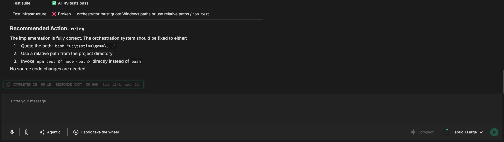

# Suivi des coûts

Fabric vous montre exactement ce que coûte chaque réponse de l'IA, directement dans la conversation. Aucun tableau de bord de facturation séparé à consulter, aucune supposition — chaque réponse terminée porte une petite note de bas de page indiquant son coût, son utilisation de jetons et sa durée.

---

## Où le trouver



Une fois qu'une réponse de l'IA a fini de se générer, regardez la note de bas de page située juste sous le message. Elle indique :

- **Coût de la réponse** — le coût en dollars de cette seule réponse, par ex. `RESPONSE COST: $0.012`
- **Utilisation de jetons** — jetons d'entrée et de sortie, par ex. `[in: 1.2k, out: 523]`
- **Taux de cache** — lorsque la mise en cache des prompts intervient, le pourcentage servi depuis le cache, par ex. `[95% cached]`
- **Durée** — le temps qu'a pris la réponse, par ex. `COMPLETED IN: 2.34s`

Tant qu'une réponse est encore en cours de diffusion, la note affiche le temps écoulé en direct (`IN PROGRESS: 1.2s`) et bascule sur le coût final une fois terminée.

---

## Comment le coût est calculé

Le coût est calculé à partir de l'utilisation de jetons de la réponse et de la tarification du modèle qui l'a produite :

```
coût = (prix_entrée × jetons_entrée + prix_sortie × jetons_sortie) / 1 000 000
```

Où `prix_entrée` et `prix_sortie` sont les tarifs par million de jetons définis pour le modèle sélectionné. Comme le calcul utilise le nombre réel de jetons renvoyé par le fournisseur, le chiffre reflète ce qui vous a réellement été facturé pour cet appel — et non une estimation.

Lorsque la **mise en cache des prompts** est active, les jetons d'entrée mis en cache sont facturés à un tarif réduit, ce qui explique pourquoi un pourcentage de cache élevé réduit nettement le coût des messages de suivi dans une longue conversation.

---

## Pourquoi par réponse

Fabric rapporte le coût **par réponse** plutôt qu'en un total cumulé unique pour la conversation. C'est délibéré — cela rend évident quelles actions sont coûteuses. Une question de clarification rapide coûte une fraction de centime ; une tâche agentique approfondie qui lit des dizaines de fichiers et raisonne sur un changement complexe coûte davantage. Voir le coût attaché à chaque réponse vous aide à relier le chiffre au travail qui l'a produit.

Pour estimer le coût d'une conversation entière, parcourez les notes de bas de page — les réponses coûteuses ressortent immédiatement.

---

## Utiliser la conscience des coûts en pratique

- **Adaptez le modèle à la tâche.** Si vous remarquez que des réponses de routine coûtent plus qu'elles ne le devraient, passez à un modèle plus petit et moins cher pour ce type de travail. Voir [Modèles](../../../getting-started/models/models.md).
- **Misez sur le cache pour les longues sessions.** Poursuivre une conversation (plutôt que la redémarrer) permet à la mise en cache des prompts de réduire le coût de chaque suivi. Observez le pourcentage de cache grimper dans les notes.
- **Compactez au lieu de redémarrer.** Le [compactage de la conversation](../chat-compaction/chat-compaction.md) réduit le contexte pour maîtriser à la fois le coût et la pression sur la fenêtre de contexte, sans perdre le fil.
- **Repérez les schémas coûteux.** Si une seule réponse est étonnamment coûteuse, c'est généralement parce que beaucoup de contexte a été envoyé. C'est le signal d'attacher moins de fichiers ou de réduire la portée de la tâche.

---

## Remarques

- Les coûts sont calculés localement à partir du nombre de jetons et de la tarification du modèle — ils reflètent l'utilisation du fournisseur mais ne remplacent pas sa facturation officielle.
- Les modèles hébergés par Fabric et les fournisseurs externes sont chiffrés de la même façon, en utilisant les tarifs configurés de chaque modèle.
- Les étapes de continuation à l'intérieur d'une boucle automatisée n'affichent pas chacune une note distincte ; le coût est rapporté sur la réponse terminée.
