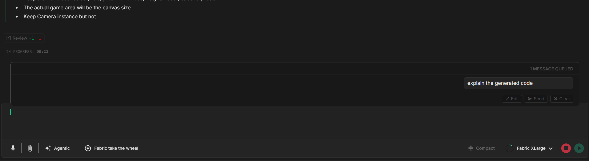

# メッセージのキューイング

次の指示を出すために、AI が終わるのを待つ必要はありません。レスポンスの生成中でも、入力した内容をキューに入れ、現在のターンが完了したときに自動的に送信できます。手を止めて待つ代わりに、思考の流れを止めずに進められます。

---

## メッセージをキューに入れる

AI が生成している間に、次のメッセージを入力して `Enter` を押します。現在のレスポンスを中断する代わりに、メッセージは **キュー** に追加され、入力欄のすぐ上にある小さなポップオーバーにチップとして表示されます。入力欄はクリアされ、次の入力に備えます。

この方法で複数のメッセージをキューに入れられます（1 セッションあたり最大 20 件）。順番に保持され、AI が空くと 1 つずつ送信されます。

---

## キューの管理

キューのポップオーバーは、保留中の各メッセージをチップとして表示します。そこから次のことができます：

- キュー内のメッセージを **その場で編集** — 編集アイコンをクリックし、テキストを変更して保存します。
- メッセージを **削除** — チップの × をクリックしてキューから外します。
- 1 件のメッセージを **今すぐ強制送信** — その送信アイコンをクリックすると、現在の生成を中断してそのメッセージだけをすぐに送信します。
- **すべて送信** — キュー全体を一度に送信します。
- **複数選択** — 2 件以上キューに入っている場合、チェックボックスで複数をまとめて操作できます（選択したものを送信または削除）。

ちょっとしたショートカット：生成中に、空の入力欄の先頭にカーソルを置いて **上矢印キー** を押すと、直近にキューへ入れたメッセージが編集用に入力欄へ戻ってきます。

---

## キュー内のメッセージの送信方法

現在のレスポンスが完了すると、キューは自動的に送信されます。キューに入った複数のテキストメッセージは 1 つのフォローアップターンにまとめられ（AI が区別できるように区切られます）、添付された画像やファイルも一緒に送られます。

手動で送信することもできます。AI がまだ生成中に、入力欄が空の状態で `Enter` を押すと、キュー全体がすぐに送信されます。

生成の途中でメッセージを強制送信すると、Fabric はまず現在のターンを停止してから、あなたのメッセージを送信します。すぐに方向修正が必要だと気づいたときに便利です。

---

## 使いどころ

- **一連のステップをまとめておく。** 最初のタスクの実行中に、「次はテストを書いて」「それから README を更新して」「それからリンターを実行して」とキューに入れておきます。
- **忘れる前に思いつきを残す。** レスポンスの途中で何か思いついたら、待って忘れる代わりにキューに入れましょう。
- **すぐに方向修正する。** AI が間違った方向に進んでいると気づいたら、最後まで生成させるのではなく修正を強制送信します。

---

## 注意事項

- キューはチャットセッションごとに最大 20 件まで保持します。それを超えてキューに入れようとすると、短い「queue full（キューが満杯）」の警告が表示されます。
- 各タブは独立したキューを持ちます。あるチャットでのキューイングは別のチャットに影響しません。
- キューに入れたメッセージは、テキストだけでなく添付ファイル（画像やファイル）も保持します。
